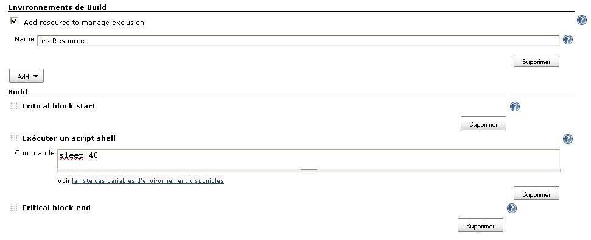
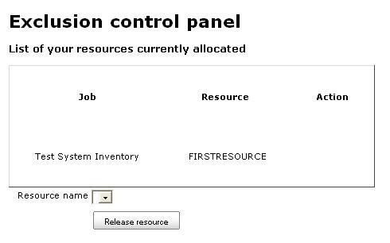

This plugin manages exclusion between jobs.

# About this plugin

This plugin is inspired by the Port-Allocator plugin.

The purpose of this plugin is to manage conflicts between jobs.

The Exclusion plugin allows you to assign resource names to jobs on
Jenkins.The plugin will ensure that jobs sharing a same resource will
not be executed at the same time. The resource name is a semaphore.

With the second part of the plugin you can, in an administration panel,
see the list of resources configured in each job, see when a resource is
allocated and, thanks to the release button, you can release a resource
currently used.

# Configuration

Firstly you have to activate the plugin by checking the box “Add
resource to manage exclusion”. It allows you to add resources. A
resource is represented by a name (String). You can add as much
resources as needed.

Secondly you have to determine the critical zone, delimited by a start
(Critical Block Start) and an end (Critical Block End). All build steps
included in a critical zone will be managed by Exclusion plugin.

  

If you don’t add a start block the plugin won’t do anything. If you
don’t add an end block, resources will be release after the last build
step.

# Administration Panel

When you are on the home page of Jenkins, you can access the
Administration Panel.

In this page, you can see all resources configured. The status (Action)
of a job is set to "Currently Used" when the job is running (if he has a
resource configured). It means that the resource is currently allocated
-\> the other jobs using the same resource can’t be run at this moment.

You can release a resource by selecting a resource name in the combo box
(that displays only the resources currently used) and clicking on
“Release resource button”.

# About me

Owner & maintainer of the project: GitHub:
[anthonyroux](https://github.com/anthonyroux) & Twitter:
[AnthonyRoux\_](https://twitter.com/AnthonyRoux_)

# Change Log

### Version 0.12 (Apr 19, 2016)

***Contribution of*** ***[Oleksandr
Kulychok](https://github.com/kool79)***

-   Fixed Administration panel 

### Version 0.11 (Oct 25, 2015)

***Contribution of*** ***[Emanuel
Zattin](https://github.com/emanuelez)***

-   Add support for the Workflow plugin.

### Version 0.10 (Jan 25, 2014)

-   Fixed issue
    \#[14953](https://issues.jenkins-ci.org/browse/JENKINS-14953) and
    issue \#[15884](https://issues.jenkins-ci.org/browse/JENKINS-15884)

### Version 0.9 (Nov 18, 2013)

-   Fixed a security vulnerability that allows non-administrator users
    from releasing resources that are currently held (SECURITY-53)

### Version 0.8 (Nov 8, 2012)

-   [JENKINS-14953](https://issues.jenkins-ci.org/browse/JENKINS-14953)
    Exclusion plugin sometimes reports a resource as locked when it is
    not. Jobs hang as a result.

### Version 0.7 (July 7, 2012)

-   [JENKINS-12250](https://issues.jenkins-ci.org/browse/JENKINS-12250)
    Critical block can not be added into conditional step

### Version 0.6 (Jun 19, 2011)
