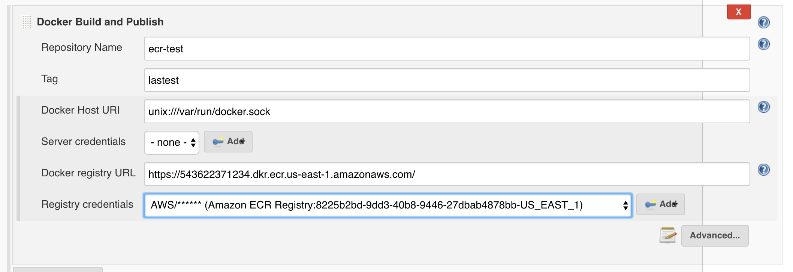

This plugin offers integration with Amazon EC2 Container Registry (ECR)
as a DockerRegistryToken source to convert Amazon Credentials into a
Docker CLI Authentication Token.

# About

Amazon ECR plugin implements a Docker Token producer to convert Amazon
credentials to Jenkins’ API used by (mostly) all Docker-related
plugins.  
Thank's to this producer, you can select your existing registered Amazon
credentials for various Docker operations in Jenkins, for sample using
CloudBees Docker Build and Publish plugin:

{height="250"}

# Requirements

-   Jenkins version 1.642 or later

# Installation

Navigate to the "Plugin Manager" screen, install the "Amazon ECR" plugin
and restart Jenkins.

The plugin will use the proxy configured on Jenkins if it is set since
1.6 version.

Recommended logger for troubleshooting, you have to take care where you
publish these logs could contain sensitive information

-   com.cloudbees.jenkins.plugins.amazonecr
-   com.amazonaws
-   org.apache.http.wire
-   org.jenkinsci.plugins.docker.workflow

# Docker Pipeline Usage

When using the [CloudBees Docker Pipeline
Plugin](https://wiki.jenkins-ci.org/display/JENKINS/CloudBees+Docker+Pipeline+Plugin),
in order to obtain an ECR login credential, you must use the ecr
provider prefix.

``` syntaxhighlighter-pre
docker.withRegistry("https://your.ecr.domain.amazonws.com", "ecr:us-east-1:credential-id") {
  docker.image("your-image-name").push()
}
```

 

If you experience authentication issues, you would try to remove user
docker configuration files on the agents before to run the docker
commands, something like this pipeline script.

 

``` syntaxhighlighter-pre
node {
        //cleanup current user docker credentials
        sh 'rm  ~/.dockercfg || true'
        sh 'rm ~/.docker/config.json || true'
        
        //configure registry
        docker.withRegistry('https://ID.ecr.eu-west-1.amazonaws.com', 'ecr:eu-west-1:86c8f5ec-1ce1-4e94-80c2-18e23bbd724a') {
          
            //build image
            def customImage = docker.build("my-image:${env.BUILD_ID}")
            
            //push image
            customImage.push()
        }
```

 

#  Versions

## 1.6 (2017-05-16)

-   [JENKINS-34437](https://issues.jenkins-ci.org/browse/JENKINS-34437) Enable
    amazon-ecr-plugin behind proxy
-   Performance improvements
-   Set minor version to 1.642.1
-   Upgrade Credentials Plugin
-   Upgrade AWS Java SDK Plugin

-   Upgrade AWS Credentials Plugin

-   Upgrade Docket Commons Plugin

-   improve log

## 1.5 - Burned

## 1.4 (2016-10-29)

-   [JENKINS-38465](https://issues.jenkins-ci.org/browse/JENKINS-38465) ECR
    Plugin now it is compatible with credential stored into folders
-   [JENKINS-36127](https://issues.jenkins-ci.org/browse/JENKINS-36127) Resolved
    a NPE when attempt to configure docker build and publish
-   [JENKINS-34958](https://issues.jenkins-ci.org/browse/JENKINS-34958) New
    credential format that contains the region. For example, by
    specifying the following credentials: ecr:us-west-2:credential-id,
    the provider will set the Region of the AWS Client to us-west-2,
    when requesting for Authorisation token.

## 1.3 (2016-06-06)

-   1.2 Release failed to upload the artifact - so just release again to
    correctly upload the artifact.  
    NOTE: This release doesn't contain any update.

## 1.2 (2016-06-03)

-   Update parent pom

## 1.1 (2016-05-30)

-   [JENKINS-35220](https://wiki.jenkins.io/display/JENKINS/Amazon+ECR#)
    Correctly display the credentials

## 1.0 (2016-01-12)

-   Replace custom ECR API client with aws-java-sdk

## 1.0-beta-1 (2015-12-22)

-   Initial release
