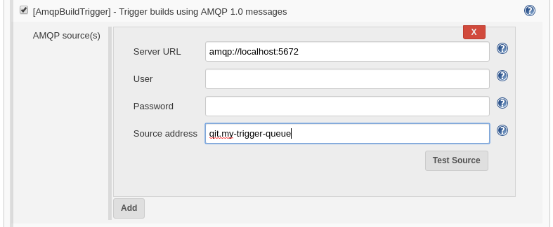

  

This Jenkins plugin will trigger builds when AMQP messages are received
from AMQP message sources (typically a broker with a queue or topic).
Each job may specify one or more AMQP sources from which to receive
messages. If any AMQP message is received from any of the configured
sources, then a build is triggered. The same source may also be used to
trigger multiple jobs.

Note that the message content plays no role in message triggering. The
only criterion for triggering a job is that a message is received from
the specified AMQP source.

# Basic Configuration

Within each job, scroll down to the **Build Triggers** section (or click
on the **Build Triggers** tab) and then locate the
**\[AmqpBuildTrigger\]** checkbox. Select the **\[AmqpBuildTrigger\]**
checkbox to enable the trigger:

  

Each job may specify multiple AMQP sources for trigger messages.
Initially, the list will be empty. Click the **Add** button to add an
AMQP trigger source:

  

This will create a new empty server parameters block. To complete this
block:

-   Enter the **URL** in the format
    `amqp://ip-addr[:port]. (`Examples: `amqp://localhost` or
    `amqp://localhost:5672` or `amqp://10.0.0.5:35672.)`
-   If necessary, enter a **User** and **Password** for logging onto the
    server. If supplied, the connection will use SASL PLAIN
    authentication, otherwise if left blank, ANONYMOUS. Make sure the
    server is configured for this type of access and that the user (if
    set) is known to it.
-   Enter a **Source address** from which to receive messages. If the
    server is a broker, then this is usually the name of a *queue* or
    *topic*.

-   A **Test Source** button if clicked will establish a temporary
    connection to the server and report \`Ok\` if it worked, otherwise
    an error message will be displayed.

To add additional sources, click the **Add** button. To remove a source,
click the **red X** button at the top of each block.

Finally, click the **Save** button at the bottom of the form to save the
settings. Once these settings are saved, a new connection to each server
will be established and a listener will wait for messages to be
received.

------------------------------------------------------------------------

  

**NOTE:**

If you have the **`qpid-cpp-client-devel`** package installed, it is
possible to test a configuration by quickly sending a trigger message
using `qpid-send` through a broker as follows (and to which the trigger
must be configured to listen):

    qpid-send [-b <broker-url>] -a <queue-name> -m1

where:

**`<broker-url>`** is the broker URL (defaults to `localhost` if not
provided)

**`<queue-name>`** is replaced by the queue name configured in the
**Source Address** field for your project.

To get help, use `qpid-send -h` or `qpid-send --help`.

# Change Log

### Release 1.0

2019-08-27: Initial release.

  
