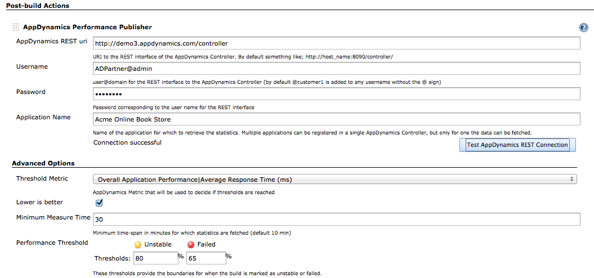
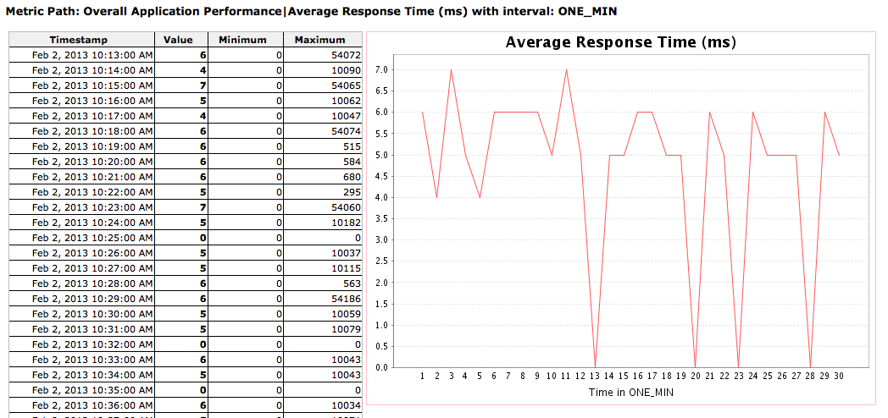
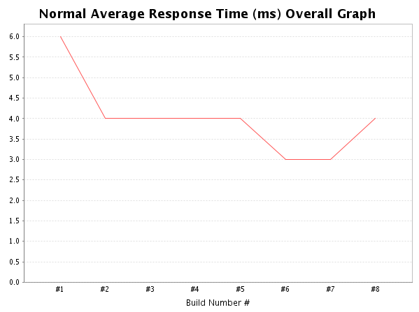

Older versions of this plugin may not be safe to use. Please review the
following warnings before using an older version:

-   [Credentials stored in plain
    text](https://jenkins.io/security/advisory/2019-03-06/#SECURITY-1087)

This plugin integrates with [AppDynamics](http://www.appdynamics.com/)
to fetch measurements.

## Plugin Features

This plugin makes it possible to integrate data
from [AppDynamics](http://www.appdynamics.com/) into your Jenkins
build. A performance test should be run during build time (e.g. by
using [JMeter](http://jakarta.apache.org/jmeter/)), and having
AppDynamics connected to your application. After the build,
the performance statistics will be fetched from the REST uri and shown
in the Jenkins interface.  
It includes the feature of setting the final build status as good,
unstable or failed, based on the reported metrics.

## Changelog:

#### v1.0.14

-   Better handling of custom metrics. Especially when changing the
    'main' metric, it might not be always available in previous reports.
    Now will skip those in counting averages and creating graphs.

#### v1.0.13

-   Added possibilities for custom metrics, thanks to Volodymyr
    Lukashevych.
-   Updated to one of the later Jenkins versions, using newer dependency
    versions.

#### v1.0.3-12

-   Various releases that failed because of updates. Can be ignored.

#### v1.0.2

-   Minor fix for NPE when no metrics found.

#### v1.0.1

-   Minor fix for running and testing the plugin locally. Plugin
    configuration could not be opened. Solved by stepping up the Jenkins
    build system version.

#### v1.0.0

-   First release, working version to fetch statistics from AppDynamics
    REST interface and display the results
-   Only several default metrics available, all on 'overall application'
    level.
-   One main metric that can be selected on which basis the build is
    marked as successful, unstable or failed.

## Jenkins Build Configuration

-   Create a new build for executing the performance tests.

&nbsp;

-   Add a build-step for e.g. JMeter, or a script that will generate
    load on your system under test.

&nbsp;

-   Add the AppDynamics plugin as post-build-step to fetch actual
    metrics and generate reports.

## AppDynamics Plugin usage

#### Configuration

Default configuration for the AppDynamics plugin only needs the
following information to connect to the AppDynamics REST api:

-   REST uri: The uri where AppDynamics Controller is living. Same uri
    as you would use for logging into the AppDynamics dashboard.
-   Username: Username for authentication. Don't forget the
    "@\<domain\>" part if using a multi-tenant Controller.
-   Password: Password for authentication.
-   Application Name: Name of the application that should be monitored,
    exactly as it appears in the Controller (possibly with spaces). Also
    accepts the application id (numeric value).

Furthermore, some advanced settings are available. You can configure the
error percentage thresholds which would make the project unstable or
failed or leave them blank to disable the feature.

-   Threshold Metric: The metric that will be used to determine whether
    the build is succeeded, unstable or failed. Normally the average
    response time is used.
-   Lower is better: Checkbox to specify whether the measurements
    belonging to the metric, are better when higher or better when lower
    values are measured.
-   Minimum Measure Time: The plugin will fetch measurements from the
    time the build started. But in case the load-generation is not
    directly executed within this build, it is possible to specify a
    minimum time for which measurements must be fetched.
-   Performance Threshold: Specify a percentage as to when the build is
    marked as unstable or failed. These values specify a boundary for
    the new build, for wich the performance is taken as percentage of
    the average.

#### Output

The AppDynamics plugin will show output per build, and as overall
statistics for the project. The following two images are two examples:

Build output

Overall graph for the project (and floating box on the project page)

## Compiling

To use the latest plugin release, you need to download, compile and
install by hand. To do it, you need Git, Maven and Java 6 installed in
your computer.

    $ git clone https://github.com/jenkinsci/appdynamics-plugin.git
    $ cd appdynamics-plugin
    $ mvn package
    $ cp target/appdynamics-dashboard.hpi <path_to_jenkins>/data/plugins

Remember to restart jenkins in order to use / reload the plugin.
