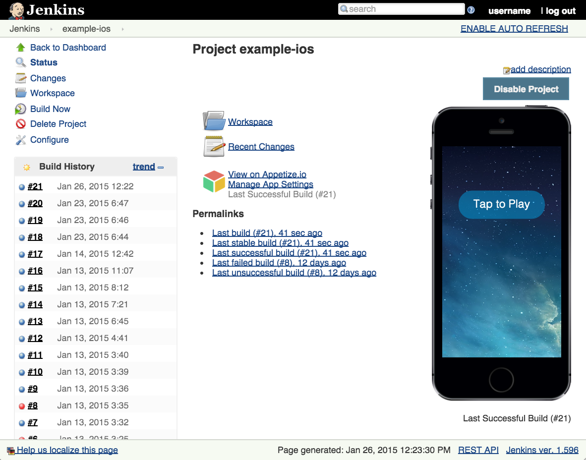

# appetize-plugin

Stream iOS & Android builds directly within Jenkins via Appetize.io's
cloud-based iOS Simulators & Android Emulators.

This plugin adds a post-build step that uploads iOS and Android builds
to [https://appetize.io](https://appetize.io/), a service that streams
cloud-based iOS Simulators and Android emulators in web browsers. On
success, users can run their builds directly in the Jenkins UI.

  

  

## Configuration

Use the built-in placeholder token for simple testing, or enter your own
API token.

Add your API token via Jenkins Credentials \> Global Credentials \> Add.
For Type, choose "Appetize.io Credentials" and enter an optional
description to help distinguish multiple tokens.

Then, add the "Upload to Appetize.io" post-build action on your Project
configuration page and follow the directions for iOS and Android
projects below.

### iOS Projects

Create a simulator build by running xcodebuild with the "-sdk
iphonesimulator" option. If you are using the XCode Jenkins plugin, set
SDK to "iphonesimulator".

Choose "iOS" for platform and set the app path to be the location of
your .app folder, e.g. build/Release-iphonesimulator/APPNAME.app.

### Android Projects

Choose "Android" for platform, and set the app path to be the location
of your APK, e.g. app/build/outputs/apk/app-release.apk.

## For other plug-in developers

On success, this plugin adds the following environment variables:

-   APPETIZEIO\_PUBLIC\_URL - link to runnable app hosted on appetize.io
-   APPETIZEIO\_MANAGE\_URL - private link to change settings on
    appetize.io
-   APPETIZEIO\_PUBLIC\_KEY - public identifier for the app
-   APPETIZEIO\_PRIVATE\_KEY - secret used to prove ownership of app

## Version History

Version 1.1.0 - (Apr 3, 2015)

-   Improvement: Add environment variables for integration with other
    plugins

Version 1.0.0 - (Jan 26, 2015)

-   Initial release
