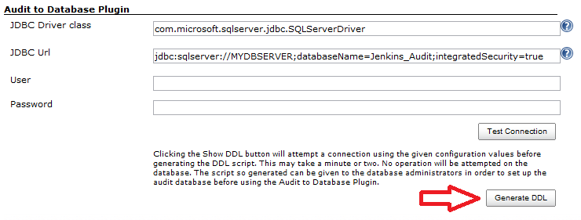
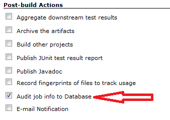
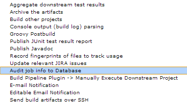
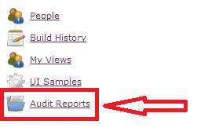
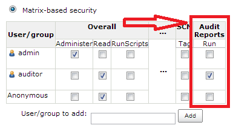

The current version of this plugin may not be safe to use. Please review
the following warnings before use:

-   [Audit to Database Plugin stores credentials in plain
    text](https://jenkins.io/security/advisory/2019-04-03/#SECURITY-966)
-   [CSRF vulnerability and missing permission check allow connecting to
    arbitrary
    databases](https://jenkins.io/security/advisory/2019-04-03/#SECURITY-977)

Download latest release from
[jenkins-ci.org](http://maven.jenkins-ci.org/content/repositories/releases/org/jenkins-ci/plugins/audit2db/)

Download latest continuous integration release from
[CloudBees](https://buildhive.cloudbees.com/job/jenkinsci/job/audit2db-plugin/lastBuild/org.jenkins-ci.plugins$audit2db/) 


### Plugin Info

This plugin provides database audit functionality to Jenkins. It allows
recording build information to database, including the build parameters
(if any), the node where the build is executed, and the user who started
the build.  
Jenkins activity is already being stored in XML files. However, historic
activity can be easily lost due to configuration (e.g. keep only the
latest "n" builds), and is not easy to report off. As Jenkins is already
much more than just a continuous integration platform, this plugin will
help those organisations that have strict audit and reporting
requirements. For example, if a job is meant to deploy artifacts to a
production environment, organisations may want to record that job's
activity and report off historical data for compliance purposes, showing
when the job was executed, by whom, with what parameters, and on which
Jenkins slave.

### Installation

Database connections are established via JDBC, so you have to ensure a
valid JDBC driver for your database can be found by this plugin. This
can be accomplished in two ways:

#### Use the Jenkins classpath

If Jenkins is running as a standalone application, you can put the JDBC
driver package in the `war/WEB-INF/lib` directory. If Jenkins is running
inside a J2EE container (e.g. Tomcat) you can use the container's
classpath instead (consult the container's documentation for details).

#### Use the plugin's classpath

Regardless of whether jenkins is running as a standalone application or
as a web application inside a J2EE container, you can put the JDBC
driver package in `$JENKINS_HOME/plugins/audit2db/WEB-INF/lib`. This
directory will be created the first time you run the plugin inside
Jenkins, so if you can't see it (and assuming you have actually already
installed the audit to database plugin), then try restarting Jenkins.

MS SQL Server and Integrated Authentication

If you want to use MS SQL Server with Integrated Authentication, you
might want to check [this article from the
MSDN](http://blogs.msdn.com/b/jdbcteam/archive/2007/06/18/com-microsoft-sqlserver-jdbc-sqlserverexception-this-driver-is-not-configured-for-integrated-authentication.aspx)
for troubleshooting a common situation.

This plugin has been tested with the following JDBC drivers:

``` syntaxhighlighter-pre
org.hsqldb.jdbc.JDBCDriver
oracle.jdbc.driver.OracleDriver
com.microsoft.sqlserver.jdbc.SQLServerDriver
```

JDBC Driver Redistribution

This plugin does **NOT** ship with any JDBC drivers. Yes, it may be
useful to ship supported drivers with the plugin, but it can quickly
become a bit of a headache to manage redistribution licenses so we'll
keep it simple instead... or at least until we get the time (and will)
to study the relevant licensing terms.

### Usage

Before you can use the plugin you need to set up the audit database. In
the Jenkins global configuration page, enter the JDBC connection details
for your audit database and test the connection.


If the connection is successful, click on the `Advanced` button and the
`GenerateDDL` button will appear. This will allow you to generate the
data definition script to set up the audit database.



The DDL is generated as a temporary file in the plugin's home folder,
and its contents displayed. The temporary file gets deleted right away.
Because of this, the account used to run Jenkins must have full rights
on the plugin's folder. This should already be the case, but it's
something to check if an error occurs during the DDL generation. In any
case, the audit database schema is given below on this page.

If you have any DBAs, it is a good idea to pass this script over to them
now. It is also a good idea to discuss in detail your audit reporting
requirements with your DBAs, so that they can configure the appropriate
indexes on the audit tables and help you build your reporting queries.

Once your audit database is ready, you can enable this plugin in the
`Post-build Actions` section of the job configuration. This step might
look slightly differently from the screenshots below, depending on the
version of Jenkins being used.





### The Audit Reports

This plugin comes with some basic reports to help the audit activity.



By default, only users with administrative rights are able to access the
reports. This can be changed by using the Jenkins configuration page and
enabling Matrix-based security.



### The Audit Database Schema

If you need to build other reports, then you can build them outside of
Jenkins by queryng the audit database. The audit database schema is
extremely simple and becomes very clear once you generate the DDL
script. It consists of 3 tables:

##### JENKINS\_BUILD\_DETAILS

| Field Name | Type   | Description                                                                               |
|------------|--------|-------------------------------------------------------------------------------------------|
| ID         | String | Primary Key.                                                                              |
| NAME       | String | The name of the project that the build refers to.                                         |
| FULLNAME   | String | Full name of the build, includes the project name and build number. E.g. "TestProj \#44". |
| NODE\_URL  | String | Foreign key on JENKINS\_BUILD\_NODE.                                                      |
| STARTDATE  | Date   | The build's start date.                                                                   |
| ENDDATE    | Date   | The build's end date.                                                                     |
| DURATION   | Number | The build's duration in milliseconds.                                                     |
| USERID     | String | The id of the user who started the build (NULL for Anonymous).                            |
| USERNAME   | String | The name of the user who started the build.                                               |
| RESULT     | String | The build result.                                                                         |

##### JENKINS\_BUILD\_NODE

| Field Name     | Type   | Description                                                                                                                                                                           |
|----------------|--------|---------------------------------------------------------------------------------------------------------------------------------------------------------------------------------------|
| URL            | String | Primary Key.                                                                                                                                                                          |
| NAME           | String | The internal name of the node where builds get executed.                                                                                                                              |
| DISPLAYNAME    | String | The name of the node as displayed to the user. This is not always the same as the node's internal name. For example, the master's `name` is blank, but its `displayname` is 'master'. |
| MASTERHOSTNAME | String | The hostname of the master that owns the build node.                                                                                                                                  |
| MASTERADDRESS  | String | The IP address of the master that owns the build node.                                                                                                                                |
| LABEL          | String | The label associated with this node in Jenkins                                                                                                                                        |
| DESCRIPTION    | String | The description of this node in Jenkins                                                                                                                                               |

##### JENKINS\_BUILD\_PARAMS

| Field Name       | Type   | Description                            |
|------------------|--------|----------------------------------------|
| ID               | String | Primary Key                            |
| NAME             | String | The parameter name                     |
| VALUE            | String | The parameter value                    |
| BUILDDETAILS\_ID | String | Foreign key on JENKINS\_BUILD\_DETAILS |

------------------------------------------------------------------------

### TODO List

-   Support JNDI datasource.
-   Write more audit reports to display in Jenkins.

------------------------------------------------------------------------

### Known Issues

-   Plugin will not work with JDK 1.6\_29 due to a bug in the JDK.
    See [this
    article](https://forums.oracle.com/forums/thread.jspa?messageID=9954398&tstart=0) or
    [this
    article](http://social.msdn.microsoft.com/Forums/en/sqldataaccess/thread/97dce8fd-6487-4bca-80b0-492167db3e0d) for
    details. 

------------------------------------------------------------------------

### Changelog

##### Version 0.5

Fixed a bug in Jobs By Date report that prevented users from applying
filter criteria.

##### Version 0.4

Added Jobs By Param report to show jobs that have been executed with the
same parameter value.

##### Version 0.3

Now scrambling datasource password in Jenkins configuraton XML file.

Added Jobs By Date report to show jobs executed between two dates
(defaults to current month activity).

Added Audit Reports page to list all available reports.

Added audit reports RUN permission option in matrix-based Jenkins
security.

##### Version 0.2

Added master hostname and IP address in the build node details.

Added build result in the build details.

##### Version 0.1

Initial working version.
