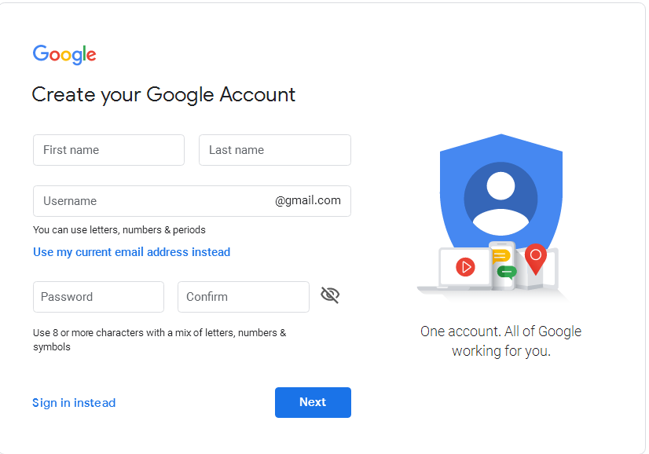
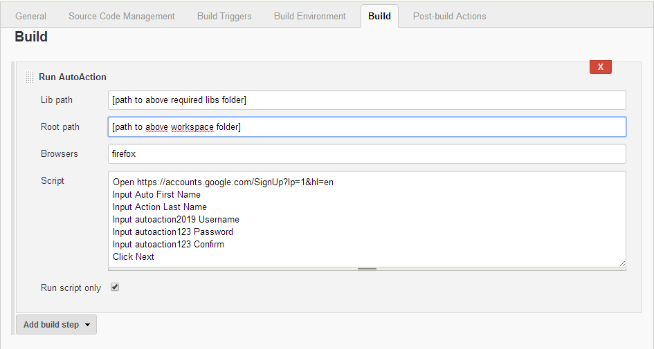
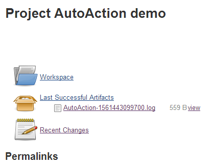
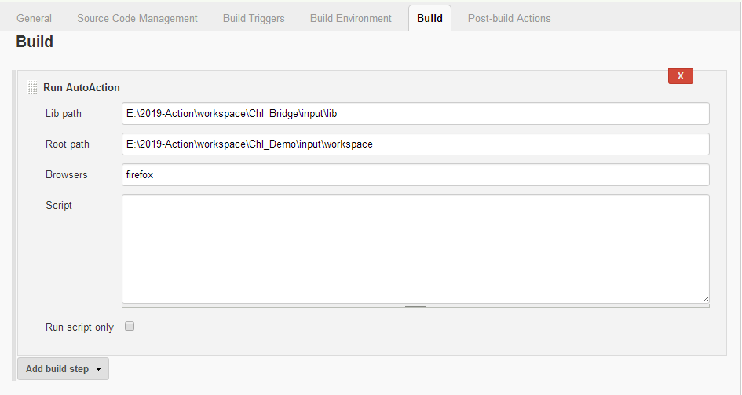

*Run the auto actions from "flat lines" scripts based on Selenium
WebDriver*

This plugin is used to simplify the usage of Selenium WebDriver which is
main tool for Automate testing and other tasks.

For example, to complete below form:

{width="826"
height="578"}

We just need few lines as below:

**Script content**

``` syntaxhighlighter-pre
Open https://accounts.google.com/SignUp?lp=1&hl=en
Input Auto First Name
Input Action Last Name
Input autoaction2019 Username
Input autoaction123 Password
Input autoaction123 Confirm
Click Next
```

instead of complex coding by Java, or Python ...

# Prerequisites

** T*o
avoid some issues with Windows security,* *please start JENKINS server
from WAR file (not from Window service mode)***

**Install browser** ( in case the browser is installed at different
machine, please refer to [Selenium
Grid](https://www.seleniumhq.org/docs/07_selenium_grid.jsp) and [Selenium
Grid config
samples](https://developers.perfectomobile.com/pages/viewpage.action?pageId=21435360)
and skip this step)

AutoAction plugin will open real browser and execute the actions, so the
browser is required to be installed at the machine hosting Jenkins
server  

-   Firefox browser: <http://getfirefox.com/>
-   Chrome browser
-   Edge browser

**Download browser driver**

-   Firefox driver: get it from
    <https://github.com/mozilla/geckodriver/releases>  
    (For **Window Vista/Windows 8**, there are issues with the few
    recent versions, please get the version 0.17.0
    <https://github.com/mozilla/geckodriver/releases/tag/v0.17.0> )
-   For other drivers please refer to:
    <https://www.seleniumhq.org/download/>  

**Download required libs**

The plugin requires the libs(\*.jar)  in for executing the AutoAction
scripts

-   Please get libs from
    repository <https://github.com/vochithanh/autoaction-lib.git>

**Download the workspace**

The plugin requires the workspace folder for the cofigurations

-   Please get workspace folder from
    repository <https://github.com/vochithanh/autoaction-workspace.git>  

# Preparing

-   Copy above required libs to a folder
-   Copy above worksapce to a folder
-   Copy above Firefox driver (**geckodriver.exe**) file to folder
    **drivers** under **workspace folder**

# Your first AutoAction running

Below steps will help you run the auto action script via Jenkins job

-   Create new project (Freestyle project is prefered)
-   Open Configuration
-   Go to Build
-   Add build step: "**Run AutoAction**"

{height="250"}

-   Filling values (as below): Lib path, Root path, Browsers, Scripts,
    Run script only

{height="400"}

**Script content**

``` syntaxhighlighter-pre
Open https://accounts.google.com/SignUp?lp=1&hl=en
Input Auto First Name
Input Action Last Name
Input autoaction2019 Username
Input autoaction123 Password
Input autoaction123 Confirm
Click Next
```

  

-   Click Save and Click "Build Now" to run the job
-   After few seconds, a browser window would be openned and go to
    Google account site up page, filling the values to the form and go
    to the next page
-   View the statuses of steps

{height="400"}

  

# Sample AutoAction scripts from workspace

For complex cases (e.g. auto testing purpose), multiple test cases need
to be run. Please put the content of test cases to files with extension
is "**chl**" and copy them to anywhere in workspace folder. When
running, the plugin will find them and run the script content from them.

-   Change the configuration of above Jenkin project as below (clear
    content of **Script** text area and uncheck "**Run script only**"
    checkbox)

{height="400"}  

-   Click Save and Click "Build Now" to run the job
-   Now, system will find 2 files in
    workspace: **creategoogleaccount.chl**
    and **createmicrosoftaccount.chl** and run the script content of
    them.

  

# Config browsers field

The value for "Browsers" field could be:

-   firefox → Firefox browser
-   chrome → Chrome browser
-   edge → Edge browser
-   http://\[hub-ip\]:\[port\]/wd/hub,\[browser\] for Selenium Grid
    case, e.g. <http://hub:4441/wd/hub,firefox>

# AutoAction syntax

Each line in script is an action. Currently, below list is the supported
acions:

[TABLE]

Please refer to sample scripts from **creategoogleaccount.chl**
and **createmicrosoftaccount.chl**

***System would skip all lines which contains unsupported actions.***

To make the script more readable, the complex text (e.g. url, value with
spaces) can be put in **dictionary files** (any file with extension
\*.**dic**) with format: key = value. Please refer to sample
dictionaries files under workspace folder: **form.dic** and **url.dic**
