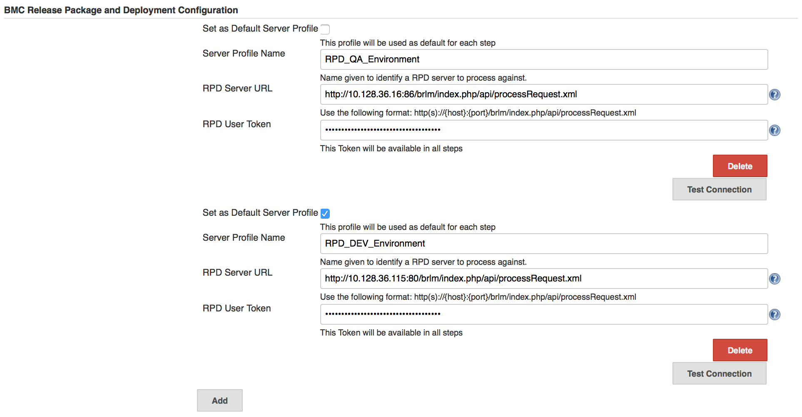
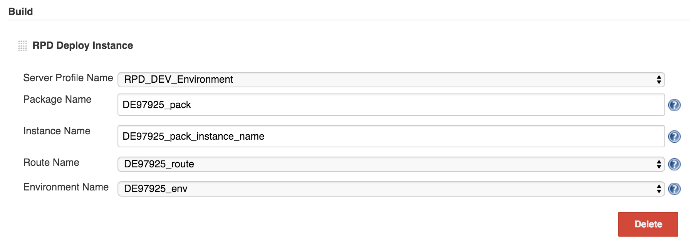
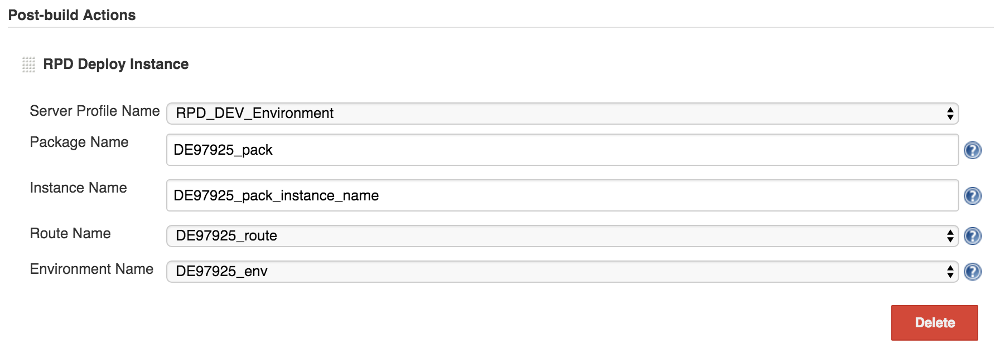

| Plugin Information                                                                                                     |
|------------------------------------------------------------------------------------------------------------------------|
| View BMC Release Package and Deployment [on the plugin site](https://plugins.jenkins.io/bmc-rpd) for more information. |

The current version of this plugin may not be safe to use. Please review
the following warnings before use:

-   [Credential stored in plain
    text](https://jenkins.io/security/advisory/2020-02-12/#SECURITY-1547)

  
The RPD Plugin integrates Jenkins with BMC Release Package and
Deployment (RPD) by adding two build and post-build actions to your
Jenkins build configuration,  
which can be executed separately or combined sequentially:

-   Create an instance
-   Deploy an instance

### Requirements

-   RPD 4.4.00 and later
-   Jenkins 1.639 and later

#### Dependencies

-   Apache Maven 3.0.5 or later

To build this plugin from the source code, in the project root
directory, run the following command:

``` syntaxhighlighter-pre
shell
mvn package
```

This command will generate the **.hpi** file for you.

#### Local installation

1.  Run the **mvn package** command to generate **/target/bmc-rpd.hpi**.
2.  Remove the previous **bmc-rpd.hpi** file from
    **$user.home/.jenkins/plugins/** and copy a new one into the same
    location.
3.  Restart Jenkins.

### RPD Plugin Configuration

##### **To configure the RPD Plugin:**

1.  Go to **Manage Jenkins \> Configure System**.
2.  In the **BMC Release Package and Deployment Configuration** section,
    click **Add**, and provide the following information:
    -   **Set as Default Server Profile**: Select this option to set the
        specified profile as the default one.  
        If you do not select the default profile, the first one will be
        selected by default.
    -   **Server Profile Name**: Custom name for the RPD server profile.
    -   **RPD Server URL**: The URL that identifies the RPD Server on
        which processing will occur.
    -   **RPD User Token**: User token that will be used to authenticate
        against RPD. For more information,  
        see
        <https://docs.bmc.com/docs/display/rpd48/Creating+authentication+tokens>.
3.  *(Optional)* To verify connection to the RPD server, click **Test
    Connection**.
4.  Click **Save**.

 
{width="700"}

### Job Configuration

##### **To create a RPD instance:**

1.  Click **New Item** to create a new job.
2.  In the **Build** section, from the **Add build step** list, select
    **RPD Create Instance**.
3.  In the **RPD Create Instance** section, provide the following
    information:
    -   **Server Profile Name**: Custom name for the RPD server profile.
    -   **Package Name**: Name of the package where you want to create
        the RPD instance.
    -   **Instance Name**: *(Optional)* Custom name for the RPD instance
        that you want to create.  
        If you do not specify an instance name, the name specified in
        RPD will be used.
4.  Click **Save**.

 
{width="700"}

##### **To deploy a RPD instance:**

1.  Click **New Item** to create a new job.
2.  In the **Build** section, from the **Add build step** list,
    select **RPD Deploy Instance**.
3.  In the **RPD Deploy Instance** section, provide the following
    information:
    -   **Server Profile Name**: Custom name for the RPD server profile.
    -   **Package Name**: Name of the package where you want to deploy
        the RPD instance.
    -   **Instance Name**: *(Optional)* Custom name for the RPD instance
        that you want to deploy.  
        If you do not specify an instance name, the name specified in
        RPD will be used.
    -   **Route Name**: Route where to deploy the RPD instance.
    -   **Environment Name**: Environment where to deploy the RPD
        instance.
4.  Click **Save**.

 
{width="700"}

### Job Configuration as a Post-build Action

##### **To create a RPD instance:**

1.  Click **New Item** to create a new job.
2.  In the **Post-build** **Actions** section, from the **Add post-build
    action** list, select **RPD Create Instance**.
3.  In the **RPD Create Instance** section, provide the following
    information:
    -   **Server Profile Name**: Custom name for the RPD server profile.
    -   **Package Name**: Name of the package where you want to create
        the RPD instance.
    -   **Instance Name**: *(Optional)* Custom name for the RPD instance
        that you want to create.  
        If you do not specify an instance name, the name specified in
        RPD will be used.
4.  Click **Save**.

 
{width="700"}

##### **To deploy a RPD instance:**

1.  Click **New Item** to create a new job.
2.  In the **Post-build Actions** section, from the **Add build
    step** list, select **RPD Deploy Instance**.
3.  In the **RPD Deploy Instance** section, provide the following
    information:
    -   **Server Profile Name**: Custom name for the RPD server profile.
    -   **Package Name**: Name of the package where you want to deploy
        the RPD instance.
    -   **Instance Name**: *(Optional)* Custom name for the RPD instance
        that you want to deploy.  
        If you do not specify an instance name, the name specified in
        RPD will be used.
    -   **Route Name**: Route where to deploy the RPD instance.
    -   **Environment Name**: Environment where to deploy the RPD
        instance.
4.  Click **Save**.

Note

For the post-build action, you can create and deploy only one instance.

 
{width="700"}

### Variables

When creating an instance, use the following custom variables:

-   RPD\_\<Package name\>\_instance\_name – allows using an instance
    name for the next deployment or in some kind of notifications.
-   RPD\_\<Package name\>\_instance\_id – allows using an instance name
    for the next deployment or in some kind of notifications.

Notes

• If you create an instance, deploy an instance, and specify the same
package name for both actions  
  but without a specified instance name, then the instance name will be
uploaded from RPD.

• If you create an instance with both package name and instance name
specified, deploy an instance with the same package name  
  but without a specified instance name, then RPD will deploy the
instance that you have just created.

You can also use standard Jenkins variables. To see the list of standard
variables, go to [Jenkins Set Environment
Variables](https://wiki.jenkins-ci.org/display/JENKINS/Building+a+software+project#Buildingasoftwareproject-JenkinsSetEnvironmentVariables.).

### RPD Instance Logs

##### **To see the** **RPD instance create and deploy** **logs:**

Click **Jenkins**, select the necessary job, and click **Console
Output**.

### RPD Secure Connection

##### **To install the certificate authority (CA):**

1.  Go to the necessary URL, click the HTTPS certificate chain, and then
    click **Certificate information**.
2.  On the **Details** tab, click **Copy to File…**
3.  Install the CA by running the following command: keytool -import
    -alias example -keystore/path/to/cacerts -file example.der.

Note

Ensure that you are installing the CA on the same computer where Jenkins
is installed.
