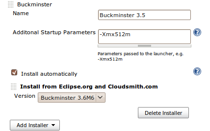
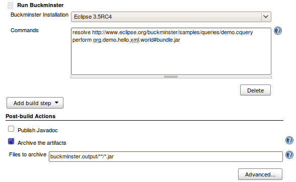
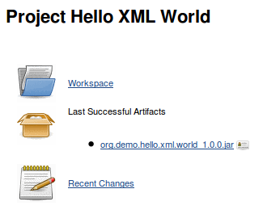
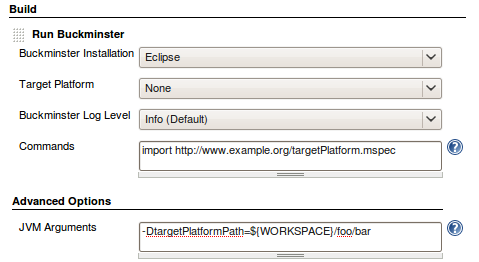

This PlugIn integrates [Eclipse
Buckminster](http://www.eclipse.org/buckminster "Eclipse Buckminster")
as a new build step into Jenkins.  

# Usage

To use buckminster you need to configure at least one Buckminster
installation. This is done in the Jenkins configuration. The easiest way
to do this, is to use the 'Install automatically' feature. Enter a name
for the Buckminster installation, select a version from the dropdown box
and buckminster will be installed as needed when you run a buckminster
build step. The installed buckminster will contain every feature from
the respective headless update-site on eclipse.org as well as the
'subclipse' feature from cloudsmith.com.

If you activate the 'update automatically' checkbox, a check for updates
will be performed before a build gets executed. If features have been
updated or new features get available, they will automatically
provisioned into the buckminster installation.  
 
  
If you have extended buckminster, simply want another feature
configuration, or download from other repositories, you can customize
the installation. Currently there is the following options available:

1.  Deactivate 'Install automatically' and enter the home path to an
    existing buckminster installation (usually a buckminster folder that
    contains a plugins/ and a features/ directory)
2.  Execute a shell script to fetch and configure buckminster
3.  Extract a preconfigred buckminster from an archive
4.  place a 'buckminster.json' file under
    JENKINS\_HOME/userContent/buckminster to override the default
    installer configuration. The file must list all available
    buckminster versions, the URL to the p2 director application, the IU
    of the product to be provisioned as well as the p2 repositories and
    the features to install from these repositories. The file structure
    is defined as following:
         {"buckminsters":[
                {"id":"3.5",
                  "name":"Buckminster 3.5",
                  "url":"http://example.org/p2_director.zip",
                  "iu":"org.eclipse.buckminster.cmdline.product",
                  "repositoryURL":"http://example.org/p2Repository",
                  "repositories":[
                        {
                            "url":"http://example.org/p2Repository",
                            "features":[
                                {"id"="feature.one"},
                                {"id"="feature.two"}
                           ]
                       }
                  ]
              }
           ]
        }

    Once the instance is configured it can be used as a build step  
       
    

Those screenshot show the setup for the Buckminster [Hello XML World
Example](http://wiki.eclipse.org/Hello_XML_World_Example_(Buckminster) "Hello XML World Example").
Running it will produce the following result:  
   

## Target Platform Publisher (Experimental)

The Target Platform Publisher can be used to share a definition of an
eclipse target platform between different projects that build eclipse
plugins with buckminster. To make use of these capabilities you need to
create a new job that creates a target platform first. This can be done
for example with one or more MSPECs (detailed information on when and
how to use MSPECs can be found in the [Buckminster
Book](http://www.eclipse.org/downloads/download.php?file=/tools/buckminster/doc/BuckyBook.pdf)),
or simply by downloading/copying an update-site or eclipse package to
the workspace.  
  
 Once the build is set for the target platform, you need to publish the
created artifact. To do so, activate the Target Platform Publisher,
enter the directory where your target platform can be found and give the
artifact a name.  
  
This will archive the target platform produced by the build and makes it
available to other projects under the name 'MailApp Target Platform'.
All other jobs that have a Buckminster build step may now choose from
all published Target Platforms in the build-step configuration.

This will also introduce the project that creates the target platform as
an upstream project of the job that depends on the target platform:

!UpstreamProject.png! 

# Remarks

  

-   If a *perform* command is executed, the PlugIn sets the property
    buckminster.output.root to *JOB\_WORKSPACE/buckminster.output* to
    make all artifacts appear in the actual job workspace.
-   The working and data directory of buckminster is set to the
    directory of the job workspace. This is especially useful if you
    want your code to be checked out with Jenkins and only do a local
    resolution of the already checked-out source code from within
    buckminster.  

# Known Limitations

-   So far the Buckminster PlugIn works only for freestyle and matrix
    projects.
-   When using the Target Platform Publisher you need to make sure that
    the job that's exporting the Target Platform runs on the same node
    as the jobs that make use of it.

# Changelog

### Version 1.1.1 (17.02.2013)

-   fixed
    [JENKINS-13218](https://issues.jenkins-ci.org/browse/JENKINS-13218 "JENKINS-13218") -
    Can't add build step on current Jenkins
-   fixed
    [JENKINS-10089](https://issues.jenkins-ci.org/browse/JENKINS-10089 "JENKINS-10089") -
    Recent versions of Buckminster (3.7 and 4.2) can now be installed in
    Jenkins configuration
-   help contents is visible when Jenkins is installed on Tomcat

### Version 1.0.8 (15.01.2011)

-   fixed
    [JENKINS-8186](http://issues.jenkins-ci.org/browse/JENKINS-8186 "JENKINS-8186") -
    Version Property not available in Buckminster Plugin  1.0.5
-   fixed
    [JENKINS-8459](http://issues.jenkins-ci.org/browse/JENKINS-8459 "JENKINS-8459") -
    Add way of passing arbitrary options to the equinox launchers

### Version 1.0.4 (09.10.2010)

-   fixed
    [JENKINS-7118](http://issues.jenkins-ci.org/browse/JENKINS-7118) -
    Add a field where the path to a global property file can be
    specified
-   fixed
    [JENKINS-7037](http://issues.jenkins-ci.org/browse/JENKINS-7037) -
    Check if Buckmister\_3.x/directory is available
-   fixed
    [JENKINS-7672](http://issues.jenkins-ci.org/browse/JENKINS-7672) -
    Missing help text for "Path to Target Platform"

### Version 1.0.3 (11.05.2010)

-   Fixed
    [JENKINS-6488](http://issues.jenkins-ci.org/browse/JENKINS-6488)
    (Buckminster doesn't inherit environment variables)

### Version 1.0.2 (06.04.2010)

-   Fix for Buckminster invocation (see
    [Bug\#287575](https://bugs.eclipse.org/bugs/show_bug.cgi?id=287575)
    for details)

### Version 1.0.1 (02.04.2010)

-   Several fixes for Distributed Builds and Windows Nodes
-   Fixed a NullPointerException during Form validation

### Version 1.0.0 (27.03.2010)

-   Distributed Builds (Master/Slave) are now supported
-   Buckminster Installations can now be updated automatically every
    time you run a build. See
    [JENKINS-6065](http://issues.jenkins-ci.org/browse/JENKINS-6065) for
    details.

### Version 0.9.5 (24.03.2010)

-   it's now possible to configure the buckminster workspace,
    buckminster.temp.root and buckminster.output.root
    [JENKINS-6040](http://issues.jenkins-ci.org/browse/JENKINS-6040)
-   Instead of entering commands in the text area you can now also
    specify a script file in the workspace
    [JENKINS-6038](http://issues.jenkins-ci.org/browse/JENKINS-6038)
-   fixed
    [JENKINS-6039](http://issues.jenkins-ci.org/browse/JENKINS-6039) 
-   fixed
    [JENKINS-5971](http://issues.jenkins-ci.org/browse/JENKINS-5971)

### Version 0.9.4 (22.03.2010)

-   Support for automatic Tool installation from
    Eclipse.org/Cloudsmith.com
-   Support for automatic Tool installation from custom sources or
    custom feature configurations

### Version 0.9.3 (10.12.2009)

-   fixed
    [JENKINS-5004](http://issues.jenkins-ci.org/browse/JENKINS-5004) -
    Plugin relies on 'java' being in the system path

### Version 0.9.2 (25.11.2009)

-   fixed
    [JENKINS-4947](http://issues.jenkins-ci.org/browse/JENKINS-4947) -
    WORKSPACE variable not working on windows systems

### Version 0.9.1 (06.08.2009)

-   fixed [Issue
    4171](https://hudson.dev.java.net/issues/show_bug.cgi?id=4171) -
    Target Platform Publisher fails for Matrix Projects

### Version 0.9 (03.08.2009)

-   added a target platform publisher (experimental)
-   canceling builds should now work properly 

### Version 0.8.4 (23.07.2009)

-   Set buckminster.temp.root to $workspace/buckminster.temp
-   Property expansion for additional properties of each eclipse
    installation (hudson configuration)

### Version 0.8.3 (17.07.2009)

-   Support for Matrix Jobs (thanks to Carsten Reckord)

### Version 0.7.1 (11.07.2009)

-   The build step configuration contains a new advanced section to add
    additional JVM parameters
-   Ant-style property expansion works now in commands and JVM
    parameters (Hudson environment variables can be used that way)

### Version 0.6 (19.06.2009)

Initial release
