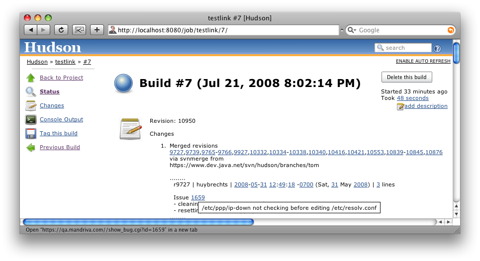

This plugin integrates [Bugzilla](http://www.bugzilla.org/) into
Jenkins. It hyperlinks bug numbers that appear in changeset descriptions
to the bugzilla bug detail page. It can also, optionally, add a tooltip
to each linked bug, showing the bug 'summary' text.

##### This plugin [needs a new maintainer](http://n4.nabble.com/Bugzilla-plugin-needs-new-maintainer-td1016194.html)

Jenkins needs to know the URL to your bugzilla server. In addition, you
can specify a username and password to the bugzilla server. If login is
required to see bug detail, then the username and password are necessary
for the tooltip feature. Note that the password is stored in plaintext
within Jenkin's configuration files. Here is an example configuration
page, with the bugzilla project's own bugzilla server:  
  
Once the plugin is configured, all numbers are hyperlinked and get
tooltips. Since there is no convention to distinguish bugzilla bug
numbers, all integers get hyperlinked. Here is a nonsensical example of
a changeset on Jenkin's SVN server, linked with the mandriva Bugzilla
database, with the mouse cursor over bug 1659. Note that the revisions
are hyperlinked in addition to Issue 1659:  

## Change Log

##### Version 1.5 (Nov 05, 2011)

-   [JENKINS-11614](https://issues.jenkins-ci.org/browse/JENKINS-11614)

##### Version 1.4 (Jan 30, 2010)

-   Update code for more recent Hudson

##### Version 1.3 (Jan 29, 2009)
