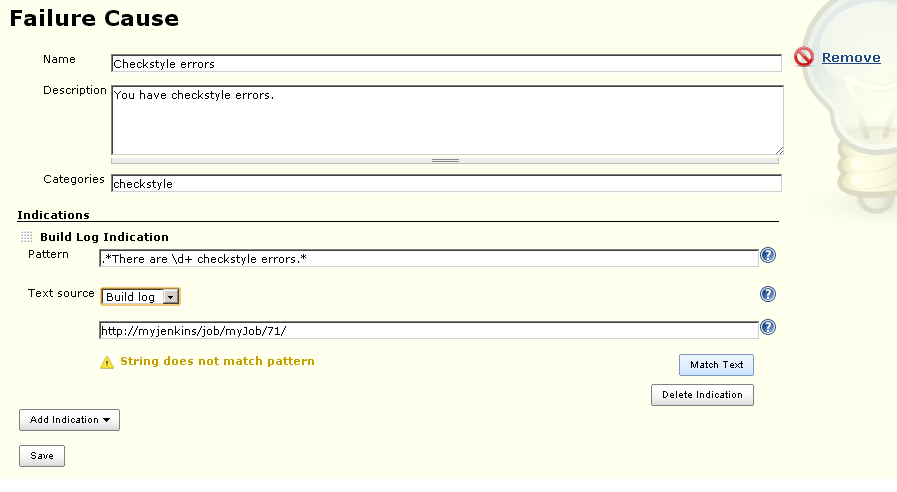
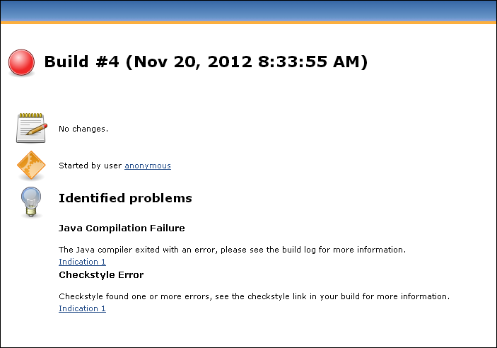
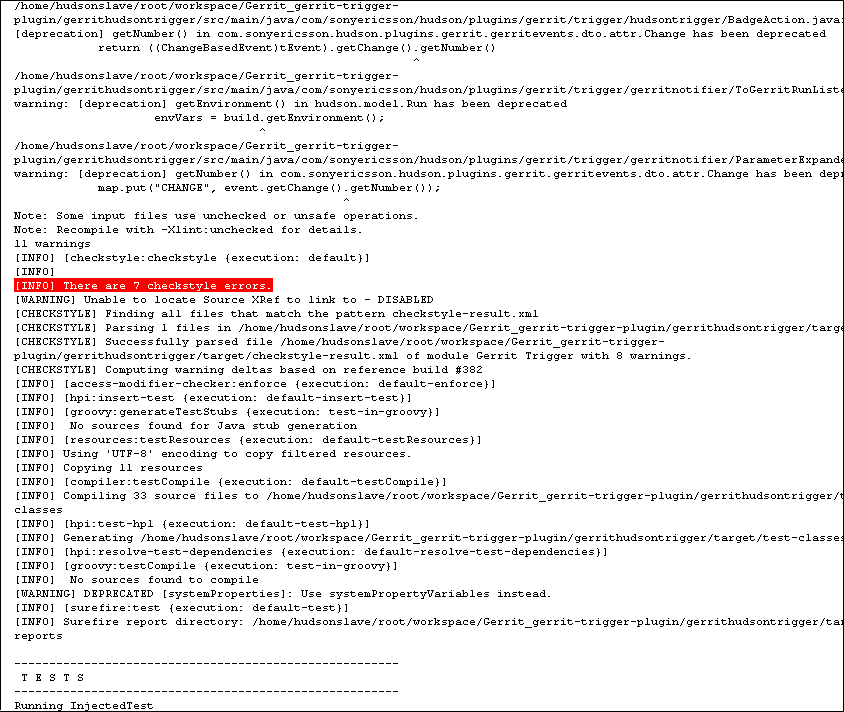

This plugin analyzes the causes of failed builds and presents the causes
on the build page. It does this by using a knowledge base of build
failure causes that is built up from scratch.  
Saving statistics about failure causes is also possible.

### Knowledge base

The plugin comes with an empty knowledge base of failure causes.
Populating this knowledge base is done by using the link "Failure Cause
Management".  
The link is shown only if the permission UpdateCauses is set for the
current user. Press "Create new" and add a name and a description for
the Failure Cause.  
The description should contain the reason why this build failed as well
as possible solutions for the build failure.

One or more optional categories can be added as a whitespace-separated
list. These categories are only used for the statistics part of the
plugin.  
Add one or more Indications by pressing "Add Indication". By default,
only one type of Indication exists, a "Build Log Indication".  
Plugin developers can add new Indication types and more are planned to
be added to the plugin itself.  
The Build Log Indication searches through the build log, one line at a
time, for a regular expression.

It uses Pattern.match, so the regular expression needs to match should
be as follows

[TABLE]

  
*Adding new failure causes and indications to the knowledge base.*

From version 1.3.1 of the plugin, regular expressions can be tested on
the Failure Cause Management page, in two different ways:

-   Writing a text in the text field shown above and testing against
    that.
-   Writing a URL to a build log in the text field. The plugin then runs
    through the log trying to match the regexp.

When accessing the Failure Cause Management page from a build, the URL
will be added to the text field automatically.

The plugin comes with two ways of saving the knowledge base:

-   Local knowledge base. Saves the knowledge base in memory and
    serializes it as an xml file on the local Jenkins server (i.e. the
    "standard" Jenkins way of saving information).
-   MongoDB knowledge base. Saves the knowledge base in a Mongo
    database. This can be used to share the  
    same knowledge base between servers. The knowledge base is still
    cached locally in-memory to avoid unnecessary database accesses.  
    Plugin developers can add new knowledge base types.

### Build log scanning

All builds on the server that are non-successful (aborted, failed,
unstable) will be scanned for all failure causes.   
If an indication is found, the description will be put directly on the
build page, with a link to the matching line in the build log.  
If no cause is found, a text stating this will be shown. The text is
configurable on the main configuration page of the server.  
  
*The build page when the build failure analyzer has found a failure
cause.*

  
*The build log with the matching line marked in red.*

### Statistics

If MongoDB or some knowledge base type that supports statistics is used,
statistics will be saved to that database. The same information  
that is shown on the build page is saved to the database.

### Administrative settings

On the configure system page in Jenkins, under Build failure analyzer,
some new settings are available:

-   Enabled - since the plugin scans all failed builds, we felt the need
    to be able to disable the scanning. Uncheck to disable.
-   Text when no failure causes are found - text to show for failed
    builds whose failure cause is not found in the knowledge base.
-   Storage type - Jenkins Local or Mongo DB, as described above. For
    Mongo DB, configuration details to fill in are as follows: Host,
    Port, Database name, Username and Password for the Database, Enable
    Statistics logging (described above).
-   Convert knowledge base - If this check box is checked when the
    configuration is saved and a change has been made to the knowledge
    base settings, the data from the old knowledge base will be added to
    the new one. Note that duplicates could appear this way, so make
    sure that you untick this check box if you for example just have
    changed the username or password, or if you want to start with a
    clean knowledgebase.
-   Send notifications to Gerrit-Trigger-plugin - if enabled, will send
    the text for the found failure cause via the gerrit-trigger-plugin
    to Gerrit.
-   Concurrent scans - To speed up the scanning, each build will get a
    threadpool of this number of threads, with each thread handling one
    indication. For a small system, 3 is usually enough.

## Token Macro integration

### Usage:

${BUILD\_FAILURE\_ANALYZER, includeTitle=true, includeIndications=true,
useHtmlFormat=true, noFailureText="Sometext"}

### Parameters (=default):

-   **includeTitle (=true)** -- When true, the "Identified problems:"
    title will appear over the causes.
-   **includeIndications (=true)** -- When true, the indication numbers
    and links into the console log are included in the token replacement
    text.
-   **useHtmlFormat (=false)** -- When true, the replacement will be an
    HTML snippet.
-   **wrapWidth (=0)** -- Wrap long lines at this width. If wrapWidth is
    0, the text isn't wrapped. Only applies if useHtmlFormat == false.
-   **noFailureText (="")** -- Text to provide if there are no found
    failures

### Token macro in Jenkins Pipeline DSL:

    node {
       def buildFailure = tm('${BUILD_FAILURE_ANALYZER}')
    }

## Placeholders in description

Replace description placeholders from captured expressions in found
indications

Substitutions may be made within the description with placeholders of
the form **${I,G}**, where **I** is the indication number and **G** is
the captured group within the indication expression. e.g., **${1,1}**
would be replaced with the first indication's first captured group and
**${1,2}** would be replaced with the first indication's second captured
group.

## Tips & Tricks

### Aggregate statistics to Graphite

If you are using the MongoDB KnowledgeBase, you can use these scripts in
a cron job to aggregate the statistics into Graphite. Note that they
only work on mongo 2.x node js driver

-   [Known vs Unknown Failures per
    hour](https://gist.github.com/rsandell/9484345)
-   [Failure Categories per
    hour](https://gist.github.com/rsandell/9484534)

### Known bugs

A full list of [open bugs raised against
build-failure-analyzer](https://issues.jenkins-ci.org/issues/?jql=component%20%3D%20build-failure-analyzer-plugin%20and%20resolution%20is%20empty%20order%20by%20updated%20desc) component..

Key

Summary

T

Created

Updated

Assignee

Reporter

P

Status

Loading...

Refresh

## Change Log

#### From 1.23.1 the change log is on [GitHub releases](https://github.com/jenkinsci/build-failure-analyzer-plugin/releases)

#### Version 1.23.0 (released Aug 23, 2019)

-   Update jackson from 2.9.3/2.9.7 to 2.9.9 CVE-2019-12086 ([Pull
    \#99](https://github.com/jenkinsci/build-failure-analyzer-plugin/pull/99))
-   [ JENKINS-47027](https://issues.jenkins.io/browse/JENKINS-47027) -
    Getting issue details... STATUS  Fix umlauts ([Pull
    \#109](https://github.com/jenkinsci/build-failure-analyzer-plugin/pull/109))
-   New feature: fallback causes ([Pull
    \#108](https://github.com/jenkinsci/build-failure-analyzer-plugin/pull/108))
-   [ JENKINS-22026](https://issues.jenkins.io/browse/JENKINS-22026) -
    Getting issue details... STATUS  New DownstreamBuildFinder using
    build-cache-plugin ([Pull
    \#107](https://github.com/jenkinsci/build-failure-analyzer-plugin/pull/107))
-   [ JENKINS-54439](https://issues.jenkins.io/browse/JENKINS-54439) -
    Getting issue details... STATUS  -
    [JCasC](https://jenkins.io/projects/jcasc/) compatibility ([Pull
    \#97](https://github.com/jenkinsci/build-failure-analyzer-plugin/pull/97))
-   [ JENKINS-42755](https://issues.jenkins.io/browse/JENKINS-42755) -
    Getting issue details... STATUS  - Missing pipeline logs ([Pull
    \#103](https://github.com/jenkinsci/build-failure-analyzer-plugin/pull/103))
-   [ JENKINS-54840](https://issues.jenkins.io/browse/JENKINS-54840) -
    Getting issue details... STATUS  - Stop calling get log file ([Pull
    \#106](https://github.com/jenkinsci/build-failure-analyzer-plugin/pull/106))
-   Upgrade parent pom and checkstyle ([Pull
    \#98](https://github.com/jenkinsci/build-failure-analyzer-plugin/pull/98))
-   [ JENKINS-57812](https://issues.jenkins.io/browse/JENKINS-57812) -
    Getting issue details... STATUS  - Fix test connection ([Pull
    \#102](https://github.com/jenkinsci/build-failure-analyzer-plugin/pull/102))
-   [ JENKINS-55110](https://issues.jenkins.io/browse/JENKINS-55110) -
    Getting issue details... STATUS  - Fix deserialisation for mongo
    ([Pull
    \#105](https://github.com/jenkinsci/build-failure-analyzer-plugin/pull/105))

#### Version 1.23.0-beta-1 (released Jun 28, 2019)

-   [ JENKINS-54439](https://issues.jenkins.io/browse/JENKINS-54439) -
    Getting issue details... STATUS  -
    [JCasC](https://jenkins.io/projects/jcasc/) compatibility ([Pull
    \#97](https://github.com/jenkinsci/build-failure-analyzer-plugin/pull/97))
-   [ JENKINS-42755](https://issues.jenkins.io/browse/JENKINS-42755) -
    Getting issue details... STATUS  - Missing pipeline logs ([Pull
    \#103](https://github.com/jenkinsci/build-failure-analyzer-plugin/pull/103))
-   [ JENKINS-54840](https://issues.jenkins.io/browse/JENKINS-54840) -
    Getting issue details... STATUS  - Stop calling get log file ([Pull
    \#106](https://github.com/jenkinsci/build-failure-analyzer-plugin/pull/106))
-   Upgrade parent pom and checkstyle ([Pull
    \#98](https://github.com/jenkinsci/build-failure-analyzer-plugin/pull/98))
-   [ JENKINS-57812](https://issues.jenkins.io/browse/JENKINS-57812) -
    Getting issue details... STATUS  - Fix test connection ([Pull
    \#102](https://github.com/jenkinsci/build-failure-analyzer-plugin/pull/102))
-   [ JENKINS-55110](https://issues.jenkins.io/browse/JENKINS-55110) -
    Getting issue details... STATUS  - Fix deserialisation for mongo
    ([Pull
    \#105](https://github.com/jenkinsci/build-failure-analyzer-plugin/pull/105))

#### Version 1.22.0 (released Feb 15, 2019)

-   Add empty check to password ([Pull
    \#95](https://github.com/jenkinsci/build-failure-analyzer-plugin/pull/95)) *(Mongo
    Client regression)*
-   Add support for Token Macro `tm` pipeline step ([Pull
    \#94](https://github.com/jenkinsci/build-failure-analyzer-plugin/pull/94))

#### Version 1.21.0 (released Dec 6, 2018)

-   [JENKINS-47882](https://issues.jenkins-ci.org/browse/JENKINS-47882),
    [JENKINS-45315](https://issues.jenkins-ci.org/browse/JENKINS-45315)),
    [JENKINS-49140](https://issues.jenkins-ci.org/browse/JENKINS-49140) -
    Upgrade mongo client to 3.x and jackson to 2.x ([Pull
    \#89](https://github.com/jenkinsci/build-failure-analyzer-plugin/pull/89))
-   [JENKINS-54839](https://issues.jenkins-ci.org/browse/JENKINS-54839),
    [JENKINS-54839](https://issues.jenkins-ci.org/browse/JENKINS-54839)) -
    Make match text work for PRs in multibranch github pipeline ([Pull
    \#93](https://github.com/jenkinsci/build-failure-analyzer-plugin/pull/93))
-    Allow markup in no identified problems message ([Pull
    \#92](https://github.com/jenkinsci/build-failure-analyzer-plugin/pull/92))
-    Escape regex special chars in project full name ([Pull
    \#88](https://github.com/jenkinsci/build-failure-analyzer-plugin/pull/88))
-   [JENKINS-52860](https://issues.jenkins-ci.org/browse/JENKINS-52860) -
    Remove flow dependency ([Pull
    \#91](https://github.com/jenkinsci/build-failure-analyzer-plugin/pull/91))
-   [JENKINS-54439](https://issues.jenkins-ci.org/browse/JENKINS-54439) -
    Upgrade Jenkins baseline ([Pull
    \#90](https://github.com/jenkinsci/build-failure-analyzer-plugin/pull/90))

  

#### Version 1.20.0 (released Jun 14, 2018)

-   Moved to a slightly more modern minimum Jenkins core version (2.7.3)
    (Pull
    [\#81](https://github.com/jenkinsci/build-failure-analyzer-plugin/pull/81),
    [\#83](https://github.com/jenkinsci/build-failure-analyzer-plugin/pull/83))
-   Display HTML for cause description in matrix ([Pull
    \#84](https://github.com/jenkinsci/build-failure-analyzer-plugin/pull/84))
-   Improve support sorting "Never" on cause management page ([Pull
    \#86](https://github.com/jenkinsci/build-failure-analyzer-plugin/pull/86))

#### Version 1.19.1 (released Jan 8, 2018)

-   Clarification of documentation ([Pull
    \#69](https://github.com/jenkinsci/build-failure-analyzer-plugin/pull/69),
    [\#70](https://github.com/jenkinsci/build-failure-analyzer-plugin/pull/70), [\#71](https://github.com/jenkinsci/build-failure-analyzer-plugin/pull/71))
-   Fixed a possible startup error ([Pull
    \#80](https://github.com/jenkinsci/build-failure-analyzer-plugin/pull/80))

#### Version 1.19.0 (released May 5, 2017)

-   Use fixed pool size, parse all single line matchers in one thread
    ([Pull
    \#57](https://github.com/jenkinsci/build-failure-analyzer-plugin/pull/57))

#### Version 1.18.1 (released Mar 7, 2017)

-   Corrected JSON structure of RabbitMQ message ([Pull
    \#66](https://github.com/jenkinsci/build-failure-analyzer-plugin/pull/66))

#### Version 1.18.0 (released Feb 17, 2017)

-   Added a FailureCauseProvider for the MQ Notifier plugin ([Pull
    \#64](https://github.com/jenkinsci/build-failure-analyzer-plugin/pull/64))
-   [JENKINS-41279](https://issues.jenkins-ci.org/browse/JENKINS-41279) Fixed
    broken div wrapping ([Pull
    \#63](https://github.com/jenkinsci/build-failure-analyzer-plugin/pull/63))
-   Better feedback to Gerrit when no FailureCauses are found for a
    build ([Pull
    \#61](https://github.com/jenkinsci/build-failure-analyzer-plugin/pull/61))

#### Version 1.17.2 (released Oct 21, 2016)

-   JSON Serialization fix for MultiLineBuildLogIndication ([Pull
    \#59](https://github.com/jenkinsci/build-failure-analyzer-plugin/pull/59))
-   Performance fix for MultiLineBuildLogIndication ([Pull
    \#59](https://github.com/jenkinsci/build-failure-analyzer-plugin/pull/59))
-   Line break fix ([Pull
    \#58](https://github.com/jenkinsci/build-failure-analyzer-plugin/pull/58))

#### Version 1.17.1 (released Sep 5, 2016)

-   Fix Gerrit feedback for nested builds ([Pull
    \#56](https://github.com/jenkinsci/build-failure-analyzer-plugin/pull/56))
-   Introduced and separated out Renderer for report formatting ([Pull
    \#55](https://github.com/jenkinsci/build-failure-analyzer-plugin/pull/55))
-   Escape single quote correctly ([PR
    \#54](https://github.com/jenkinsci/build-failure-analyzer-plugin/pull/54))

#### Version 1.17.0 (released Aug 17, 2016)

-   Add configurable limit for log size to be scanned. ([Pull
    \#53](https://github.com/jenkinsci/build-failure-analyzer-plugin/pull/53))

#### Version 1.16.0 (released Jun 20, 2016)

-   Refactored "Scan on demand" a.k. "Scan Options" page to fix an [XSS
    vulnerability](https://wiki.jenkins-ci.org/display/SECURITY/Jenkins+Security+Advisory+2016-06-20)
    and increase it's performance.
    ([\#df74f8c](https://github.com/jenkinsci/build-failure-analyzer-plugin/commit/df74f8c013defe7f0844ed72930273e1df68a6c3))

#### Version 1.15.0 (released Apr 19, 2016)

-   [JENKINS-27123](https://issues.jenkins-ci.org/browse/JENKINS-27123)
    Support for [Pipeline
    Plugin](https://wiki.jenkins.io/display/JENKINS/Pipeline+Plugin) and
    other non abstract builds. ([Pull
    \#52](https://github.com/jenkinsci/build-failure-analyzer-plugin/pull/52))

#### Version 1.14.0 (released Apr 5, 2016)

-   Code quality fixes (Pulls:
    [\#43](https://github.com/jenkinsci/build-failure-analyzer-plugin/pull/43),
    [\#44](https://github.com/jenkinsci/build-failure-analyzer-plugin/pull/44),
    [\#45](https://github.com/jenkinsci/build-failure-analyzer-plugin/pull/45),
    [\#46](https://github.com/jenkinsci/build-failure-analyzer-plugin/pull/46),
    [\#47](https://github.com/jenkinsci/build-failure-analyzer-plugin/pull/47),
    [\#48](https://github.com/jenkinsci/build-failure-analyzer-plugin/pull/48),
    [\#49](https://github.com/jenkinsci/build-failure-analyzer-plugin/pull/49))
-   Turned off auto-refresh on the cause management page. ([Pull
    \#50](https://github.com/jenkinsci/build-failure-analyzer-plugin/pull/50))
-   Added option to ignore aborted builds. ([Pull
    \#51](https://github.com/jenkinsci/build-failure-analyzer-plugin/pull/51))

#### Version 1.13.5 (released Feb 17, 2016)

-   Added build.displayName to stored statistics. ([Pull
    \#42](https://github.com/jenkinsci/build-failure-analyzer-plugin/pull/42))

#### Version 1.13.4 (released Feb 5, 2016)

-   Some minor formatting fixes in UI strings. ([Pull
    \#40](https://github.com/jenkinsci/build-failure-analyzer-plugin/pull/40))
-   Scanning-threads now gets the name of the indication and pattern
    currently being scanned for, for easier thread dump analysis. ([Pull
    \#41](https://github.com/jenkinsci/build-failure-analyzer-plugin/pull/41))

#### Version 1.13.3 (released Jan 5, 2016)

-   [JENKINS-25396](https://issues.jenkins-ci.org/browse/JENKINS-25396)
    Prevent a breakage involving build-flow plugin. ([Pull
    \#39](https://github.com/jenkinsci/build-failure-analyzer-plugin/pull/39))

#### Version 1.13.2 (released Nov 25, 2015)

-   Fixed a issue when testing expressions on build logs located in
    folders. ([Pull
    \#36](https://github.com/jenkinsci/build-failure-analyzer-plugin/pull/36))

#### Version 1.13.1 (released Sept 25, 2015)

-   [JENKINS-30643](https://issues.jenkins-ci.org/browse/JENKINS-30643).
    ([Pull
    \#38](https://github.com/jenkinsci/build-failure-analyzer-plugin/pull/38))
-   Small UI text fix ([Pull
    \#37](https://github.com/jenkinsci/build-failure-analyzer-plugin/pull/37))

#### Version 1.13.0 (released Apr 10, 2015)

-   Add to build log if a known cause was found. ([Pull
    \#35](https://github.com/jenkinsci/build-failure-analyzer-plugin/pull/35))
-   Noting <https://github.com/jenkinsci/jenkins/pull/1596>. ([Pull \#
    34](https://github.com/jenkinsci/build-failure-analyzer-plugin/pull/34))
-   Make error message readable on List View. ([Pull
    \#33](https://github.com/jenkinsci/build-failure-analyzer-plugin/pull/33))

#### Version 1.12.1 (released Jan 16, 2015)

-   Found downstream builds fix. ([Pull
    \#27](https://github.com/jenkinsci/build-failure-analyzer-plugin/pull/27))

#### Version 1.12.0 (released Jan 15, 2015)

-   [JENKINS-24434](https://issues.jenkins-ci.org/browse/JENKINS-24434)
    fix trim() usage. ([Pull
    \#29](https://github.com/jenkinsci/build-failure-analyzer-plugin/pull/29))
-   Configurable anonymous access to the list of failure causes. ([Pull
    \#31](https://github.com/jenkinsci/build-failure-analyzer-plugin/pull/31))
-   Having the token expand into some text when no failure cause is
    identified. ([Pull
    \#32](https://github.com/jenkinsci/build-failure-analyzer-plugin/pull/32))

#### Version 1.11.0 (released Nov 27, 2014)

-   Failed Tests can be shown as failure causes, *but not counted in the
    statistics* ([Pull
    \#25](https://github.com/jenkinsci/build-failure-analyzer-plugin/pull/25))
-   \[UI\] Added space between indication links. ([Pull
    \#26](https://github.com/jenkinsci/build-failure-analyzer-plugin/pull/26))

#### Version 1.10.3 (released Oct 13, 2014)

-   One more fix for icons not correctly displayed ([Pull
    \#24](https://github.com/jenkinsci/build-failure-analyzer-plugin/pull/24))

#### Version 1.10.2 (released Oct 7, 2014)

-   [JENKINS-23409](https://issues.jenkins-ci.org/browse/JENKINS-23409) Fixed
    correctly exporting FailureCauseDisplayData to the Http Api ([Commit
    \#96bf0ef](https://github.com/jenkinsci/build-failure-analyzer-plugin/commit/96bf0efc5c7c766aba902e0e9afb336fd8608d48))

#### Version 1.10.1 (released Sep 30, 2014)

-   Fixed an issue reading a property from MongoDB ([Commit
    \#f3626c5](https://github.com/jenkinsci/build-failure-analyzer-plugin/commit/f3626c5abbef57d57b3a8830022bc06133cbe6c3))

#### Version 1.10.0 (released Sep 19, 2014)

-   [JENKINS-24059](https://issues.jenkins-ci.org/browse/JENKINS-24059)
    Fixed NullPointerException on missing downstream project ([pull
    \#23](https://github.com/jenkinsci/build-failure-analyzer-plugin/pull/23))
-   Added Modifications + LastOccurred as admin fields
-   Placeholders in description ([pull
    \#20](https://github.com/jenkinsci/build-failure-analyzer-plugin/pull/20))
-   [JENKINS-17658](https://issues.jenkins-ci.org/browse/JENKINS-17658)
    BUILD\_FAILURE\_ANALYZER TokenMacro ([pull
    \#22](https://github.com/jenkinsci/build-failure-analyzer-plugin/pull/22))

#### Version 1.9.1 (released Jun 25, 2014)

-   "Failure Scan Options" is not hidden for users without build or
    configure permissions, it also hides when scanning is turned off.

#### Version 1.9.0 (released Jun 18, 2014)

-   Statistics upstream link - added upstream link info to statistics.
-   [JENKINS-18518](https://issues.jenkins-ci.org/browse/JENKINS-18518) Red
    highlights not showing when clicking on indications ([pull
    \#21](https://github.com/jenkinsci/build-failure-analyzer-plugin/pull/21))
-   BuildFlow Dependencies And Nested Failure Causes in Gerrit ([pull
    \#18](https://github.com/jenkinsci/build-failure-analyzer-plugin/pull/18))
-   Address multiline "Match Text" failure ([pull
    \#17](https://github.com/jenkinsci/build-failure-analyzer-plugin/pull/17))

#### Version 1.8.1 (released May 22, 2014)

-   Address NPE in getNotScannedBuilds() ([pull
    \#16](https://github.com/jenkinsci/build-failure-analyzer-plugin/pull/16))

#### Version 1.8.0 (released May 19, 2014)

-   Project page shows last build failure cause
-   Failure Cause Management link hidden for projects with disabled
    scanning

#### Version 1.7.0 (released Apr 1, 2014)

-   Multi line build log indications
-   Optionally store statistics about successful builds

#### Version 1.6.0 (released Mar 10, 2014)

-   Ability to re-scan non scanned builds (for new installations) and
    all builds for a project
-   Graphs on projects, slaves and master(s) if using a statistics
    logging enabled knowledge base (like the MongoDB Knowledge base)
-   Shows failure causes from downstream builds directly on the upstream
    build page.
-   ListView column showing the failure cause of the last build, if
    there is one.

#### Version 1.5.1 (released Nov 19, 2013)

-   Fixed an XSS vulnerability

#### Version 1.5.0 (released Apr 24, 2013)

##### New Features

-   The found failure cause is exposed to the REST Api (jobX/1/api).

#### Version 1.4.1 (released Mar 14, 2013)

##### Bugs fixed

-   [JENKINS-16868](https://issues.jenkins-ci.org/browse/JENKINS-16868) Icons
    are not displayed with a reverse proxy

#### Version 1.4.0 (released Feb 15, 2013)

##### New Features

-   Possibility to test regexps on a build log

##### Bugs fixed

-   Log annotation bugfixes.
-   [JENKINS-15948](https://issues.jenkins-ci.org/browse/JENKINS-15948) Build
    Failure Analyzer icons aren't displayed if Jenkins isn't installed
    at root context.(again)
-   [JENKINS-15926](https://issues.jenkins-ci.org/browse/JENKINS-15926) Build
    Failure Analyzer with Timestamper output ugly.(again)
-   [JENKINS-16596](https://issues.jenkins-ci.org/browse/JENKINS-16596) Repeat/double
    loggin issue due to Build failure Analyzer.
-   [JENKINS-16104](https://issues.jenkins-ci.org/browse/JENKINS-16104) Build
    Failure Analyzer: Ugly output from plugin.
-   NPE fix when a slave is taken offline during a build.
-   Fix for internal serialization of matrix aggregated indications.
-   Small UI fix in failure cause management page.

#### Version 1.3.0 (released Dec 06, 2012)

##### New Features

-   Possibility to test regexp on a line of text when editing
    BuildLogIndications
-   Output from Build Failure Analyzer shown in normal console.

##### Bugs fixed

-   [JENKINS-15986](https://issues.jenkins-ci.org/browse/JENKINS-15986) Cannot
    save job configuration pages on Jenkins 1.463 or newer.
-   [JENKINS-15948](https://issues.jenkins-ci.org/browse/JENKINS-15948) Build
    Failure Analyzer icons aren't displayed if Jenkins isn't installed
    at root context.
-   [JENKINS-15926](https://issues.jenkins-ci.org/browse/JENKINS-15926) Build
    Failure Analyzer with Timestamper output ugly.

##### Other

-   Updated Gerrit Trigger optional dependency: 2.7.0

#### Version 1.2.0 (released Nov 22, 2012)

Initial Release

##### Known issues

**Breaks Job configuration pages on Jenkins 1.463 or newer**  
The problem we have seen is when loading configuration pages. We don't
have a registered descriptor for our notifier,  
hence, when the hetero-list for the post build actions is generated, an
Exception is thrown.
