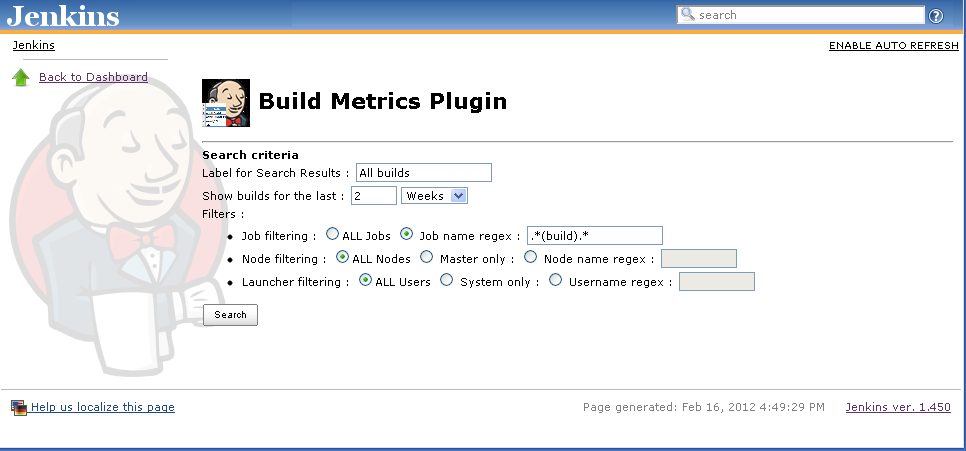
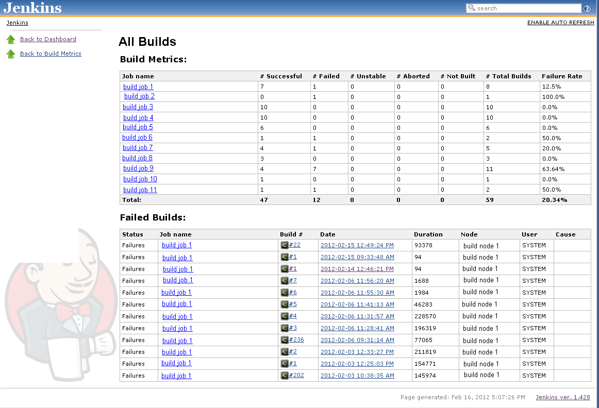

This plugin uses the results from the [Global Build Stats
Plugin](http://localhost:8085/display/JENKINS/Global+Build+Stats+Plugin) to
generate some basic build metrics.  It is really useful in combination
with the [sidebar links
plugin](http://localhost:8085/display/JENKINS/Sidebar-Link+Plugin).

## Requirements 

This plugin requires Jenkins 1.509 or better and the [Global Build Stats
plugin](http://localhost:8085/display/JENKINS/Global+Build+Stats+Plugin) 1.2
or better.

## Installation

To install the build metrics plugin, Go to "Manage Jenkins" -\> "Plugin
Management". Check the latest version and install.  You will probably
need to restart the Jenkins server after that.

## How To Use the Plugin

### Manage Jenkins Screen

Go to "Manage Jenkins". You should see an icon of Jenkins with a little
data grid in front. 
  Click
that and it will take you to the Built Metrics Search screen (see
below).

### Build Metrics Search Screen

The search screen is where you tell the plugin which jobs you wish to
report on and what timeframe should be included in the report.  


Configure the following parameters:

-   Search Results Label: set this to whatever text you wish to be
    displayed at the top of the search results screen. Usually this
    would be some descriptive text for the build job metrics being
    summarized.
-   Select the time window: default is 2 weeks (must be an integer)
-   Configure the filters (for more information on this, see the [Global
    Build Stats
    Plugin](http://localhost:8085/display/JENKINS/Global+Build+Stats+Plugin) configuration
    since this part of the UI was copied directly from it).

Click Search and the report will be generated and displayed (see Build
Metrics Report Screen below)

### Build Metrics Report Screen

The build metrics report screen is split into two sections. The top
section contains the selected jobs and their associated build metrics.
 The bottom section contains a list of failed builds; complete with the
job name, a link to the console output of the build, and a link to the
build itself as well as a section to display the 'cause' for the build
(see description of adding build failure cause below).  


#### Adding a Cause for a build failure

I found it useful to have a description in the report for why the build
failed. This way I could see trends as they happened over time.  To add
a cause:

1.  Click on the build number link in the failed build list (at the
    bottom of the build metrics report screen). This will take you to
    the home screen for the indicated build number.
2.  Click the 'edit description' link (on the right hand side of the
    page).  Enter a description for the cause of the build failure and
    click the submit button.
3.  Refresh the build metrics report screen and you will see the cause
    added to the build failure list.

## Intended Use Case

This plugin was created because the team I work on needed to deliver
some concise build metrics for our Jenkins builds on a rolling two week
iteration. These build metrics needed to have an overall failure rate
and an individual one per job, as well as a list of failed builds (with
associated causes).  This plugin provides that reporting mechanism.  To
be really useful though, we needed to be able to pull it up quickly and
easily every time we wanted to generate the report.  I use the [sidebar
links
plugin](http://localhost:8085/display/JENKINS/Sidebar-Link+Plugin) to
accomplish this, by simply copying the url for the build metrics report
screen for a given set of search criteria.  I then enter this URL as a
sidebar link, using the icon that I created for the plugin and the
description (1st parameter on the search page) as the txt of the link.
 This way all of our users can just go to the main Jenkins dashboard and
pull up the report as needed.  

We currently take the results of the report, copy them into an email and
send that to our development teams as a 'report card'.  A great
next-step for the use of this plugin would be to have a job that ran the
report and emailed out the contents on a scheduled basis.

## Changelog

#### Version 1.3 - 2016-08-22

-   fixed the "& nbsp ; " problem in output.

#### Version 1.2 - 2016-08-21

-   fix
    [JENKINS-37329](https://issues.jenkins-ci.org/browse/JENKINS-37329)
    : Bug in StatsMath.java DecimalFormat
-   fix
    [JENKINS-16270](https://issues.jenkins-ci.org/browse/JENKINS-16270)
    : Build metrics icon filename incorrect
-   [JENKINS-20945](https://issues.jenkins-ci.org/browse/JENKINS-20945)
    : New filter for causes
-   Updated to newer parent pom
-   **DO NOT USE THIS RELEASE USE 1.3 INSTEAD. The output in this
    release is broken.**

#### Version 1.1 - 2016-03-08

-   fix
    [JENKINS-32651](https://issues.jenkins-ci.org/browse/JENKINS-32651)
    : Incorrectly calculated reporting period can lead to an empty
    report

#### Version 1.0 - 2012-02-17

-   Initial release
