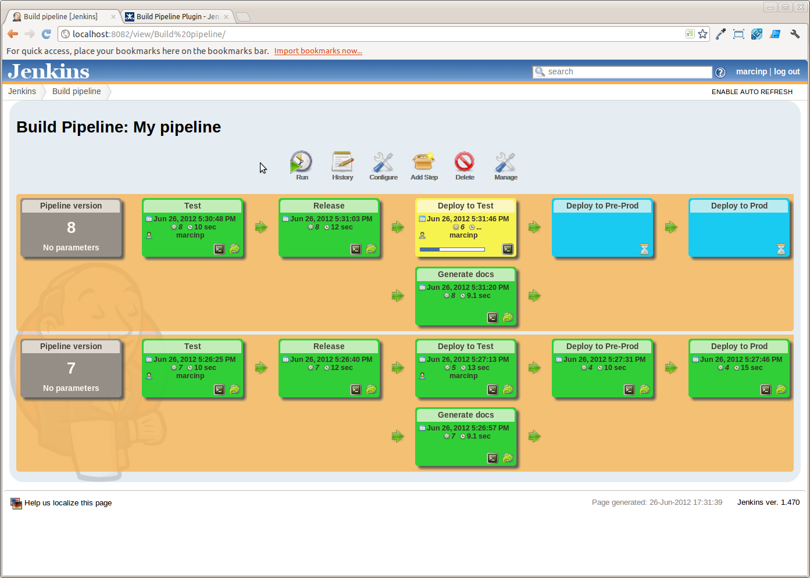
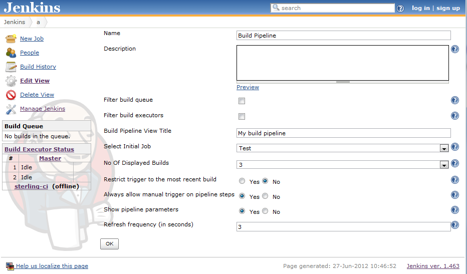
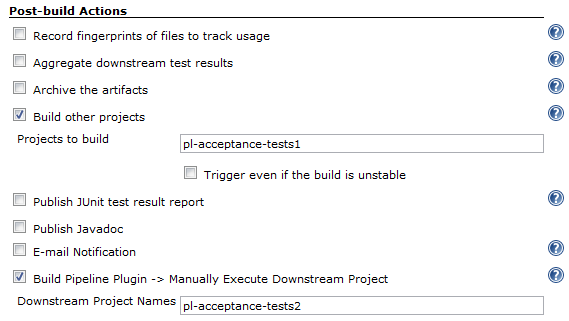

## Summary 

This plugin provides a *Build Pipeline View* of upstream and downstream
connected jobs that typically form a build pipeline.  In addition, it
offers the ability to define manual triggers for jobs that require
intervention prior to execution, e.g. an approval process outside of
Jenkins.

### Release Notes

1.5.8

-    Address
    boundary case of
    [JENKINS-23532](https://issues.jenkins-ci.org/browse/JENKINS-23532) where
    relative paths would not retrigger

[1.5.7.1](https://github.com/jenkinsci/build-pipeline-plugin/releases/tag/build-pipeline-plugin-1.5.7.1)

-   (-) [JENKINS-45137](https://issues.jenkins-ci.org/browse/JENKINS-45137)
    Fix stack trace for pipelines created / edited in v 1.5.6

[1.5.7](https://github.com/jenkinsci/build-pipeline-plugin/releases/tag/build-pipeline-plugin-1.5.7)

-   (-) [JENKINS-23532](https://issues.jenkins-ci.org/browse/JENKINS-23532) Manual
    trigger execution causes TriggerException
-   (-) [JENKINS-44324](https://issues.jenkins-ci.org/browse/JENKINS-44324) NullPointerException upgrading
    from very old versions of plugin  
-   (-) Fix issue with dashboard view not loading
-   (+)Added support for extensible BuildCard

[1.5.6](https://github.com/jenkinsci/build-pipeline-plugin/releases/tag/build-pipeline-plugin-1.5.6)

-   
    [Issues \#34722](https://issues.jenkins-ci.org/browse/JENKINS-34722)
    ([Pull
    \#88](https://github.com/jenkinsci/build-pipeline-plugin/pull/88))
    Performance fix when determining view permissions
-   
    [Issues \#14591](https://issues.jenkins-ci.org/browse/JENKINS-14591)
    ([Pull
    \#96](https://github.com/jenkinsci/build-pipeline-plugin/pull/96)
    and [Pull
    \#106](https://github.com/jenkinsci/build-pipeline-plugin/pull/106))
    Add the ability to choose which parameters build will be displayed

[1.5.5](https://github.com/jenkinsci/build-pipeline-plugin/releases/tag/build-pipeline-plugin-1.5.5)

-   
    Eaten by
    [INFRA-588](https://issues.jenkins-ci.org/browse/JENKINS-31088)

[1.5.4](https://github.com/jenkinsci/build-pipeline-plugin/releases/tag/build-pipeline-plugin-1.5.4)

-   
    [Pull
    \#105](https://github.com/jenkinsci/build-pipeline-plugin/pull/105)
    Keep git-plugin RevisionParameterAction on rerun of a build
-   
    [Issues \#31088](https://issues.jenkins-ci.org/browse/JENKINS-31088)
    show displayName by default

[1.5.3.1](https://github.com/jenkinsci/build-pipeline-plugin/releases/tag/build-pipeline-plugin-1.5.3.1)

-   
    [Issue \#33935](https://issues.jenkins-ci.org/browse/JENKINS-33935)
    Fix re-running a build - broken in Jenkins \> 1.653, LTS \> 1.651.1
-   
    [Issue \#34722](https://issues.jenkins-ci.org/browse/JENKINS-34722)
    Performance fix - limit the number of downstream projects iterated
    over

[1.5.2](https://github.com/jenkinsci/build-pipeline-plugin/releases/tag/build-pipeline-plugin-1.5.2)

-   
    [Issue \#33591](https://issues.jenkins-ci.org/browse/JENKINS-33591)
    Fix manual trigger breaking in Jenkins \>1.653

[1.5.1](https://github.com/jenkinsci/build-pipeline-plugin/releases/tag/build-pipeline-plugin-1.5.1)

-   
    [Issue \#31746](https://issues.jenkins-ci.org/browse/JENKINS-31746)
    Fix issues in layout, UI updates

[1.4.9](https://github.com/jenkinsci/build-pipeline-plugin/releases/tag/build-pipeline-plugin-1.4.9)

-   
    ([issue
    \#30801](https://issues.jenkins-ci.org/browse/JENKINS-30801))
    Re-triggering a failed build copies the Actions from previous builds
-   
    ([issue
    \#28068](https://issues.jenkins-ci.org/browse/JENKINS-28068)) Build
    Pipeline Dashboard View destroys layout of jenkins
-   
    ([issue
    \#29477](https://issues.jenkins-ci.org/browse/JENKINS-29477)) View
    bad for Build Pipeline Plugin

[1.4.8](https://github.com/jenkinsci/build-pipeline-plugin/compare/build-pipeline-plugin-1.4.7...build-pipeline-plugin-1.4.8)

-   
     ([issue
    \#28180](https://issues.jenkins-ci.org/browse/JENKINS-28180)) Build
    Pipeline background layout does not extend full width of pipeline

[1.4.7](https://github.com/jenkinsci/build-pipeline-plugin/compare/build-pipeline-plugin-1.4.6...build-pipeline-plugin-1.4.7)

-   
    ([JENKINS-25666](https://issues.jenkins-ci.org/browse/JENKINS-25666))
    Fixed left-side indentation for new jenkins versions

[1.4.6](https://github.com/jenkinsci/build-pipeline-plugin/compare/build-pipeline-plugin-1.4.5...build-pipeline-plugin-1.4.6)

-   
    ([JENKINS-20499](https://issues.jenkins-ci.org/browse/JENKINS-20499))
    Null cause brokes Cause entry and job
-   
    ([JENKINS-22665](https://issues.jenkins-ci.org/browse/JENKINS-22665))
    ([JENKINS-19755](https://issues.jenkins-ci.org/browse/JENKINS-19755))
    Don't store whole user object for cause
-   
    Fixed UI tests
-   
    Removed test libs from final package

[1.4.5](https://github.com/jenkinsci/build-pipeline-plugin/compare/build-pipeline-plugin-1.4.4...build-pipeline-plugin-1.4.5)

-   
    Support cloudbees-folder-plugin
    ([JENKINS-14565](https://issues.jenkins-ci.org/browse/JENKINS-14565))
    ([JENKINS-20841](https://issues.jenkins-ci.org/browse/JENKINS-20841))
-   
    Start build with parameters for parametrized builds
    ([JENKINS-25427](https://issues.jenkins-ci.org/browse/JENKINS-25427))
    ([JENKINS-19121](https://issues.jenkins-ci.org/browse/JENKINS-19121))
-   
    Clicking on "console" icon doesn't work
    ([JENKINS-25430](https://issues.jenkins-ci.org/browse/JENKINS-25430))

[1.4.4](https://github.com/jenkinsci/build-pipeline-plugin/compare/build-pipeline-plugin-1.4.3...build-pipeline-plugin-1.4.4)

[1.3.3](http://code.google.com/p/build-pipeline-plugin/issues/list?can=1&q=label%3AMilestone-Release1.3.3&colspec=ID+Type+Status+Priority+Milestone+Owner+Summary&cells=tiles)  
[1.3.1](http://code.google.com/p/build-pipeline-plugin/issues/list?can=1&q=label%3AMilestone-Release1.3.1&colspec=ID+Type+Status+Priority+Milestone+Owner+Summary&cells=tiles)  
[1.3.0](http://www.centrumsystems.com.au/2012/07/build-pipeline-plugin-1-3-0-release/)
- Also see the
[roadmap](http://localhost:8085/display/JENKINS/Build+Pipeline+Plugin+-+Roadmap)
for details.  
[1.2.4](http://code.google.com/p/build-pipeline-plugin/issues/list?can=1&q=label%3AMilestone-Release1.2.4&colspec=ID+Type+Status+Priority+Milestone+Owner+Summary&cells=tiles)
- Also see the
[roadmap](http://localhost:8085/display/JENKINS/Build+Pipeline+Plugin+-+Roadmap)
for details.  
[1.2.2](http://www.centrumsystems.com.au/blog/?p=325)  
[1.2.1](http://www.centrumsystems.com.au/blog/?p=287)  
[1.2](http://www.centrumsystems.com.au/blog/?p=281)  
[1.1.2](http://www.centrumsystems.com.au/blog/?p=200)  
[1.1.1](http://www.centrumsystems.com.au/blog/?p=165)  
[1.0.0](http://www.centrumsystems.com.au/blog/?p=121)

## Overview

Continuous Integration has become a widely adopted practice in modern
software development. Jenkins & Hudson are great tools for supporting
Continuous Integration.

**Taking it to the next level:** Continuous integration can become the
centerpiece of your [deployment
pipeline](http://www.informit.com/articles/article.aspx?p=1621865),
orchestrating the promotion of a version of software through quality
gates and into production. By extending the concepts of CI you can
create a chain of jobs each one subjecting your build to quality
assurance steps. These QA steps may be a combination of manual and
automated steps. Once a build has passed all these, it can be
automatically deployed into production.

In order to better support this process, we have developed the Build
Pipeline Plugin. This gives the ability to form a chain of jobs based on
their upstream\\downstream dependencies. Downstream jobs may, as per the
default behaviours, be triggered automatically ,or by a suitable
authorised user manually triggering it.

You can also see a history of pipelines in a view, the current status
and where each version got to in the chain based on its revision number
in VCS.

### Screenshots

#### The Pipeline View

{width="900"}

## Configuration

### View Configuration

1.  Install the plugin using the Hudson\\Jenkins Plugin Manager and
    restart.
2.  Create a view of the new type *Build Pipeline View*.  
    You will then be redirected directly to the configuration page.
3.  The table below outlines what each interesting parameter controls:

    [TABLE]

### Job Configuration

1.  Navigate to the Job configuration page.
2.  Scroll down to the *Post-build Actions* section.
    1.  For an **Automated** downstream build step;  
        To add a build step that will trigger automatically upon the
        successful completion of the previous one:
        1.  Select the *Build other projects* check-box
        2.  Enter the name(s) of the downstream projects in the
            *Projects to build* field. (n.b. Multiple projects can be
            specified by using comma, like "abc, def".)
    2.  For a **Manually Triggered** downstream build step:  
        To add a build step that will wait for a manual trigger:
        1.  Select the *Build Pipeline Plugin -\> Manually Execute
            Downstream Project* check-box
        2.  Enter the name(s) of the downstream projects in the
            *Downstream Project Names* field. (n.b. Multiple projects
            can be specified by using comma, like "abc, def".)
3.  Click *Save*

Automatic & Manual downstream build steps

The Build Pipeline Plugin handles the creation of multiple automatic
and/or manually triggered downstream build steps on the same project.

### Upgrading from Release 1.0.0

When upgrading from 1.0.0 to 1.1.x some of the previous view and job
configuration fields have been removed. You may notice some errors of
the following errors appearing in the Hudson/Jenkins log.

    WARNING: Skipping a non-existent field downstreamProjectName
    com.thoughtworks.xstream.converters.reflection.NonExistentFieldException: No such field
    au.com.centrumsystems.hudson.plugin.buildpipeline.trigger.BuildPipelineTrigger.downstreamProjectName

This is because the configuration files refer to old fields that may no
longer exist.  
In order to correct these issues go to the Job configuration page,
confirm that all of the details are correct and click on the *Save*
button.

## More on Pipelines

The canonical reference for pipelines is the book [Continuous
Delivery](http://www.amazon.com/gp/product/B003YMNVC0/).

Chapter 5 of the book, which describes how deployment pipelines work, is
available for free
[here](http://www.informit.com/articles/article.aspx?p=1621865).
