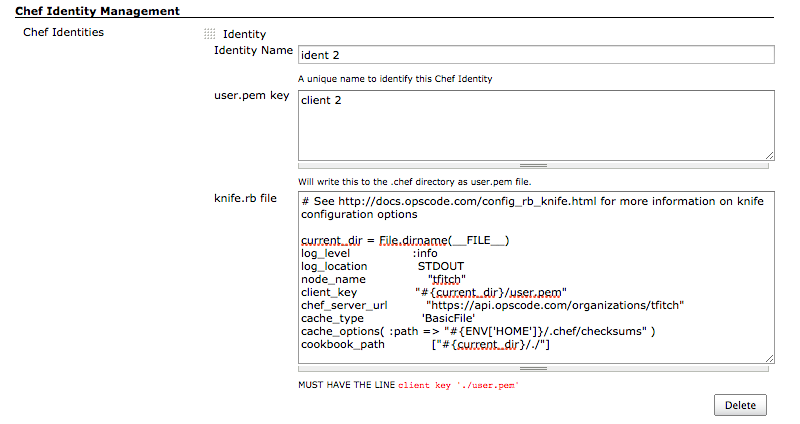

# Introduction

This plugin allows management of Chef credentials so jobs can execute
jobs against a Chef server using those credentials by adding a section
to the Jenkins configuration screen to define one or more Chef
identities (a combination of the pem key for auth and contents of a
knife.rb to define which server to talk to).

# Known Limitations

knife.rb required content

Your knife.rb must have the line `client_key "#{current_dir}/user.pem"`
to find the key file which is being written to disk as user.pem

Does not install Chef client

This DOES NOT install a Chef client on your Jenkins server, that needs
to be done separately.

# Installation

To install the Chef Identity Plugin, Go to your Jenkins' "Plugin
Management" section in the adminstration panel.  
The latest version will be available.  Install it from there (you should
need to restart Jenkins after that).

# Configuration

To verify the plugin is installed properly, go to the Adminstration
panel, then in the "Configure System" page you will find the "Chef
Identity Management" section:  

# Usage

In your job configuration pages you'll see a new checkbox in the "Build
Environment" section that says "Chef Identity Plugin".  When you check
the box it will expose a dropdown to select one of the Chef Identities
you configured in the administration area.
  
Then when the job runs, it will write a .chef folder in your Workspace
with the user.pem key file and the knife.rb you setup for the selected
Chef Identity.

You have the option to remove the .chef folder from the workspace when
the build is complete by selecting the Post-build Action of "Delete
.chef folder when build is done"

# Known issues

type

key

summary

Data cannot be retrieved due to an unexpected error.

[View these issues in
Jira](http://issues.jenkins-ci.org/secure/IssueNavigator.jspa?reset=true&jqlQuery=project%20=%20JENKINS%20AND%20status%20in%20%28Open,%20%22In%20Progress%22,%20Reopened%29%20AND%20component%20=%20%27chef-identity-plugin%27&src=confmacro)

# Releases

## 1.0.0 (May 12th, 2015)

-   Resolved [Jenkins-28344](https://issues.jenkins-ci.org/browse/JENKINS-28344):
    Convert Chef Identity storage from Scramble to Secret API.

## 0.1.4 (May 8th, 2015)

-   Resolved [Jenkins-28030](https://issues.jenkins-ci.org/browse/JENKINS-28030):
    The .chef folder is not written on the first build of a job with a
    SCM checkout.

## 0.1.3 (April 3rd, 2015)

-   Resolved
    [Jenkins-25555](https://issues.jenkins-ci.org/browse/JENKINS-25555):
    Added option to use a post build step to delete the .chef folder
    after the build is complete.

## 0.1.2 (September 19th, 2014)

-   Same as 0.1.1 - was figuring out the Maven deploy commands and
    published it twice.  Lesson learned.

## 0.1.1 (September 19th, 2014)

-   If the Chef Identity a job is configured to use no longer exists
    (has been removed from the Admin) the build will Abort.

## 0.1.0 (September 2014)

-   Manage multiple identities in the Jenkins admin
-   Select identity to use in build job
