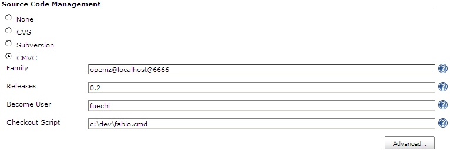

# Introduction

This plugin integrates
[CMVC](http://www.redbooks.ibm.com/abstracts/gg244178.html) to Hudson.

At the moment, it supports:

-   Polling a CMVC family to automatically start builds when changes are
    detected;
-   Ability to customize what characterizes a "change" by providing a
    custom TrackView Report where clause;
-   Delegating checkout/update logic to an external script.  

This plugin utilizes CMVC's Report command to query the family for
changes. In the default mode, first it looks for all integrated tracks -
within the specified releases - between the last build time and the
current time (-view TrackView). Then it performs another query to find
all files included in these tracks (-view ChangeView). The former query
can be easily customized by providing a custom where clause.

Changes and modifications details are detected by running commands
similar to the following:

``` syntaxhighlighter-pre
Report -family family<at:var at:name="localhost" />6666 -raw -view TrackView
-where lastUpdate between $lastBuild
and $now and state = 'integrated'
and releaseName in ('RC_123')
order by defectName


Report -family family<at:var at:name="localhost" />6666 -raw -view ChangeView
-where defectName in ('1','2')
and releaseName in ('RC_123')
order by defectName
```

These queries provide all the necessary information for generating a
Hudson´s change log set.

We all know CMVC is considered an obsolete SCM. However we also know
there are still some people using it out there. So, why not provide them
with a nice way to integrate it with Hudson and make our lives less
miserable

.

# Configuration

## System configuration

It has only one global configuration parameter: the cmvc executables
directory path.

  
  
  

Usually this directory is already part of the PATH environment variable.

## Job configuration

Jobs utilising CMVC have to define the folowing properties:

  
  
   
  

Fill in each of the settings:

-   *Family* - The CMVC family. The following format is expected:
    family(at)host(at)port
-   *Releases* - Release names separated by comma (,)
-   *Become User* - User used to connect to CMVC. Usually a family
    superuser. If left blank the **CMVC\_BECOME** environment variable
    will be used instead. This user must have permission to access the
    current family from within Hudson's host.
-   *Checkout Script* - Script that will perform the checkout/update
    logic. Besides the default Hudson's env variables, the following
    environment variables are also made available to the script:
    **CMVC\_FAMILY**, **CMVC\_BECOME** and **CMVC\_RELEASES**. This
    script will take a list of trackNames separated by space as the
    first parameter. Itn will be normally used to create a new Level
    containing the provided integrated tracks (which are the same tracks
    detected by the polling).

Optionally, you can hit the *Advanced...* button and configure the
TrackView Report where clause.

 
  

There are 3 available implicit variables that can be used in the custom
where clause (prefixed by $):

1.  **now** - current time
2.  **lastBuild** - last build datetime
3.  **releases** - releases ( properly quoted to be used in "IN"
    statement )

# Release Notes

## [Version 0.2 (09/06/2009)](https://hudson.dev.java.net/files/documents/2402/136324/cmvc.hpi)

-   Fixed NullPointer when saving global configuration
-   Added defectName to changes related pages
-   In the default mode the lastBuild time is the last successful build
    time
-   Fixed checkout exception handling
-   Upgraded pom to depend on Hudson 1.309  

## [Version 0.1 (30/05/2009)](https://hudson.dev.java.net/files/documents/2402/135805/cmvc.hpi)

-   Initial release;
-   Tested on Windows and Linux environments;
-   Tested only on CMVC 2.X ( won´t work with 5.X due to date format
    incompatibilities);
-   Checkout is delegated to an external script;
-   Lacks i18n;  

# TODO

-   Add support to other CMVC versions
-   Handle multiple releases
-   Properly handle CMVC´s errors
-   Alter changes sorting criteria. Order it by trackName, pathName and
    version
-   Improve i18n
-   Diferentiate features from defects in changes reports
-   Create levels after successfull builds (tagging logic)
