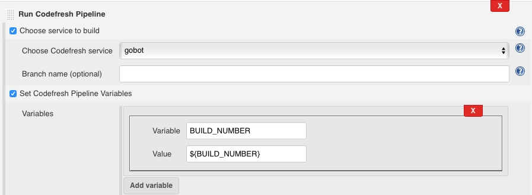

| Plugin Information                                                                                          |
|-------------------------------------------------------------------------------------------------------------|
| View Codefresh Integration [on the plugin site](https://plugins.jenkins.io/codefresh) for more information. |

The current version of this plugin may not be safe to use. Please review
the following warnings before use:

-   [SSL/TLS certificate validation globally and unconditionally
    disabled](https://jenkins.io/security/advisory/2019-08-07/#SECURITY-931)

.png){width="400"}

Allows integrating [Codefresh](https://codefresh.io/) docker flow
pipelines into your existing Jenkins flows.

 

## Features:

-   Define Codefresh account details (currently limited to a single
    account)
-   Trigger Codefresh pipelines as a build step in Jenkins jobs
    -   Codefresh Pipeline ID is concluded automatically from the git
        repository URL (if git SCM is used in the job)
    -   Another Codefresh pipeline can be selected instead.
    -   Pass environment variables from Jenkins to Codefresh.
    -   Codefresh build logs are presented on Jenkins console output
        page.
-   A badge with Codefresh build status and a link to Codefresh build
    page is shown for each build.
-   Launch Codefresh composition environments.
    -   Pass environment variables from Jenkins to Codefresh.
    -   Codefresh environment launch logs are presented on Jenkins
        console output page.
-   A badge with environment URL shown in build history.
-   Triggered build URL available as Jenkins env variable -
    CODEFRESH\_BUILD\_URL.
-   Launched environment URL available as Jenkins env variable -
    CODEFRESH\_ENV\_URL (for subsequent testing).
-   Ability to terminate Codefresh environment as post-build action.
-   Jenkins Pipeline DSL support : [codefresh step
    reference](https://jenkins.io/doc/pipeline/steps/codefresh/)

##  Upcoming features:

-   Display environment status (running/stopped) and link on Jenkins UI.
-   Live log streaming (currently the logs are presented after Codefresh
    process finishes)
-   Enhanced Codefresh docker image tagging from Jenkins pipeline.

### Getting Started:

-   Define the connection to Codefresh in Jenkins system config (Manage
    Jenkins-\>Configure system-\> scroll down to find '*Define Codefresh
    Integration*'). This requires filling out your user name and
    Codefresh auth token. You can verify the authentication by using the
    '*Test Connection*' button. 

   To find your auth token:

-   -   Log in to Codefresh and then open <https://g.codefresh.io/api/>
        in another tab of the same browser.
    -   Copy your token from the right-hand text field on the Swagger
        header.

Screenshot:

-   Trigger Codefresh pipeline execution from your freestyle Jenkins
    jobs:
    -   'Add Build Step' -\> 'Run Codefresh Pipeline'
    -   By default - this will trigger the pipeline that corresponds to
        the git repo defined in the job's SCM configuration.
    -   If there's no SCM defined for current job or you would like to
        trigger a different service pipeline - check the '*Choose
        service to build*' option. This will present you with drop-down
        selectable list of all your defined Codefresh pipelines.
    -   Check the 'Set Codefresh Pipeline Variables' option to pass
        environment variables to the pipeline execution.

Screenshot:

Once configured - the plugin will trigger Codefresh, run your tests and
report the results. On job completion a Codefresh badge will appear next
to the build execution. Clicking on it will take you to the build
results page on Codefresh:

-   Launch Codefresh composition environment:
    -   Check the 'Launch a composition' option. 
    -   You will be presented with a drop-down selection list of all
        Docker compositions you have defined on Codefresh.
    -   Choose one, save configuration and run the build.
    -   Check the 'Set Codefresh Environment Variables' option to pass
        variables to the launched environment.
    -   If composition launch is successfull - the new envrionment URL
        will be printed to job console output and made available through
        a Codefresh green leaves badge on build history.

Screenshot

:

