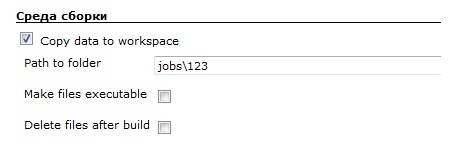

| Plugin Information                                                                                                               |
|----------------------------------------------------------------------------------------------------------------------------------|
| View Copy data to workspace [on the plugin site](https://plugins.jenkins.io/copy-data-to-workspace-plugin) for more information. |

The current version of this plugin may not be safe to use. Please review
the following warnings before use:

-   [Arbitrary file read
    vulnerability](https://www.jenkins.io/security/advisory/2020-09-16/#SECURITY-1966)

  

Copies data to workspace directory for each project build.

Hudson 1.366 or later.

This plugin was created for Hudson 1.366. It might not work with earlier
versions of Hudson.

# User guide

This plugin copies data from directory stored on master node. The path
to this directory should be relative to Hudson root path (HUDSON\_HOME).
All data will be copied to the project workspace directory

on master or slave node.

1\. Select "Copy data to workspace" in the Build Environment (list of
BuildWrappers).

2\. Enter the path to a data storage directory. All data in this
directory will be copied to workspace (only data, not a directory
itself). Path should be relative to Hudson root path (HUDSON\_HOME).  
For example, Hudson root path = "C:\\tmp". Path to folder =
"storage\\task". Plugin will copy data from directory
"C:\\tmp\\storage\\task".

3\. Option "Make files executable". It means that after copying data to
workspace plugin apply to each file chmod(0755). So all files become
executable. On Windows, no-op.

4\. Option "Delete files after build". If checked, plugin will delete all
copied files from workspace after build.



## Changelog

##### Version 1.0 (February 24, 2011)

-   Initial release.
