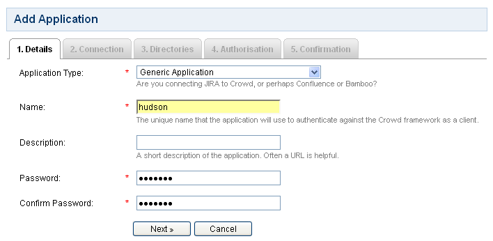

The current version of this plugin may not be safe to use. Please review
the following warnings before use:

-   [Crowd Integration Plugin stores credentials in plain
    text](https://jenkins.io/security/advisory/2019-04-03/#SECURITY-1069)

# Crowd plugin

This plugin enables use of [Atlassian
Crowd](http://www.atlassian.com/crowd) as an authentication source.
Crowd is a commercial identity management and Single Sign-On (SSO)
application.

In the current version, the Crowd plugin does not support SSO.

For SSO support, check out the [Crowd 2
Plugin](http://localhost:8085/display/JENKINS/Crowd+2+Plugin).

## Configuration

To configure the plugin, you first need to create a new application in
Crowd.
<http://confluence.atlassian.com/display/CROWD/Managing+Applications>
has more information on how to configure applications in Crowd.

Be sure to also allow connections to Crowd from the server Jenkins runs
on. As of the current (1.5.1) release, this must be done per IP address;
vote for <http://jira.atlassian.com/browse/CWD-84> to allow this to be
configured on a block basis.

Once you have the application configured in Crowd, you can enable
Crowd-based security in Jenkins on the Manage Jenkins page. Enter the
URL of the Crowd's servers endpoint (will typically be /crowd/services/
or /services/) as well as the application name and password you
configured in Crowd.

## Requirements

This plugin requires Hudson/Jenkins version 1.318 or higher. It has
primarily been tested against Crowd version 1.6.

## Troubleshooting

### Users can log in, but Jenkins doesn't see some of their groups

Crowd has a setting, which can be set per application, called "Lower
Case Output". If you have, e.g., a group called "SystemAdministrators",
and "Lower Case Output" is set, then Crowd will pass this group name to
Jenkins as "systemadministrators". To fix this, either:

-   Use all-lowercase group names in your authorization settings in
    Jenkins.
-   Or, turn off "Lower Case Output" in Crowd. This is on the "Options"
    tab for your Jenkins application. Note that if you do this, you must
    make sure to always use the correct capitalization in your Jenkins
    authorization settings.

## Version History

##### Version 1.2 (Aug 5, 2011)

-   Use newer version of Crowd library

##### Version 1.1 (Jan 30, 2010)

-   Update code for more recent Hudson

##### Version 1.0 (Jan 16, 2009)

-   Initial release
