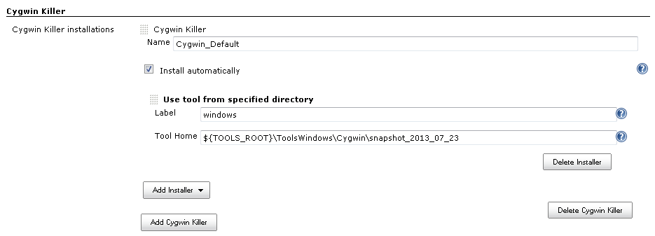

| Plugin Information                                                                                                      |
|-------------------------------------------------------------------------------------------------------------------------|
| View Cygwin Process Killer [on the plugin site](https://plugins.jenkins.io/cygwin-process-killer) for more information. |

**This plugin is up for adoption.** Want to help improve this plugin?
[Click here to learn
more](http://localhost:8085/display/JENKINS/Adopt+a+Plugin "Adopt a Plugin")!

Plugin implements proper termination of Cygwin processes in Jenkins jobs

# About this plugin

By default, Jenkins don't terminate Cygwin process trees on timeouts and
manual termination of builds on Windows platforms. This is caused by
Cygwin architecture, but it is very painful in automation environments,
because unterminated processes may modify files and even lock workspace
for the future builds. This plugin implements proper termination of
Cygwin process trees in Jenkins jobs. See
[JENKINS-13615](https://issues.jenkins-ci.org/browse/JENKINS-13615) for
more info.

# Usage guidelines

Warning

Due to the current implementation of Jenkins core, this plugin version
works only for processes, which are the children of the parent process
being terminated by Jenkins.

## Requirements

1.  Jenkins Core should contain fix for invocation of Process Killers on
    Windows (see
    [JENKINS-19156](https://issues.jenkins-ci.org/browse/JENKINS-19156)
    for more info)
2.  You should use only one Cygwin installation on the host
    1.  Due to Cygwin's architecture, ps commands discovers processes
        running within the same cygwin1.dll
    2.  Other processes will be ignored

## Initial configuration

By default, plugin is disabled. After the installation, plugin should be
configured via Jenkins global configuration page.

### Approach 1. Minimal configuration

Steps below allow to use Cygwin Process Killer, which relies on global
environment variables during the process termination. Please note that
this approach is not recommended due to possible conflicts with other
utilities.

1.  Go to "Cygwin process killer" section of the global configuration
    page
2.  Click on "Enable killer" checkbox to enable the plugin

### Approach 2. Configure the plugin to use Cygwin tool installations

This section describes setup of Cygwin Killer for installations without
configured Cygwin environment

1.  Configure the "Cygwin Process Killer" installation
    1.  Tool's home should point to CYGWIN\_HOME (root folder with bin
        and lib folders)
    2.  %CYGWIN\_HOME%\\bin must contain *uname.exe* and *bash.exe*
        utilities
    3.  You can use any tool installer. You also can configure local
        installation via individual node configurations.
2.  Save and reopen the configuration. Then, go to the "Cygwin process
    killer" section
3.  Click on the "Use Cygwin from a tool installation" checkbox
4.  Select a tool installation from the list
5.  Optional
    1.  You can customize process termination scripts. If you have a
        version for execution with "-ex" flags, please create a pull
        request ASAP :)

{width="819"
height="296"}

# Wishlist

-   Extended logging and support of various interpreters
-   Automatic definition of used cygwin1.dll
-   Support of a graceful process termination (the current version
    invokes "kill -9")
-   "Restore default" script button in the web interface

# Version history

#### Version 0.2 (Jan 31, 2018)

-   Require Jenkins Core 1.625.3 or above
-   Fix issues reported by FindBugs and injected tests

#### Version 0.1 (10/25/2013)

-   Initial version of the plugin
