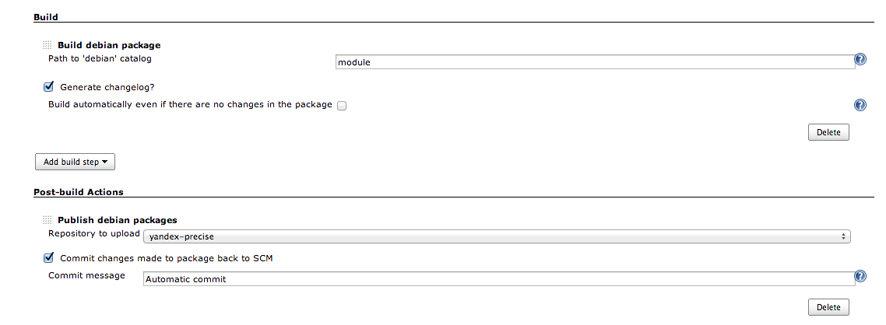
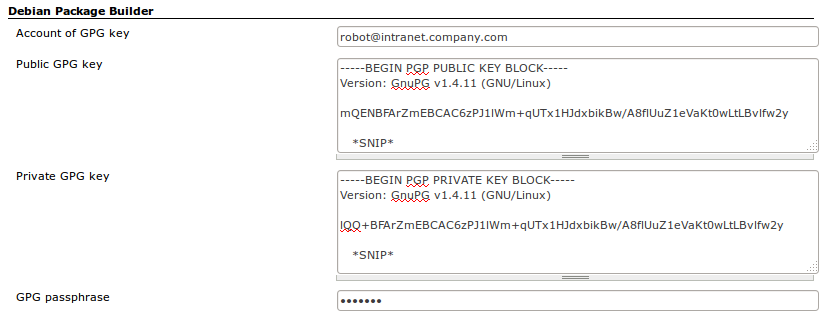
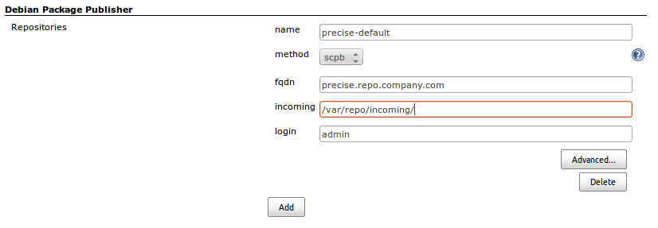

The current version of this plugin may not be safe to use. Please review
the following warnings before use:

-   [Credentials stored in plain
    text](https://jenkins.io/security/advisory/2020-02-12/#SECURITY-1558)

This plugin helps building debian (.deb) packages

Cloudbees link:
<https://jenkins.ci.cloudbees.com/job/plugins/job/debian-package-builder-plugin/>

# Screenshot

# Basic usage

##### Components

Installing this plugin contributes following:

-   **Build debian package** build step
-   **Publish debian packages** post-build step
-   **Debian package builder** section in the global configuration
-   **Debian package publisher** section in the global configuration

##### Configuration

The plugin uses global GPG key to build and sign .deb packages. It is
configured in the **Debian package builder** section of the global
configuration. The parameter names are pretty much self-descriptive:

**Debian package publisher** section configures available debian
repositories to publish packages to:

The **Advanced** section configures SSH key to be used with SCPB method
and extra SSH options (like -o StrictHostKeyChecking=no)

##### Building

The **Build debian package** step has a main configuration parameter
"Path to 'debian' catalog" that should point to a catalog that contains
**debian** catalog.

For example, if checkout has structure like
**$WORKSPACE/myproject/util/debian/** you should use **myproject/util**
as a configuration value.

By default, the build step will install all the requirements on its own,
use **pbuilder-satisfy-depends** to install build-deps of a package and
then use **debuild** to actually build package.

The package **.deb** will be added as a build artifact and badge with a
version per backage built will be applied to the build:

##### Publishing

The **Publish debian packages** post-build step uses **debrealease** to
publish package and according .changes to the selected repository. The
**dupload.conf** will be automatically generated with configured GPG
account data and used keys.

##### Automatic version manipulation

Plugin is capable of automatically starting new package version upon
build, recording recent changes and commiting it back to SCM.

However, the only supported SCM so far is Subversion due to the absence
of commit capabilities in Jenkins SCM core classes.

To use it, check the "Generate changelog" box on the build step and
"Commit changes back to repository" on the post-build step.

Upon build, it will:

-   start a new version, increasing last numeric component of version by
    1 – i.e. version **1.2.8** will become **1.2.9**;
-   if SCM is SVN, append revision number to the version number in form
    of '1.2.r12345', where 12345 is the revision;
-   record all the changes – from SVN revision history, starting from
    last recorded revision, or from Jenkins build history – to
    **debian/changelog** of a new version via **dch**;

To better handle failed builds, use 'Checkout fresh copy' SVN option (or
similar for other SCM).

# Known issues

#### Spaces in path

In versions prior to 1.3 there were issues with spaces in path, causing
all kinds of errors. Problems in the plugin itself are fixed, however
there are certain troubles in the debian build systems themselves,
namely CDBS. See this issue on debian.org:
<http://bugs.debian.org/cgi-bin/bugreport.cgi?bug=306941>.

# Changelog

#### Version 1.6.6 (Dec 26, 2014)

Thanks to the <https://github.com/roadrunner2> for PR

-   Fix race and leak (pr \#35)

#### Version 1.6.5 (Nov 06, 2014)

-   Expand variables in pathToDebian (pr \#34)

#### Version 1.6.2 (Aug 13, 2014)

-   Preserve **distribution** of package when starting new version

#### Version 1.6.1 (Aug 11, 2014)

Thanks to the <https://github.com/itIGO> and
<https://github.com/guilhem> for PR

-   Put dupload config in home directory (pr \#23)
-   Remove **--distributor** from **dch** invocation (pr \#18)
-   Make gpg-signing optional (pr \#15)
-   Switch to 1.509.4 LTS (pr \#16)

#### Version 1.6.0 (May 16, 2014)

Thanks to the <https://github.com/itIGO> for PR

-   Fix/tweak changelog generation for git
-   Allow specifying explicitly new version for package

#### Version 1.5.7 (May 14, 2014)

Thanks to the <https://github.com/raizdepi> and
<https://github.com/jacksoncage> for PRs

-   Fix **git commit** in case of subdirectory checkouts
-   Add -y to all **apt-get install** commands
-   Various internal improvements and docs

#### Version 1.5.3 (January 17, 2014)

Thanks to the <https://github.com/itIGO> for PRs

-   Expanding environmental variables in DebianPackagePublisher's
    commitMessage
-   Exporting source package name to the build's environment variables

#### Version 1.5.2 (August 8, 2013)

-   Minor bugfix in git support

#### Version 1.5.1 (August 8, 2013)

-   Minimal support for git is introduced. *Commit changes back to SCM*
    now commits **debian/changelog** to the local git repository in
    order to allow **Git publisher** to push the branch to the origin.

#### Version 1.4.2 (March 21, 2013)

-   Minor fix to work with parametrized SVN URLs

#### Version 1.4 (Nov 7, 2012)

-   Minor fix to add '--no-tgz-check' debuild param

#### Version 1.3 (Oct 26, 2012)

-   Minor fixes to allow spaces in workspace path

#### Version 1.2 (Oct 22, 2012)

-   Initial version
