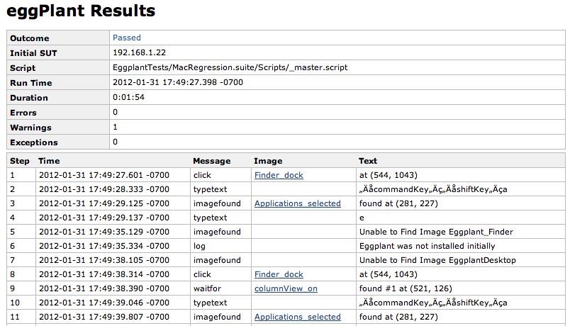

**NOTE:  **

This plug-in is deprecated.  

We encourage calling the Eggplant Command Line directly as described in
the on-line documentation:

<http://docs.testplant.com/ePF/using/epf-runscript-command-options.htm>

 

 

| Plugin Information                                                                                   |
|------------------------------------------------------------------------------------------------------|
| View eggPlant [on the plugin site](https://plugins.jenkins.io/eggplant-plugin) for more information. |

The current version of this plugin may not be safe to use. Please review
the following warnings before use:

-   [Credentials stored in plain
    text](https://jenkins.io/security/advisory/2019-08-07/#SECURITY-1430)

This plugin calls Eggplant scripts as a Jenkins Build Action and returns
the results to Jenkins for review or further processing.

# Configuration

For detailed installation and configuration instructions see the
[Eggplant Jenkins
Integration](http://docs.testplant.com/?q=jenkins-integration)
documentation.

1.  Ensure that eggPlant is installed and accessible to the Jenkins
    user. You can install the plugin from the Manage Plugins, Available
    page.  
    You do not need to restart Jenkins after installation.
2.  On the Manage Jenkins, Configure System page, click the
     button **Add Eggplant** and fill in the Eggplant Functional version
    and the path to the eggPlant runscript command.  
      
     
3.  On the configuration page for a build project, click the **Add build
    step** button and select the Eggplant option.  Enter the script path
    and System Under Test details.  
    
4.  The **Advanced...** button give the following additional fields.  
    

# **Results**

-   After executing a build, both job level results and the results of
    the Eggplant Functional script can be viewed.
      
    .  
    

### Changelog

##### Version 1.0

-   Initial Release

##### Version 2

-   Support for Slave Nodes
-   Fixed an issue saving configuration values
-   Added Tool concept, so that the executables can be installed in
    different locations on different machines.
-   Added Job-Level Test Results Summary.
