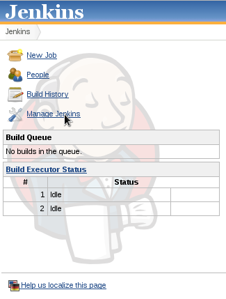
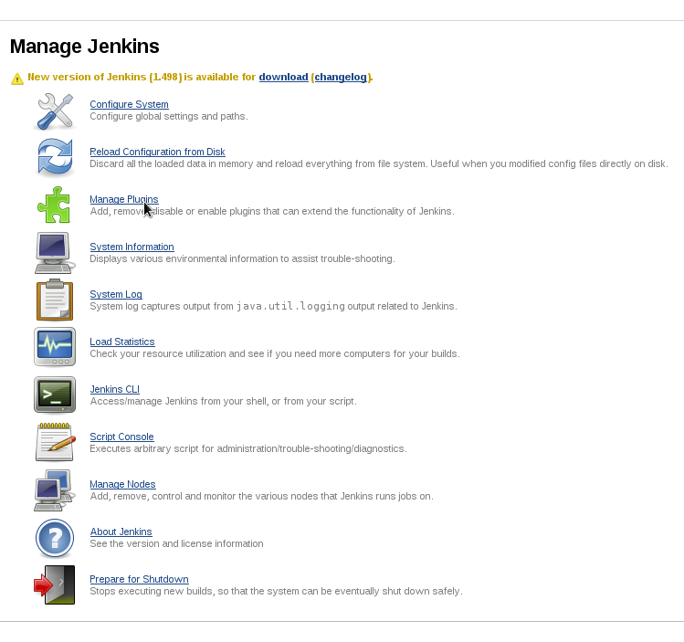
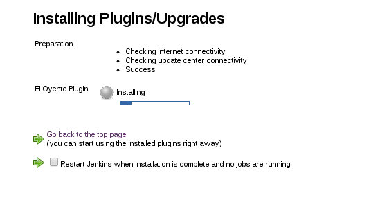
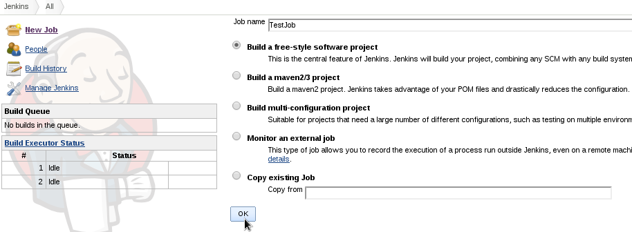
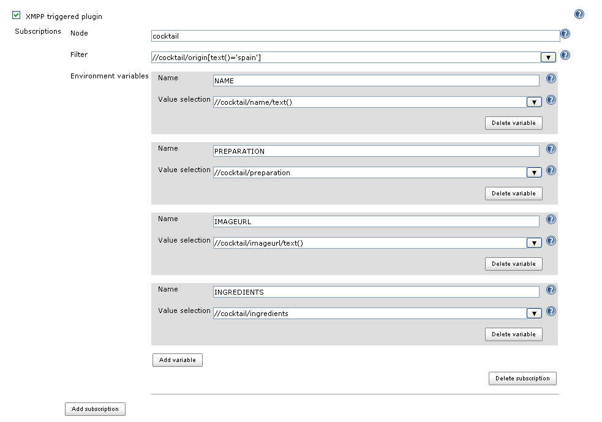

This plug-in adds job triggering based on XMPP Pub/Sub events.

# Features

This plugin allows Jenkins jobs to:

-   Subscribe for XMPP Pub/Sub events, to trigger the job.
-   Add filter expressions in XPath notation, to limit the triggering to
    particular events.
-   Extract data from the events with XPath expressions, and make it a
    vailable as environment variables.

## Prerequisites

It is required to set up or to have access to an XMPP server in charge
of handling the events and messages. There exist several available
servers that could be used. Follow this
[website](http://xmpp.org/xmpp-software/servers/?_sm_au_=iVVvfV5TJ0PJJ470)
to find some examples.  
For the development of the plug-in, it has been used **Openfire**. This
sever is quite easy to set up and use. For more information, visit its
[website](http://www.igniterealtime.org/projects/openfire/), where you
can find the [installation
guide](http://www.igniterealtime.org/builds/openfire/docs/latest/documentation/install-guide.html?_sm_au_=iVVvfV5TJ0PJJ470).

# Configuration and use

## Installation guide

To install ElOyente, just follow these easy steps:

1\. Start Jenkins, and once in the dashboard, click on **Manage Jenkins**



2\. Then select **Manage Plugins**



3\. Select the **Available** tab.


4\. Scroll down to the section **Build Triggers**, there you’ll find
ElOyente.


5\. After clicking **Download and install after restart** the plug-in
will be installed and ready to be used.



# Using the plug-in

## Main configuration

In order to set the plug-in to work it is necessary to fill the
parameters of the server we are going to use, this is done in the main
configuration.  
To access the main configuration of Jenkins, click in **Manage Jenkins**
and after that in **Configure System**.


This will open a menu like the one below, search for the section XMPP
job triggering. There you can specify the server address of your XMPP
server, a user and a password.


As you can see the interface will give you feedback about the connection
and authentication. In the example, as the server is not valid, it
cannot connect, and as the user and password are not correct it shows
that you are not authenticated.  
Once these parameters have been set we are ready to use the plug-in
within our projects.

**NOTE:**: If these values are empty or not correct, still you'll be
able to use the plug-in in the projects, but of course the connection
won't be created and they won't react to any possible events. You can
set the main configuration parameters later and once you click Save,
you'll start receiving the XMPP events.

## Configuring a job

These are the steps needed to create a job and set up ElOyente plug-in
for listening to XMPP events.

First create the job and give it a name, it doesn't matter the type of
job you're creating, the plug-in will always be available.



Once created, you'll see the configuration screen, scroll down to the
section Triggers, and click on the checkbox labelled as **XMPP triggered
plug-in** to activate it. Then click on **Add subscriptions** and you
are ready to subscribe to the nodes from which you'll receive your
events.  
Just write on the textbox the name of one of the nodes available in your
XMPP server, you can add more nodes if needed, just clicking on **Add
subscription** as many times as you need. In case you need to delete one
of the nodes just click on the **Delete subscription** button on the
right side under the subscription you want to delete.  
Once you click the **Save** button the plug-in will be listening for the
XMPP events over the nodes you selected. The job will be triggered as
soon as you receive an event from those nodes.

**NOTE:** It is possible to subscribe to nodes that still don't exist,
once they are created the plugin will start listening when clicking on
the **Save** button in the configuration of that particular job, or in
the **Save** button of the main configuration.  
You can also subscribe several times to the same node in one particular
job, in that case a build will be triggered for each of the
subscriptions.


## Setting up filters

There are 3 types of Pub/Sub systems: topic based, attribute based and
content based. Topic based is the easiest, and any Pub/Sub system
supports it. El Oyente is designed to put minimal requirements on the
messaging infrastructure, but provide fine grained triggering
capabilities. As such, El Oyente only uses topic-based subscriptions,
but provides client-side filters to have a full content-based Pub/Sub
infrastructure.  
Under the node subscriptions we see a textbox where you can add a filter
for that particular subscription. If empty, the job will be triggered
for any event occurring on the selected node. The filter expression
allows the job to be triggered only if the event matches a certain
criteria. The filter is anexpression in [XPath
notation](http://www.w3.org/TR/xpath/?_sm_au_=iVVvfV5TJ0PJJ470), which
is applied on the XMPP event. If the expression evaluates to true, the
job is triggered. See XEP-0060 for more information about [XMPP
Pub/Sub](http://xmpp.org/extensions/xep-0060.html).  
In the image below you can see a subscription to a node "cocktails", the
filter is set so only the cocktails from Spain will trigger the job.
When an XMPP message is received it is filtered, if the plug-in finds
the tag origin with a value of Spain, the triggered will be fired, in
other case, the job will not be triggered.


## Using environment variables

The plug-in also allows you to save information from the event into
environment variables that can be referred in the rest of the job, you
can add as many as you want.  
To set an environment variable you must click in the button **Add
variable** and two fields will appear.  
The first field tagged as **Name** lets you choose a name for the
variable, this variable can be referred in the rest of the job with the
$ operator.  
The second field **Value selection** allows specifying an [XPath
expression](http://www.w3.org/TR/xpath/?_sm_au_=iVVvfV5TJ0PJJ470), which
will be applied on the XMPP event. The result of this will be used as
the value for the environment variable.  
In the example it is extracted the name of the cocktail, a list of steps
for preparation, an URL that contains the image and a list of
ingredients. All this information is extracted from the payload of the
XMPP message received and could be used for example to fill an HTML file
that shows the cocktail characteristics.



# Testing

To test the plugin, the following tool can be used to send XMPP events
to a server:
[xmpp\_publisher](https://github.com/vanderhallenf/xmpp_publisher).

Arguments:

-s \<server\>                -\> URL of the XMPP server

-u \<username\>          -\> User name to connect to the XMPP server

-p \<password\>           -\> Password to connect to the XMPP server

-n \<node\>                  -\> Name of the node to publish to

-m \<message\>           -\> Message to publish

-d                              -\> Enable the debugger

-h                              -\> Show this help

Example:

``` syntaxhighlighter-pre
./run.sh -s beatles.albums.com -u Paul -p Beatles -n Albums -m "<album><name>Abbey Road</name></album>"
```

# Improvements

-   Adding dropdown menu for nodes subscriptions with the available
    nodes in the server
-   Giving feedback to the user in the job configuration in case the
    configuration of the server is not filled or it is not possible to
    establish the connection.
