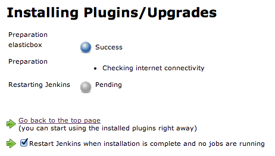
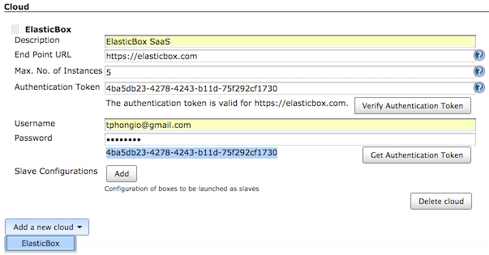
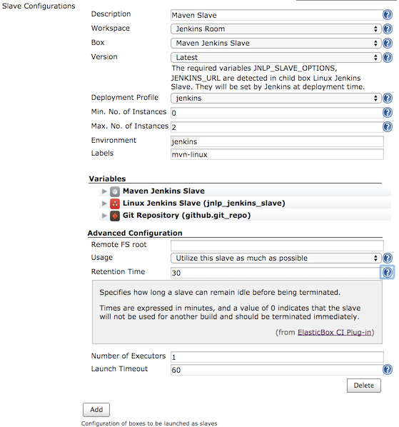
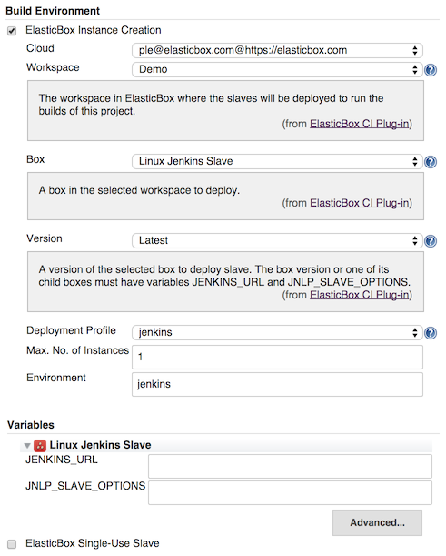
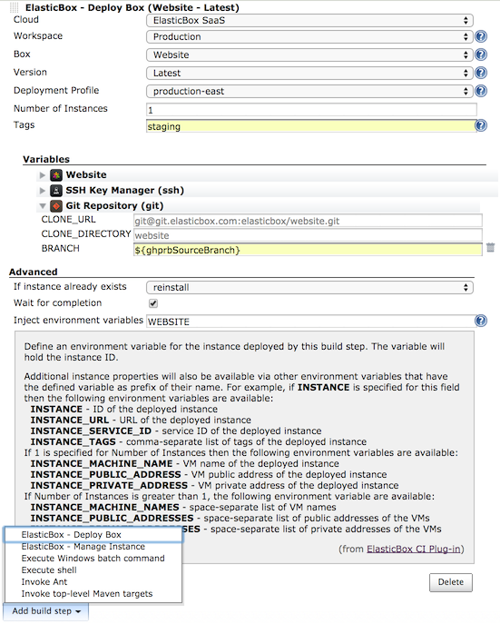
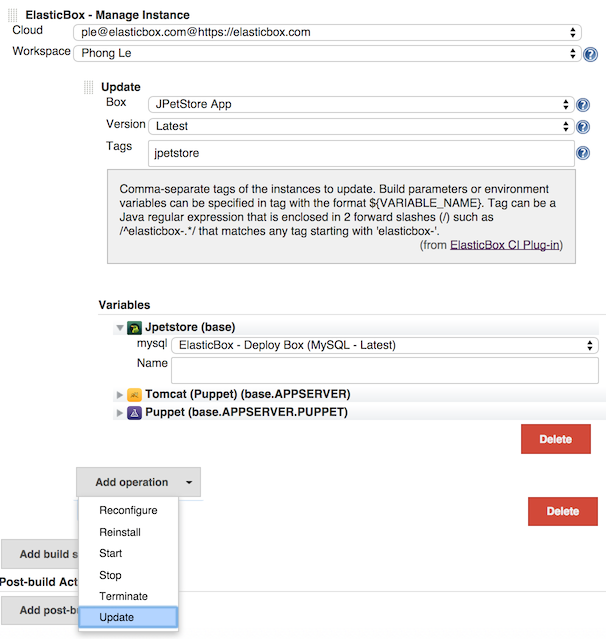
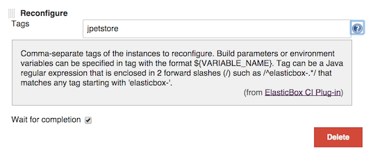
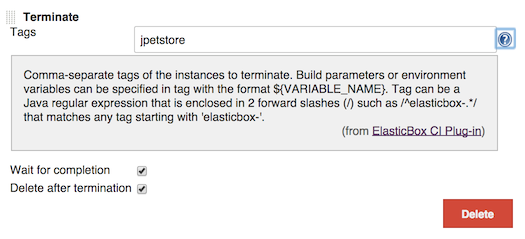

Provides full integration between Jenkins and ElasticBox
([http://elasticbox.com](http://elasticbox.com/)). With this plugin,
Jenkins can launch, provision, and manage Jenkins slaves on-demand in
different cloud providers via ElasticBox. It also provides build steps
to deploy and manage your applications, including complex, multi-tier
applications that are defined as boxes in ElasticBox.

  

Version compatibility

The plugin is always compatible with the latest version of ElasticBox.  
If you're using a previous version of ElasticBox (\<4.0), the latest
compatible version of the plugin is the 0.9.14

  

The current version of this plugin may not be safe to use. Please review
the following warnings before use:

-   [Credentials stored in plain
    text](https://jenkins.io/security/advisory/2019-10-16/#SECURITY-1434)

The latest documentation and tutorials can be found at
<https://elasticbox.com/documentation/integrate-with-jenkins/ci-cd-overview/>

# Installation / Configuration

-   Jenkins must be restarted after installation of this plugin for it
    to work properly. You can trigger a hot restart of Jenkins by
    checking the check box as shown below after your selection to
    install ElasticBox CI plugin.  
    

&nbsp;

-   If you are starting a JNLP Jenkins slave agent in your slave
    instance and your Jenkins server is not wide-open at every port,
    configure a fixed JNLP port for your Jenkins server under Manager
    Jenkins \> Configure Global Security.
-   Set Jenkins URL in configuration page of your Jenkins server with a
    host name or IP address that are accessible to the slaves.

# How To Use

-   Add ElasticBox as a cloud in the configuration page of Jenkins. You
    can add multiple ElasticBox clouds, one for each user at
    elasticbox.com or your own ElasticBox appliance. An authentication
    token is required to access ElasticBox. You can retrieve an
    authentication token from your ElasticBox account or enter the
    username and password, click Get Authentication Token button, then
    copy the returned token to the Authentication Token field. Click
    Verify Authentication Token to make sure that the specified token is
    correct.  
    
-   Create a Jenkins Slave box in ElasticBox (you can sign up at
    [http://elasticbox.com](http://elasticbox.com/) and use it right
    away if you don't have an ElasticBox account yet). The box must have
    required variables JENKINS\_URL and JNLP\_SLAVE\_OPTIONS. ElasticBox
    CI plugin will set the value of JENKINS\_URL variable to the URL
    configured for this Jenkins server, and fill the value of
    JNLP\_SLAVE\_OPTIONS automatically. Those variable are needed to
    download the slave agent from Jenkins server and start it from
    within the slave instance as shown in the following scripts.  
      
    Install event script
-   ``` syntaxhighlighter-pre
    #!/bin/bash

    # Download the slave agent from Jenkins server
    wget $JENKINS_URL/jnlpJars/slave.jar -O slave.jar
    ```

      
    Start event script
-   ``` syntaxhighlighter-pre
    #!/bin/bash

    # Execute the agent and save the PID
    nohup java -jar slave.jar $JNLP_SLAVE_OPTIONS > /dev/null 2>&1 &
    echo \$! > slave.pid
    ```

      
    You also need to add the following command in the stop event script
    of the Jenkins Slave box to kill the slave agent process when the
    instance is shutting down  
    ``` syntaxhighlighter-pre
    #!/bin/bash

    # Stop the agent
    kill -9 $(cat slave.pid)
    ```

&nbsp;

-   Configure slave to be provisioned on demand by clicking on Add
    button next to Slave Configurations in the ElasticBox cloud form.  
      
    Specify labels for the slave that any job can use to tie with slaves
    deployed with the configuration. The Environment is required and
    must be unique among slave configurations of the same ElasticBox
    cloud.

&nbsp;

-   You also can configure your Jenkins project or job to be built on
    ElasticBox-managed slaves as following. The slaves deployed with
    this per-project configuration are used exclusively for the
    project.   
      
    Select ElasticBox Single-Use Slave if you want to create a new
    instance for every execution of the job. After the job finished and
    the retention time elapsed, the instance will be terminated.

&nbsp;

-   Add ElasticBox - Deploy Box to deploy an instance of a specified
    box  
      
    You can specify build parameters or build environment variables as
    value of the variables or environment of the box you select to
    deploy. In the above picture, the GitHub Pull Request build
    parameter `ghprbSourceBranch` is specified as value for the variable
    BRANCH to receive the Git source branch to be used during deployment
    of the box.

&nbsp;

-   Add ElasticBox - Manage Instance build step to Update, Reconfigure,
    Reinstall, Stop, or Terminate instances
    -   **Update**  
          
        You can specify build parameters or build environment variables
        as value of the variables or environment of the box you select
        to update. .
    -   **Reconfigure**  
        Specify tags that are used to find the instances in the selected
        workspace of ElasticBox - Manage Instance build step to
        reconfigure  
        
    -   **Reinstall**  
        Similarly to Reconfigure, specify tags used to find instances to
        reinstall.
    -   **Start**  
        Similarly to Reconfigure, specify tags used to find instances to
        start.
    -   **Stop**  
        Similarly to Reconfigure, specify tags used to find instances to
        stop.
    -   **Terminate**  
        Similarly to Reconfigure, specify tags used to find instances to
        terminate. Additionally, you can select to delete the instance
        after its termination.  
        
