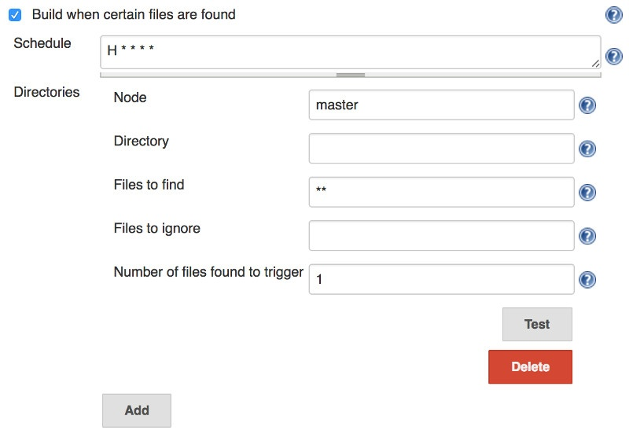

Build trigger that polls one or more directories and starts a build if
certain files are found within those directories.

Compatible with Java 7 and above.

### Instructions

Enable the trigger within the "Build Environment" section of the build's
configuration page.

### Screenshot

### Features

-   Detect files on the master or on a Jenkins slave.
-   Specify the files with [Ant-style includes and excludes
    patterns](http://ant.apache.org/manual/dirtasks.html).
-   Multiple directories can be specified.
-   Can specify the minimum number of found files to trigger the build.
-   Able to test the trigger before saving the settings.
-   Environment variables and global variables can be entered as $var or
    ${var}.
-   During the build, the settings can be accessed as environment
    variables.
    -   `filesfound_setting_node`
    -   `filesfound_setting_directory`
    -   `filesfound_setting_files`
    -   `filesfound_setting_ignoredfiles`
    -   `filesfound_setting_triggernumber`

### Similar Plugins

-   [FSTrigger
    Plugin](https://wiki.jenkins.io/display/JENKINS/FSTrigger+Plugin)
-   [File System
    SCM](https://wiki.jenkins.io/display/JENKINS/File+System+SCM)

### Release History

New releases may take a few hours to appear in the update center.

#### 1.5 (Mar 14, 2017)

-   Can now specify the minimum number of found files to trigger the
    build. ([pull request
    \#2](https://github.com/jenkinsci/files-found-trigger-plugin/pull/2))  
    Contributed by lyenliang
-   Improved diagnostic logging.
-   Now requires at least Jenkins 1.580.1 and Java 7.

#### 1.4 (Aug 15, 2015)

-   Can now look for files on Jenkins slaves.

#### 1.3.1 (Feb 25, 2015)

-   When the directory is not found, display a hint about file
    permissions.
-   Now requires at least Jenkins 1.520.

#### 1.3 (Aug 17, 2011)

-   The trigger settings are available to the build scripts as
    environment variables.
-   When testing the configuration, the number of files found is
    displayed.
-   Environment variables, provided by the global properties or the
    operating system, can be entered into the configuration page as $var
    or ${var}.
-   Now requires at least Jenkins 1.399.

#### 1.2 (Mar 06, 2011)

-   Multiple directories can be specified.
-   Now requires at least Jenkins/Hudson 1.377.

#### 1.1.4 (Feb 07, 2011)

-   Built from github repository with new Jenkins infrastructure. No
    behavioural changes.

#### 1.1.3 (Jul 18, 2010)

-   Removed dependency on Java 6, specifically the
    [String.isEmpty()](http://java.sun.com/javase/6/docs/api/java/lang/String.html#isEmpty())
    method.

#### 1.1.2 (Jun 20, 2010)

-   Now requires at least Jenkins/Hudson 1.301, rather than 1.349.

#### 1.1.1 (Jun 4, 2010)

-   Fixed the broken Ant documentation links within the help messages.

#### 1.1 (Apr 25, 2010)

-   Added a button to test the entered configuration before saving.
-   The `Files to find` field now defaults to `**`.
-   By default, no files are ignored. Previous releases ignored all
    files in the [Ant default
    excludes](http://ant.apache.org/manual/dirtasks.html#defaultexcludes).

#### 1.0.1 (Apr 23, 2010)

-   An exception no longer appears in the console when the entered
    directory does not exist.

#### 1.0 (Mar 16, 2010)

-   Initial release.
