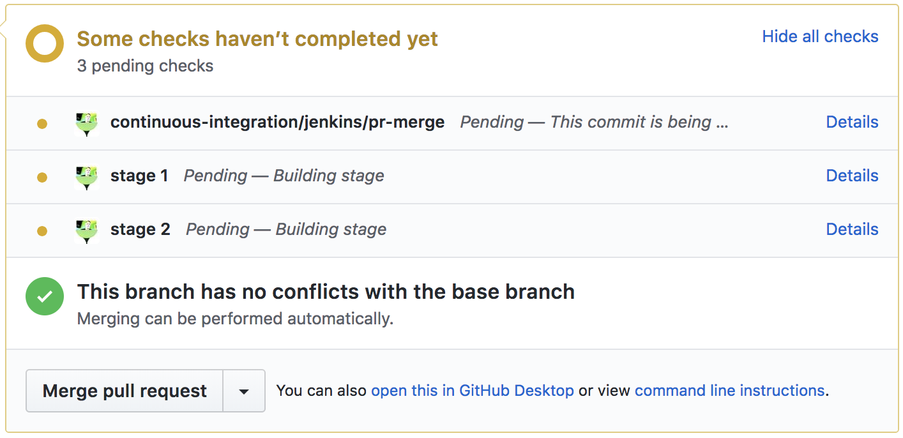
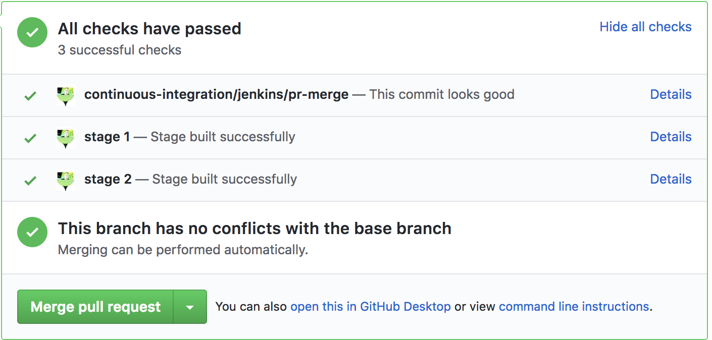
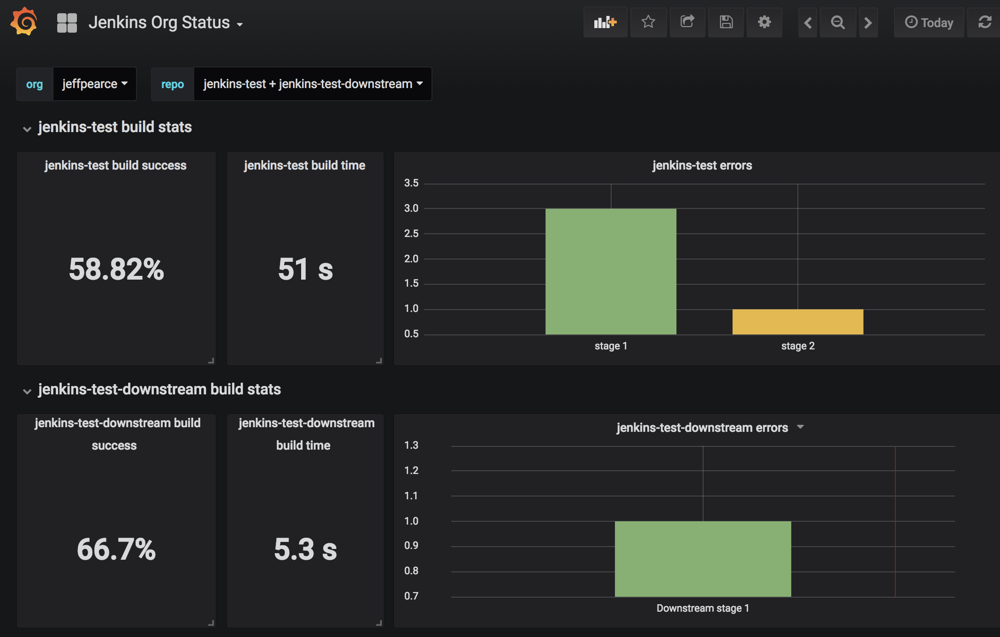

  

  

  

# Note: breaking change in version 3.0

Version 3.0 is listed as a breaking change in the Jenkins plugin update
center. This is because the optional user/password for notifying
influxDB now uses the credentials store instead of separate strings.

This is more secure, because otherwise the credentials are stored in
plain text on the Jenkins master.

If you are using the influxDB feature (and using user/password) to will
need to reconfigure the plugin to get them from a Jenkins credential
after upgrading. If this does not apply to you, you don't need to do
anything after upgrading.

# Overview

This plugin automatically sends status notification for all stages in
any pipeline job. You can configure the plugin to send status
information to:

-   Github, to see per-stage build status from the PR page

-   InfluxDb or StatsD (for automatic monitoring of build health) for
    any pipeline job

For example:

    pipeline {

      agent any

      stages {

        stage('Stage 1') {

          ...

        }

        stage('Stage 2') {

          ...

        }

    }

    }

The github page for the commit will initially show pending for each
stage:

{height="250"}

As each step is completed, the status will change to completed or error,
depending on the outcome of the stage. At the end of a successful build,
the PR page will show the following:

{height="250"}

## Showing build health in Grafana

The plugin can optionally be configured to send job and stage status to
an influxdb instance. This can be used to build dashboards in Grafana -
you can use the provided sample dashboards as-is, or as a starting point
for you own dashbaords. The sample dashboard shows overall build pass
rate, average build time, and error counts for each stage.

{height="250"}

The dashboard can configured to show all jobs, or you can select the
jobs you want to show.

### Configuring the plugin to send stats to Grafana

By default, the plugin only provides status to Github. To enable
reporting stats to influxdb for the Grafana dashboards:

1.  Open the system settings page in Jenkins (Manage Jenkins \>
    Configure System)
2.  Find the **Autostatus Config** section
3.  Click the **Send to influxdb** option
4.  Enter information for influxdb installation. You must provide the
    influxdb URL and database - all other information is
    optional.{height="250"}

### Configuring the plugin to send stats to StatsD

As noted above, by default the plugin only provides status to Github. To
enable reporting metrics to StatsD (introduced in 3.5.0):

1.  Open the system settings page in Jenkins (Manage Jenkins \>
    Configure System)
2.  Find the **Autostatus Config** section
3.  Click the **Send to statsd** option
4.  Enter the relevant information for your StatsD collector. You can
    provide:
    1.  StatsD Hostname
    2.  StatsD Port
    3.  StatsD Bucket
    4.  Maximum packet size (optional, defaults to 1400)

{height="250"}

### Importing the sample dashboard

A sample dashboard is available from grafana.com. The sample dashboard
provides a dropdown for all of the orgs with stats, and a second
dropdown for all of the repos within an org.

To import the sample dashboard (instructions current as of Grafana 5.0):

1.  Log into your grafana installation with a login that has permissions
    to create dashboards.
2.  Click the dashboard dropdown in the upper left of the page
3.  Click the **Import dashboard** link
4.  Enter the id **5786** in the **Grafana.com Dashboard** field
5.  Click the **Load** button
6.  Select the influxdb source that matches the database configured in
    Jenkins
7.  Click **Import**

Once you've imported the dashboard, just select the org you want to
monitor, then select the repos you want to provide stats for.

The sample dashboard is just a starting point to demonstrate how the
influxdb stats can be used to build dashboards. You can create
dashboards that show more detailed information, such as graphs of build
health over time. I'll continue to publish additional samples to
grafana.com as time permits.

# Version History

#### Version 3.5.0 (20-June-2019)

-   Added new feature to send metrics to StatsD collectors

#### Version 3.2 (13-Sept-2018)

-   don't include time spent blocked in total job time sent to influxdb
    (blocked time sent as a separate field).

#### Version 3.1.1 (05-Sept-2018)

-   update README, update center description, and wiki link

#### Version 3.1 (04-Sept-2018)

-   provide job name information for non-github jobs ([Github
    issue \#1](https://github.com/jenkinsci/github-autostatus-plugin/issues/12)6)

#### Version 3.0.1 (02-Sept-2018)

-   java.lang.NoClassDefFoundError in version 3.0, Jenkins
    2.121.3 ([Github
    issue \#12](https://github.com/jenkinsci/github-autostatus-plugin/issues/12))

-   Influx notifier needs to escape "=" and "," ([Github
    issue \#13](https://github.com/jenkinsci/github-autostatus-plugin/issues/13))

#### Version 3.0 (02-Aug-2018)

-   Move influxdb user/password to credentials ([Github
    issue \#9](https://github.com/jenkinsci/github-autostatus-plugin/issues/9))
-   Support secret text credentials in github status notification
    ([Github issue
    \#7](https://github.com/jenkinsci/github-autostatus-plugin/issues/7))

#### Version 2.1 (23-Apr-2018)

-   Add support for all pipelines (previously only supported declarative
    pipeline jobs).
-   Added support to send stats to an influxdb server for build
    monitoring

#### Version 2.0 (06-Feb-2018)

-   Removed unnecessary serialization of GHRepository

#### Version 1.0.1 (18-Oct-2017)

-   Minor updates

#### Version 1.0 (16-Oct-2017)

-   Initial release, supporting sending stage status to github for
    declarative pipeline branches only

  

  
