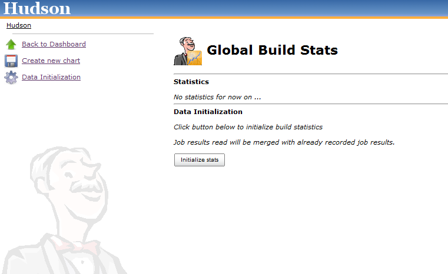
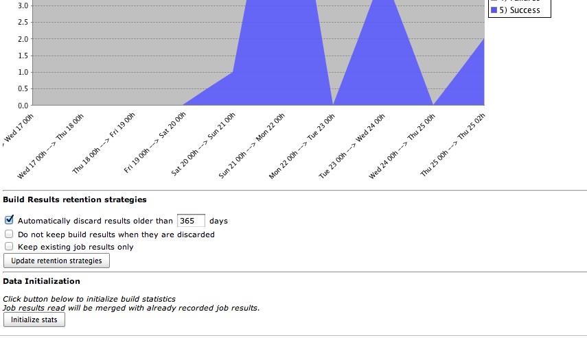
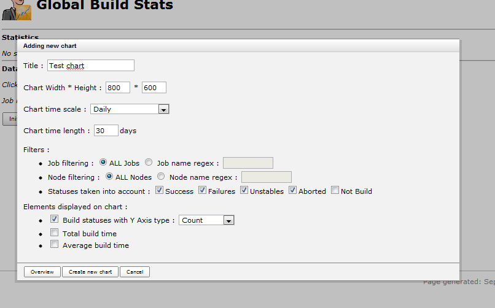
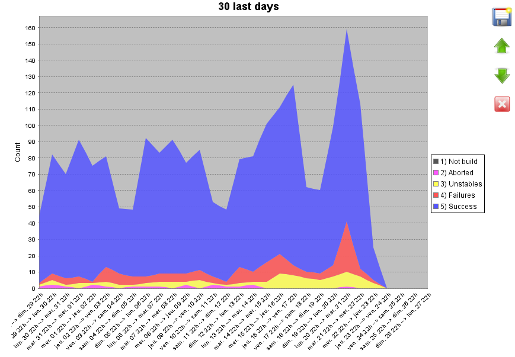
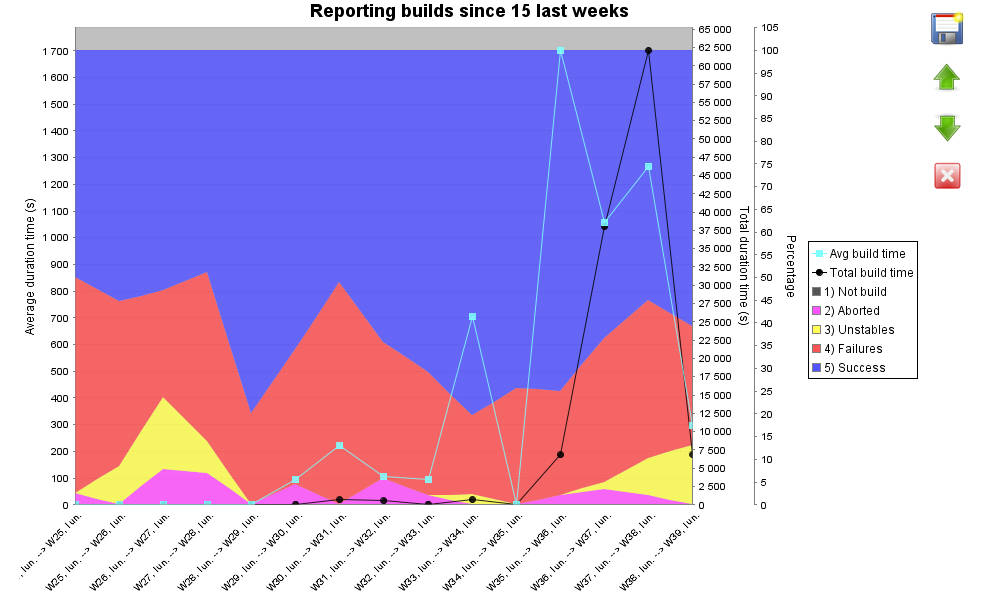
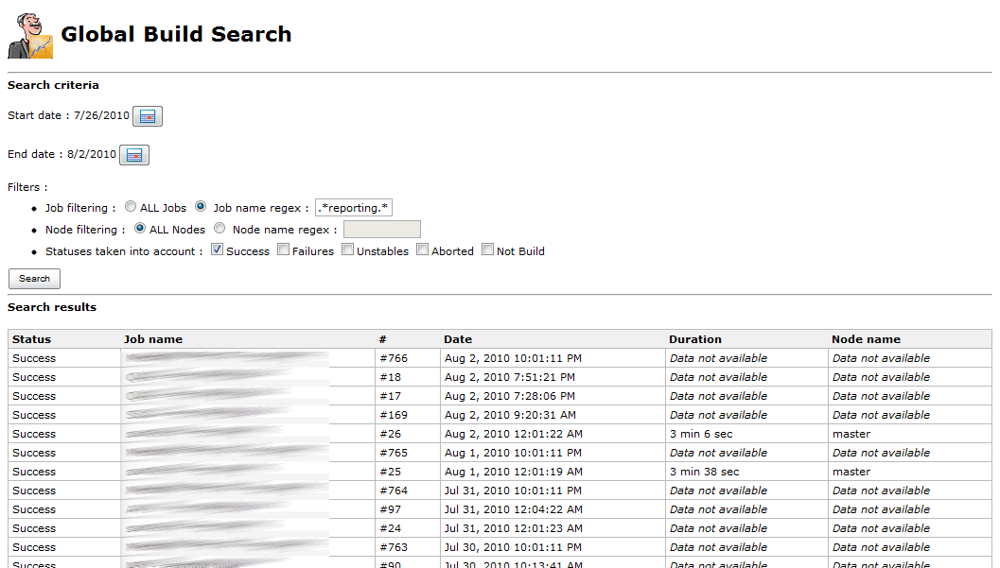

| Plugin Information                                                                                                |
|-------------------------------------------------------------------------------------------------------------------|
| View global-build-stats [on the plugin site](https://plugins.jenkins.io/global-build-stats) for more information. |

Older versions of this plugin may not be safe to use. Please review the
following warnings before using an older version:

-   [CSRF and XSS
    vulnerabilities](https://jenkins.io/security/advisory/2017-10-23/)

Global build stats plugin will allow to gather and display global build
result statistics.  
It is a useful tool allowing to display global jenkins/hudson build
trend over time.

# Requirements

Since v1.1, Global build stats plugin requires Jenkins 1.398 or higher.

Before v1.0, Global build stats plugin requires Jenkins/Hudson 1.339 or
higher.

# Installation

To install Global build stats Plugin, Go to the "plugin management"
section in the administration Panel.  
Latest released version will be available. Install it from there (you
should need to restart Jenkins/Hudson after that).

To verify that the plugin is well installed, go to the Administration
panel : you should see an icon with mister Jenkins/Hudson and a graph on
it :  
 or 

Then you can click it and access the global build stats config panel.

# Usage

The global build stats main screen is made of different sections :

-   On the left side : Action links
-   On the center : Charts displaying global build statistics & action
    buttons (update, move & delete)
-   On the bottom : Data initialization  
    

## Action links

4 links are availables :

-   Back to dashboard : Navigation link allowing to go back to
    Jenkins/Hudson root URL
-   Create new chart : Display a popup form to create a new Chart. See
    the [Create / Update a chart
    section](http://localhost:8085/display/JENKINS/Global+Build+Stats+Plugin#GlobalBuildStatsPlugin-chartcreationupdate).
-   Manage retention strategies. See the [Manage retention strategies
    section](http://localhost:8085/display/JENKINS/Global+Build+Stats+Plugin#GlobalBuildStatsPlugin-retentionStrategies).
-   Data Initialization : Useful to initialize your global build stats
    data, especially just after Global build stats first installation.
    See the [Data Initialization
    Section](http://localhost:8085/display/JENKINS/Global+Build+Stats+Plugin#GlobalBuildStatsPlugin-datainitialization).

## Data Initialization

If you click on this button, all of your existing persisted build
results will be gathered.  
This is particularly useful to initialize statistics in a first step.  
Note that data initialization gathering is only based on "recordable"
data. If you frequently purged your job results, data will no longer be
available for gathering. Nevertheless, once data has been initialized in
global-build-stats, it will be made available even if data is purged
(result data is cloned in the global-build-stats.xml file).  
Starting from 0.1 (and greater ones), you can perform several data
initializations : existing global-build-stats.xml will be merged against
eventually new gathered data.

Take into account the following only if you are using a 0.1-alphaX
version of global-build-stats plugin (for greater versions, data are
merged and thus, never lost) :  
**Beware** : this should be done only once because :

-   Statistics are automatically updated after each build
-   "not recoverable" statistics (for example, if you check the "delete
    old builds" checkbox on job configuration) will be lost if you click
    this button

## Manage retention strategies

This section is for customizing job build result retention for
global-build-stats plugin.  
Job build result is the largest data stored in global build stats
configuration files (in global-build-stats.xml or
global-build-stats/jobResults/\*). That is to say, if you're expecting
some disk consumption issue, a workaround would be to be stricter on the
job build result retention strategies.

Warning

Using retention strategies will delete **permanently** job build
results. Thus, you won't be able to retrieve them.  
Take this functionality with care.

Prior to version 1.2, 3 retention strategies are available :

-   Automatically discard results older than X days : as mentioned, by
    checking this strategy, a daily purge process will be executed to
    clean oldy job build results stored
-   Keep existing job results only : by checking this strategy, a purge
    will be triggered **only once** (when submitting the form) that will
    ensure every global-build-stats stored build results correspond to
    an **existing** (ie not purged) build result.
-   Do not keep build results when they are discarded : by checking this
    strategy, every time someone will delete a build or a job,
    corresponding job results stored by global build stats will be
    deleted. This strategy is different than "keep existing job result
    only" strategy since it won't affect job results stored in the past.
    Moreover, it is a strategy that will be triggered regularly (instead
    of only once for "keep existing job results only").

## Build stats Chart Creation / Update

In this popup form, you can create a new Build Stats Chart.  

Here are some details on the different parameters :

-   Chart title : Title displayed on top of the Chart
-   Chart size : Width & Height (in pixels) of the created chart
-   Chart Scale : Unit of chart X axis. Either Year, Month, Week, Day or
    Hour. Difference between "XXX" and "XXX From now" concerns the X
    axis ranges. If current datetime is 2010/10/27 3:00 PM and selected
    chart scale is "daily", last date ranges on X axis will be \[
    2010/10/26 00:00 AM -\> 2010/10/27 00:00 AM \] and \[ 2010/10/27
    00:00 AM -\> 2010/10/27 3:00 PM \]. If "daily from now" were
    selected, we would have \[ 2010/10/25 3:00 PM -\> 2010/10/26 3:00 PM
    \] and \[ 2010/10/26 3:00 PM -\> 2010/10/27 3:00 PM \]
-   Chart Length : Number of steps (ticks) on X axis. Unit used depends
    on selected chart scale.
-   Job filtering : Either All jobs (no filtering) or a job name regex
    (syntax is the same than the one used by [Pattern
    class](http://docs.oracle.com/javase/7/docs/api/java/util/regex/Pattern.html)
-   Node filtering : Either All nodes (no filtering), master node, or a
    node name regex (syntax is the same than the one used by [Pattern
    class](http://docs.oracle.com/javase/7/docs/api/java/util/regex/Pattern.html)
-   Launcher filtering : Filtering on user who launched the build.
    System user is used when performing triggered non manual builds, so
    if you want to display "automatic" (=non manual) builds, check the
    "System only" radio button. The user name regex syntax is the same
    than the one used by [Pattern
    class](http://docs.oracle.com/javase/7/docs/api/java/util/regex/Pattern.html)
-   Statuses filtering : Success, Failures, Unstables, Aborted or Not
    Build builds. Not that "not build" statuses are unchecked by default
    : this status is special since sometimes, on a successful maven
    multi module project, module builds are marked as "not build"
    (unknown reason)
-   Elements displayed on chart. I call these elements "dimensions" :
    -   Build statuses : will show build count (or percentage) for each
        selected build statuses
    -   Total build time : will display total cumulated build time on
        each time ranges. This functionality could be useful to
        determine the cost of an externalization in a "Jenkins/Hudson as
        a Service" platform like [cloudbees](http://www.cloudbees.com/)
    -   Average build time : will display average cumulated build time
        on each time ranges

All fields are mandatory. Chart's width, height & length should be
integers.  
**If at least 1 server-side validation fails, form will not be
"submittable".**

Before submitting the form, you can have a look at the future chart
which will be displayed by clicking the "overview" button.

## Build stats Chart display

This section displays every persisted Chart Configurations.  
You can, too, edit, delete or move up/down these graphs.  
Graphs are created using REST-like URL so that you can export this URLs
into your favourite Portal or CMS (or Jenkins/Hudson dashboard).  
2 chart examples can be seen below :  
  

Last chart displays the 3 available dimensions altogether (result
counts, total build time & average build time).

By clicking a results counts region, you will be redirected on the build
search engine screen.  
See the Build Search engine section for further details.

Near every build chart, you'll have at least two button : edit & delete
buttons.  
Depending of the placement of your chart, you'll be able to "move
up/down" the chart.

#### Notes about user & node filtering

Warning

Don't expect to have relevant results just after an upgrade between :

-   pre and post 0.4 versions for node filtering
-   pre and post 1.0 versions for user filtering

When migrating, only not purged data (concerning node & user having
launched the build) will be recorded.  
That is, "old" data (such as builds executed a few weeks ago) won't be
available.

Starting from your plugin upgrade, full data will obviously be recorded.

#### Notes about durations displayed when migrating to v0.5

Warning

For the same reasons as above, don't expect to have relevant results
just after an upgrade between pre and post 0.5 versions : you'll have to
wait a few times in order to have sufficient data amount to calculate
total & average build duration.

## Build search engine

The build search engine is accessible by clicking a build result region
on a chart.  
It will provide search criteria to query the global-build-stats build
results on different ways : result status, job name, node name and date
ranges.  

Result sort order can be changed by clicking the table headers.  
If build result has not been purged, a clickable link will be displayed
to navigate through the console output & the detailed build result.

## Bonus track : Global-build-stats JSON API

A detailed section has been created to describe [how to retrieve
global-build-stats data from Jenkins/Hudson standard JSON & REST
API](http://wiki.jenkins-ci.org/pages/viewpage.action?pageId=46336030).

# Product backlog

## Known issues

type

key

summary

Data cannot be retrieved due to an unexpected error.

[View these issues in
Jira](http://issues.jenkins-ci.org/secure/IssueNavigator.jspa?reset=true&jqlQuery=project%20=%20JENKINS%20AND%20status%20in%20%28Open,%20%22In%20Progress%22,%20Reopened%29%20AND%20component%20=%20%27global-build-stats-plugin%27&src=confmacro)

## Future version(s)

Identified issues :  
[JENKINS-7241](https://issues.jenkins-ci.org/browse/JENKINS-7241):
Special characters in chart title ("é" for example) are not well filling
textfields in edit form  
Fix legend item sorting (for now, sort depends on alphabetical order...
that's why statuses are prefixed with "1), 2).."  
Fix date displayed on build search view, due to yui calendars  
Rename persisted node names in global-build-stats.xml after node is
renamed

Features :  
Test global build stat behaviour under IE & Safari  
Cache chart renderings (provide a checkbox in the
buildStatConfiguration, allowing to enable chart caching with a given
refresh rate based on selected time scale). Chart rendering will cache
chart in-memory (thus it will consume a little bit more memory) but will
reduce the CPU used when displaying the chart. It feets particularly
well if you decide to "share" your chart with lots of users that will
want to display it (on the jenkins/hudson welcome screen for example)  
In build search results, allow to limit number of results (radio button
allowing "unlimited" and "limited to XXX results")  
Allow to select build start or build end for stats gathering (build end
could be calculated with build start + duration). For now, we use only
build start  
(if possible) Allow to click on a date to display date builds (no matter
the build result)  
If possible, provide tooltips on chart, displaying the 10 first job
names matching with the current hovered region

Tasks :

# Releases

## 1.5 (October 23, 2017)

-   [Fix security
    vulnerability](https://jenkins.io/security/advisory/2017-10-23/)

## 1.3 (April, 5th, 2012)

#### Improvements

-   Provided action link to the retention strategy section
-   [JENKINS-9088](https://issues.jenkins-ci.org/browse/JENKINS-9088) :
    Fixed stack ordering of build statuses in a more natural manner :
    not build \> failures \> aborted \> unstables \> success
-   Hierarchical project support

## 1.2 (August, 25th, 2011)

#### Improvements

-   Related to
    [JENKINS-10607](https://issues.jenkins-ci.org/browse/JENKINS-10607)
    : **Largely improved data serialization** by :
    -   Saving things in a separate thread (jobs are not hanging anymore
        after completing, due to data saving)
    -   Job build results are now sharded into monthly files so that
        save will be performed in a constant time
-   Allowing to define **build result retention strategies**, which will
    purge stored job build results and lower job build result filesize
    on filesystem. See the [Manage retention strategies
    section](http://localhost:8085/display/JENKINS/Global+Build+Stats+Plugin#GlobalBuildStatsPlugin-retentionStrategies)
    section for further informations.

#### Bugs

-   [JENKINS-10563](https://issues.jenkins-ci.org/browse/JENKINS-10563)
    Fixed NoSuchElementException when no job result was gathered
-   [JENKINS-10607](https://issues.jenkins-ci.org/browse/JENKINS-10607)
    Jenkins jobs hangs when finished

## 1.1 (August, 3rd, 2011)

#### Tasks

-   Changed Global build stats logo to be jenkins compliant

## 1.0 (November, 14th, 2010)

#### Fixed bugs

-   Internationalized week & day labels on charts

#### Improvements

-   Recorded user who launched the build, displaying it on build search
    engine view
-   Provided filter on user who launched the build (will allow to filter
    on build launched by SYSTEM only to skip manually launched builds)
-   Provided radio button allowing to filter on master node only
-   Check if build result has been performed at least once... if not,
    automatically perform a data recording
-   Externalized javascript functions in JS cacheable files
-   Simplified data migration API

#### Tasks

-   Provide wiki entry about global-build-stats json API
-   Update wiki's screenshots / user guide with new features of 0.3 &
    0.4
-   Moved global build stats svn tags on
    <https://svn.dev.java.net/svn/hudson/tags/global-build-stats/>

## 0.5 (September, 23th, 2010)

#### Improvements

-   **Display total & average builds duration** on charts
-   **Node name filtering**

## 0.4.1 (September, 16th, 2010)

#### Fixed bugs

-   [JENKINS-7476](https://issues.jenkins-ci.org/browse/JENKINS-7476):
    Jelly exception on plugin manager screen ("installed" tab)

## 0.4 (September, 15th, 2010)

#### Fixed bugs

-   [JENKINS-7240](https://issues.jenkins-ci.org/browse/JENKINS-7240):
    Don't provide link to console in build search results if build
    informations have been deleted

#### Improvements

-   **Recording additionnal data** : job build duration & job build node
    name (only used in the build search screen for now !)
-   **Allow to change y-axis unit to percent**
-   **Allow to change chart id** (for security concerns)
-   **Internationalized plugin**
-   Provide API informations regarding buildStatConfig
    (/plugin/global-build-stats/api/json?depth=2&buildStatConfigId=*XXX*)
-   Display build duration on the build search screen

#### Tasks

-   Create a JIRA component for global build stats : Issues can be seen
    here
    (http://issues.jenkins-ci.org/secure/IssueNavigator.jspa?mode=hide&reset=true&jqlQuery=project+%3D+HUDSON+AND+status+in+(Open,+%22In+Progress%22,+Reopened)+AND+component+%3D+'global-build-stats')

## 0.3.1 (August, 18th, 2010)

#### Fixed bugs

-   In some versions of chrome, "delete" JS method seems to no be
    allowed (and was, then, resulting in JS syntax errors).  
    Global build stats has been tested only with firefox & chrome. Tests
    will be made under safari & IE soon.

## 0.3 (August, 17th, 2010)

#### Fixed bugs

-   jobFilter property was badly persisted if radio button was let to
    "ALL" by default (+ provided data migration for previous versions)
-   Fixed encoding of special characters ("é" for example) in chart
    title

#### Improvements

-   Provided data migration tool API to migrate from different versions
    of the persisted plugin data (it will be easier to migrate from one
    version to another)
-   Optimized global-build-stats.xml file size (1.5Mo for 8600 build
    results) =\> Reduced by half thanks to xstream aliases
-   **UI Greatly improved by doing AJAX calls** :
    -   Move up/down in chart listing are made with AJAX (no more
        refresh !)
    -   Create/Edit/Delete in chart listing are made with AJAX (no more
        refresh !)
-   Allow an overview of a chart in the new Create/Edit popup form
-   **All charts are given a unique identifier** + calling the
    /plugin/global-build-stats/showChart?buildStatId= url (instead of
    /plugin/global-build-stats/showChart?widht=&height=etc..) will have
    the security checks de-activated  
    =\> You can now share your charts without being redirected on a 403
    error  
    Url /plugin/global-build-stats/showChart remains accessible (and is
    used for chart overview), but there, security checks are performed
    (you must be an administrator to reach the chart)
-   Provided a link, in build search results, to direct console output
    for a build number
-   Switched "unstables" and "aborted" colors (unstables:pink=\>yellow,
    aborted:yellow=\>pink) to fit with standard jenkins/hudson display +
    changed display order + changed chart background color (yellow area
    will be more visible)

#### Tasks

-   Refactored GlobalBuildStatPlugin into several new layers : business,
    validation (lowers complexity of GlobalBuildStatPlugin class)

## 0.2 (July, 4th, 2010)

#### Fixed bugs

-   Bug: Hour reset lead to 00h instead of 12h

#### Improvements

-   **Global build search engine** allowing to select several search
    criteria concerning build results and display search results
-   **Chart can be clicked** : it will list selected builds category on
    clicked year/month/week/day/hour
-   Change date displayed on chart depending on selected scale (time
    axis' height is largely lowered !)

## 0.1 (June, 13th, 2010)

#### Fixed bugs

-   Fixed rootUrl problem in checkUrls AJAX validation
-   Fixed vertical axis size in charts
-   Synchronized blocks whenever data are recorded **in order to prevent
    plugin from ConcurrentModificationException** (plugin is now thread
    safe !)  
    Note: If you have $HUDSON\_HOME/\*.tmp files looking like your
    global-build-stats.xml file, you can delete them !
-   "\\" are now allowed in your job name regexes

#### Improvements

-   **Jenkins/Hudson version 1.339 is now required**
-   **Secured chart listing screen : Administer rights needed**
-   Added HOURLY\_FROM\_NOW, DAILY\_FROM\_NOW, WEEKLY\_FROM\_NOW,
    MONTHLY\_FROM\_NOW and YEARLY\_FROM\_NOW chart scales.  
    **Beware** : pre-1.0 YEARLY, MONTHLY and WEEKLY scales were acting
    the same as post-1.0 YEARLY\_FROM\_NOW, MONTHLY\_FROM\_NOW and
    WEEKLY\_FROM\_NOW.  
    **If you want to keep your chart as if it were in pre-1.0, you
    should update these scales !**
-   Improved color used
-   Provided backward compatibility of BuildStatConfiguration (with
    1.0-alpha1 release)
-   Data initialization is now made via AJAX submission
-   Data initialization now merges read data with existing data : you
    won't lose data anymore !
-   "not build" status is unchecked by default
-   Added icons instead of buttons for chart actions (delete/edit/move
    up/move down)

## 0.1-alpha4 (March, 13th, 2010)

AJAX Form validation enabled

## 0.1-alpha3 (March, 1st, 2010)

Fixed bug : If checkbox are unchecked, build stat config is not added  
Some precision : if chart doesn't appear after form submission, check
your fields : all are mandatory (except for checkboxes which can be
unchecked), width & heigth & length should be integers

## 0.1-alpha2 (March, 1st, 2010)

Minimum Jenkins/Hudson version downgraded from 1.339 to 1.321  
Chart persistence implemented.  
Create/Update/Delete multiple chart build configurations.  
Added job name filtering.  
Changed displayed date pattern on chart.  
Server-side form validation is done .... but nothing is displayed on the
user side (due of lack on knowledge on form validation ... see 0.1
roadmap to see how this will be handled in the future)

## 0.1-alpha1 (February, 21th, 2010)

First release.  
Contained only a unique chart and the possibility to initialize build
stats from existing build results.  
Chart is contructed in a RESTly way that is to say you can provide GEt
parameters to the chart.  
No Chart persistence implemented.

# Greetings to our sponsors

I'm a proud user of
.  
Feel free to download and test this IDE, it's worth a try !
