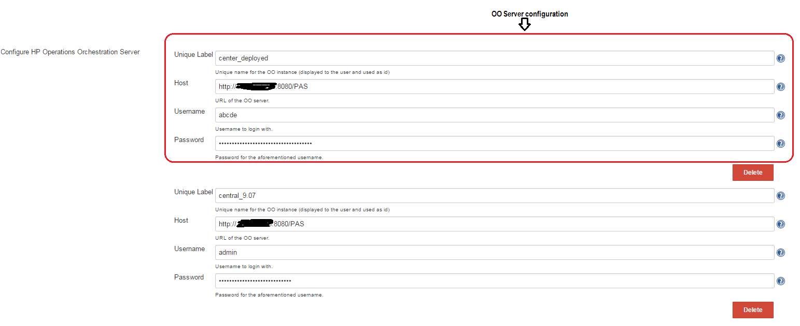
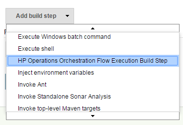
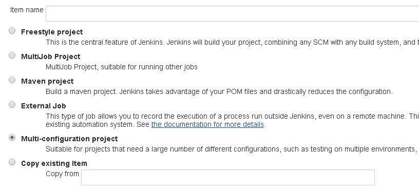
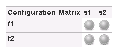
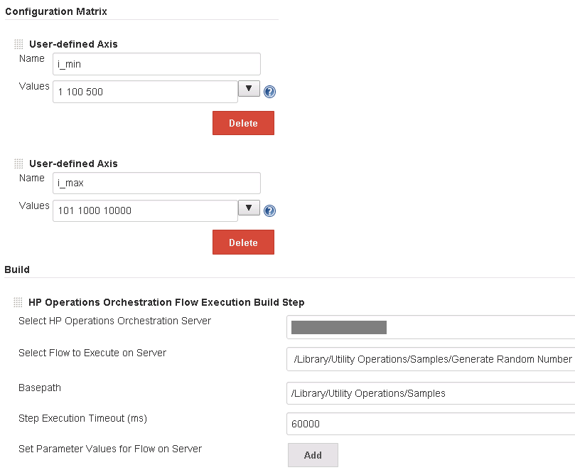
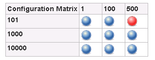
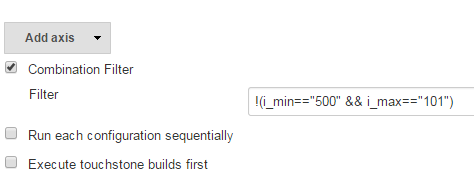
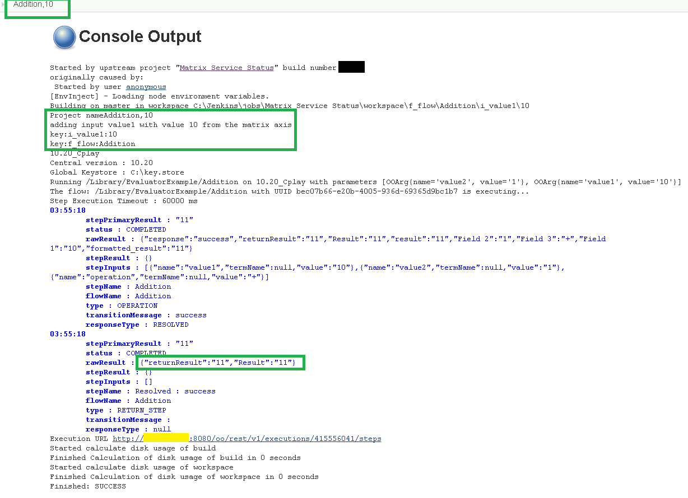

type

key

priority

summary

status/

Data cannot be retrieved due to an unexpected error.

[View these issues in
Jira](https://issues.jenkins-ci.org/secure/IssueNavigator.jspa?reset=true&jqlQuery=project%20=%20JENKINS%20AND%20component%20=%20hp-operations-orchestration-automation-execution-plugin/&src=confmacro)

            The ***HP OO Automation Execution*** plugin enables you to
leverage the capabilities of HP OO as part of your build and testing
cycles, providing DevOps capabilities for your application.

            This plugin is open source. If you identify any issues or
want to submit enhancement requests, please
use [JIRA](http://issues.jenkins-ci.org/). The component for this plugin
is the hp-operations-orchestration-automation-execution-plugin. Your
feedback will allow us to stabilize and enhance the plugin.

            Use the Case Study document to investigate several use cases
that can be implemented using the plugin.

This new version is backward compatible with the OO 9.x servers but with
limited functionality. In other words you can use this version to run
the 9.x flows as you already did but for all the new features you need
to have OO 10.x version.

This version is also compatible with the HP OO Community Edition of 10.x
version.You can download this free version here:[HP OO Community
Edition](http://www8.hp.com/us/en/software-solutions/operations-orchestration-it-process-automation/try-now.html?compURI=tcm:245-1625482)

# About this plugin

**HP Operations Orchestration**  

            HP Operations Orchestration (HP OO) software is a leading
product in the IT Process Automation market. HP OO automates the tasks
and processes in datacenters using workflows that help IT teams execute
change with greater speed, quality, and consistency.

            HP Operations Orchestration software includes HP OO Central
and HP OO Studio. OO Central is a web-based application used for
promoting, running and scheduling flows, administering the system, and
extracting and analyzing data resulting from flow runs. OO Studio is an
intuitive and easy-to-use tool for authoring and designing workflows.

            HP OO comes with a large OOTB content library, offering the
ability to integrate with many other HP software products and 3rd party
vendors like VMware, Microsoft and Openstack

            For more details see the [HP Operations Orchestration
product
page](http://www8.hp.com/us/en/software-solutions/software.html?compURI=1170673#.UQjmE7_ks2w).
   

**HP OO Content for Jenkins**

** **

            As part of the [HP
OO Community](https://hpln.hp.com/group/operations-orchestration),
content for Jenkins was created. This content is open for changes and
free for use by any OO customer. The content can be used to interact
with Jenkins continuous integration application and implements basic use
cases such as running jobs and getting details about different jobs. The
content allows you to communicate back to the Jenkins CI Server from the
same workflow that was triggered by the plugin

# Installation and Configuration

##  Manual Installation

1.  Stop the Jenkins service.
2.  Copy the
    **hp-operations-orchestration-automation-execution-plugin.hpi** file
    in the **JENKINS\_HOME\\plugins** folder.
3.  Start the Jenkins service.
4.  Go to the **Jenkins** dashboard and select **Manage Jenkins** and
    then **Manage Plugins**.
5.  In the **Installed** tab, the plugin list displays the Operations
    Orchestration plugin.


## Manual uninstallation  

1.  Stop the Jenkins service.
2.  Delete
    the hp-operations-orchestration-automation-execution-plugin folder
    in the **JENKINS\_HOME\\plugins** folder.
3.  Delete
    the hp-operations-orchestration-automation-execution-plugin\*.hpi\* file
    in the **JENKINS\_HOME\\plugins** folder.
4.  Delete the com.hp.mercury.ci.jenkins.plugins.OOBuildStep.xml in
    the **JENKINS\_HOME** folder.
5.  Start the Jenkins service.

## Automated Installation

1.  Go to the **Jenkins** dashboard and select **Manage Jenkins** and
    then **Manage Plugins**. In the **Available** tab, search for the
    plugin as **hp operations**
2.  Select the plugin and hit Install without restart  

## Automated uninstallation

1.  Go to the **Jenkins** dashboard and select **Manage Jenkins** and
    then **Manage Plugins**. In the **Installed** tab identify the
    plugin and hit uninstall button.
2.  Next time you restart Jenkins the plugin will be automatically
    uninstalled. 

# Configurations

1.  Go to the Jenkins dashboard, and select **Manage Jenkins** and
    then **Configure System***.*
2.  Scroll down until you see the **HP Operations Orchestration** field
3.  In the **Truststore File** field, enter the absolute path of the JKS
    truststore used for communication with the Operations Orchestration
    server over SSL. For details on how to generate the JKS truststore
    please refer to the section *Configuring SSL for the plugin on 10.x
    versions of OO*.  This field is only mandatory if one of the defined
    Operations Orchestrations servers is running on HTTPS.
4.  In the **Truststore Password** field, enter the password for the JKS
    truststore. The password must be at least 6 characters in length. 

  
To see the list of servers just click on the **Show Servers...** button

            Inside the **Configure HP Operations Orchestration
Server** section:

1.  In the **Unique Label** field, enter the name of the Operations
    Orchestration server. The unique label acts as a global identifier
    across all defined Operations Orchestration servers.
2.  In the **Host field,** enter the HP Operations Orchestration
    URL. For example, https://\<host\>:\*\<\*port\>/PAS for an HTTPS
    configured Operations Orchestration server. See the configuration
    sample.
3.  In the **Username** and **Password** fields, enter the HP Operation
    Orchestration authentication account.
4.  Click the **Apply** or **Save** button to save the Operations
    Orchestration server configurations in the Jenkins global settings.

Optional actions:

-   To add a new Operations Orchestration server, click
    the **Add** button.
-   To delete an Operations Orchestration server, click
    the **Delete** button.
    

# Integrating Operations Orchestration in the Jenkins build

               From the job configuration page go to the **Add build
step** menu and select **HP Operations Orchestration Flow Execution
Build Step**.

  
Inside the **HP Operations Orchestration Flow Execution Step** section
you should see the plugin like in the picture below:

  
Click on the **Advanced...** button to have the list of all the options.

1.  From the **Select HP Operations Orchestration Server** list, select
    the Operations Orchestration server. If the **Unique Label** of an
    Operation Orchestration server was changed, you must update the
    Jenkins job configurations wherever that server is referenced.
2.  From the **Select Flow to Execute on Server** list, select the flow
    to execute.
3.  In the **Basepath** field, enter the parent folder where the flow to
    execute is located.
4.  The **Select Flow to Execute on Server** list is populated with the
    flows residing in the folder entered in the **Basepath** field.
5.  The **Basepath** value represents the absolute folder path from the
    Operation Orchestration Content library.
6.  In **Step Execution Timeout (ms)** field, enter the maximum amount
    of time (in milliseconds) that the plugin should wait for each step
    to execute before it ends the Jenkins build.
7.  If the timeout expires, the execution log will not be available.
8.  Click the **Refresh** button to refresh the flows shown in
    the **Select Flow to Execute on Server** list.
9.  Optional actions:

-   To add the flow inputs to the selected flow, click
    the **Add** button. (see the image below)
-   To delete flow inputs from the selected flow, click
    the **Delete** button. (see the image below)
-   You can change the build result status to
    either **FAILURE** or **UNSTABLE** by testing a certain output
    against a constant, through the use of the following operators: IS,
    CONTAINS, STARTS\_WITH, DIFFERS\_FROM, IS\_A\_REGEX\_MATCH\_FOR.  
    To change the build status, you must input the necessary information
    in the fields.

               For more information about each field you can use the
help button. You can find configuration examples for setting up a server
or running a flow.


# Reporting in the Jenkins console

            The plugin writes in the Jenkins console the following
information: \<serverName\>  
Authentication will be used for the user : \<username\>  
Central version : \<centralVersion\>  
Global Keystore : \<globalKeystoreFile\>  
Running \<flowName\> on \<serverName\> with parameters \<parameters\>  
The flow: \<flowName\> with UUID \<flowUUID\> is executing...  
Step Execution Timeout : \<stepExecutionTime\> ms             After this
information is logged, the actual execution starts on the OO Central
server.             After the execution completes, the plugin outputs
the entire JSON from the execution log.       The last bit of
information written by the plugin in the console is the actual URL to
the execution from Central.

# Configuring SSL for the plugin on 9.x versions of OO

            If the Operations Orchestration server is configured to run
over HTTPS, then in order for the Operations Orchestration plugin to be
able to communicate with the Operations Orchestration server, the OO
plugin trustStore must contain the public key of the certificate used by
the server.

            To manually import a security certificate into the
Operations Orchestration plugin’s JKS truststore, you must perform the
following steps:

-   Export the OO server’s certificate public key,
    from **\<INCONCLUDE\_HOME\>\\conf\\rc\_keystore** : \>keytool
    -export -keystore rc\_keystore -alias pas -file PasPublicCert.cer   
     \* Import the OO server’s certificate into the plugin truststore on
    the Jenkins machine :\>keytool --importcert --keystore
    oo\_plugin\_truststore --file PasPublicCert.cer -alias pas\* After
    the import, verify that the import was successful using the
    command: \>keytool --list --keystore
    oo\_plugin\_truststore            The Operations Orchestration
    plugin truststore will contain the **TrustedCertEntry** with the
    imported key and the provided alias (pas). 

# Configuring SSL for the plugin on 10.x versions of OO 

## A. Self-signed certificate

1.  Stop Central and back up the original key.store file, located in

            *\<installation dir\>/central/var/security/key.store*

\* *

1.  Open a command line in \<installation dir\>/central/var/security.
2.  Delete the existing server certificate from the Central key.store
    file, using the following

            *keytool -delete -alias tomcat -keystore key.store
-storepass \<changeit\>*

1.  Generate a self-signed certificate:

            *keytool -genkey -alias tomcat -keyalg RSA -keypass
\<changeit \>-keystore             \<path/for/new/Keystore\> -storepass
\<changeit\>-storetype pkcs12 -dname*

\*            "CN=\<CENTRAL\_FQDN\>, OU=\<ORGANIZATION\_UNIT\>,
            O=\<ORGANIZATION\>, L=\<LOCALITY\>, C=\<COUNTRY\>"*

            Note: If you do not enter a path for generating the new
keystore, it is created in the folder where you entered the command, for
example \<installation dir\>/central/var/security.

1.  Import the self-signed certificate to the Central key.store file:

            *keytool -v -importkeystore -srckeystore
\<new/path/created/Keystore\> -srcstoretype    PKCS12 -srcstorepass
\<changeit\> -destkeystore key.store -deststoretypeJKS -     
deststorepass \<changeit\>*

            6. Start Central. 

## B. CA Certificate

            This information is present in the Hardening guide delivered
with OO 10.10 and newer versions. The following procedure uses the
Keytool utility that is located in \<installation dir\>/java/bin/keytool
on the Central server.

1\. Stop Central and back up the original key.store file, located in

*\<installation dir\>/central/var/security/key.store.*

\_2. \_Open a command line in \<installation dir\>/central/var/security.

3\. Delete the existing server certificate from the Central key.store
file

             *keytool -delete -alias tomcat -keystore key.store
-storepass changeit*

 4. If you already have a certificate with .pfx or .p12 extension, then
go to the next step.

If not, then export the certificate with private key into PKCS12 format
(.pfx, .p12).

        For example, if the certificate format is PEM:

             *\>openssl pkcs12 --export --in \<cert.pem\> -inkey
\<key.key\> -out \<certificate name\>.p12      --name \<name\>*

        If the certificate format is DER, add the --inform DER parameter
after pkcs12.

             *\>openssl pkcs12 --inform DER --export --in \<cert.pem\>
-inkey \<.key\> -out \<certificate    name\>.p12 --name \<name\>*

        Note: Make a note of the password that you provide. You will
need this password for the         private key when you input the
keystore passphrase later in this procedure.

 5. Extract the alias for your certificate’s alias, using the following
command:

             *keytool -list -keystore \<certificate\_name\> -v
-storetype PKCS12*

            The alias is displayed.

6\. Import the PKCS12 format server certificate to the Central key.store
file:

            *keytool -importkeystore -srckeystore \<PKCS12 format
certificate path\> -destkeystore    key.store -srcstoretype pkcs12
-deststoretype JKS -alias \<cert alias\> -destalias tomcat*

7\. It is recommended to change the default “changeit” password in the
automatically-generated keystore in the Central server.

8\. Start Central.

# Matrix Configuration Job

            A matrix is a collection of smaller jobs. Each job runs a
flow on a Central with a certain combination of inputs.  If any of the
smaller jobs fails, the main job will fail.  

Invoking simple operations is not supported.             

            The 3 types of information that can generate the matrix
are:  

             - What flow runs

             - What Central the flow runs on

             - What inputs the flow runs with  

            The plugin can be used to trigger the following types of
scenarios:  

-   Running a flow on the same Central with different values for some
    input(s).
-   Running different flows on different Centrals with the same,
    hardcoded inputs.
-   Running different flows on different Centrals with different input
    values.  

In order to create a matrix, add a new *Multi-configuration project*
item in Jenkins.

  
After the project is created, the next step is to add the axis and a HP
Operations Orchestration Flow Execution Build Step.

*** **Example 1:***  

            If you want to run the flows *f1* and *f2* on the Central
servers *s1* and *s2*, there will be a total of 4 smaller jobs
(mini-jobs), each testing one of the 4 combinations.

The flows and servers are actually generating the 2x2 matrix with the 4
mini-jobs.




``` syntaxhighlighter-pre
 s_server
 f_flow
 i_${inputName}
```

For the plugin to know what servers, flows and inputs you want to use,
you need a specific syntax to input the axis values in a matrix
configuration job, as follows:\|  
    
    The f\_flow values are relative to the Basepath defined in the build
step.   

            The axis *Values* list elements will be injected at runtime
in each mini-job.

            The s\_server values must match labels already defined in
the *Manage Jenkins/Configure System/HP Operations Orchestration
section* (see Example 3); otherwise the corresponding jobs will fail
because the target server does not contain a valid Central on which to
run the flows on.

            If s\_servers are not specified, the server set in the build
step will be the target Central.          

            If the f\_flows values are used to generate the matrix, the
flows they represent must be located in the *Basepath* folder. The value
from the “Select Flow to Execute on Server” is ignored in this case, but
must be supplied.

*** ***

***Example 2:***

            For the sample flow Random Number Generator (from Base CP),
that has 2 inputs *min* and *max* and generates a random number between
*min* and *max*, the axis could be specified like:
  
A 3 x 3 matrix will be generated; each of the 9 mini-jobs will run the
flow on the server specified in the build step, with different values
for *min* and *max.*

\*           * The mini-job that has *min=500* and *max=101* fails
because this is an invalid input combination for the flow.

  
In this situation you can use the Combination filter option in the
Jenkins job to skip the invalid configuration. For more options on this
combination filter you can use the help button available to the right of
the field.

  
***Example 3:***      

            If one of the axis is generated with \_f\_flow\_, and
multiple flows have common inputs with common values that do not
generate the matrix, those can be specified in the Build step section
like in the normal, non-matrix scenario.

            In this example, the matrix will run 2 flows: *Addition and
Subtraction*, located in the same folder in Central,
*/Library/EvaluatorExample*.* * Both flows have 2 inputs called *value1*
and *value2*. The first input is populated through the matrix axis, and
the 2nd through the build step.


After the execution finishes, the matrix will look like this:


Below is the console output corresponding to the “Addition, 10”
mini-job.



# Changelog

## Version 2.1.1 (July 5, 2016)

This is the list of issues that were fixed:

-   Increased global & route connections limit to 100 (it was limited to
    2 runs) (9x version)
-   Added support for CSRF (10x version)
-   Added stack trace for failed flows
-   Build wasn’t failed when timeout is reached
-   Trigger in 9x didn’t work (get version throw exception)
-   No report for 10x runs
-   Added support for customize run name 
-   Code refactoring

## Version 2.1.0 (July 5, 2016)

Failed release

## Version 2.0.0 (May 13, 2015)

Plugin enhancements :

-   support for 10.02 and newer versions of OO
-   saving the password when adding a new server
-   improve reporting by adding HTML formatting to the execution log,
-   support for running inside Jenkins multi-configuration jobs
-    improving timeout mechanism
-   improving build step view in the Jenkins job
-   adding help tags to build step text fields.

## Version 1.0.x 

Obsolete
