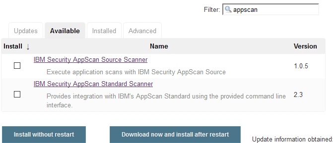
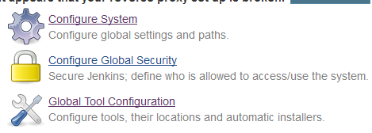
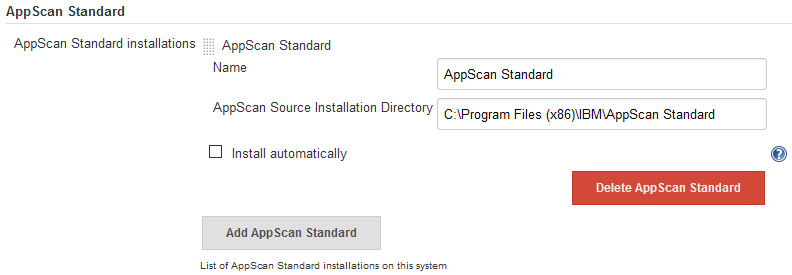
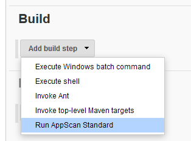
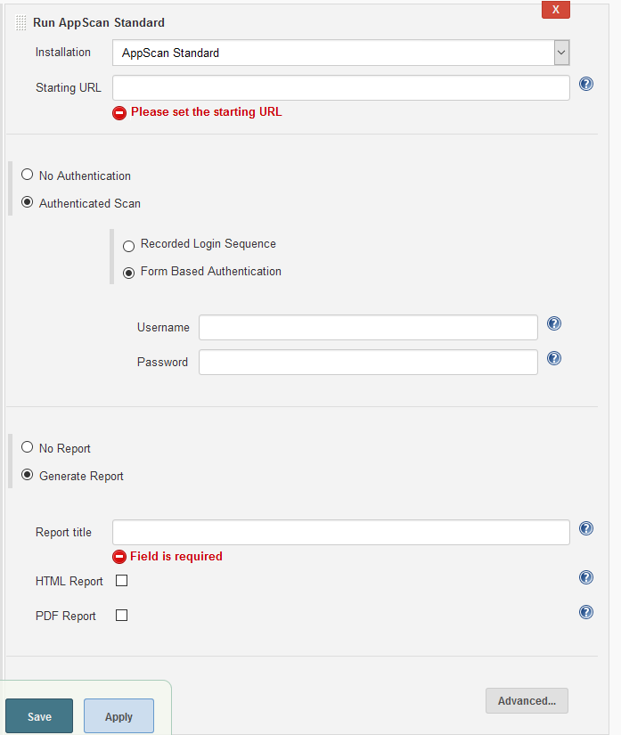
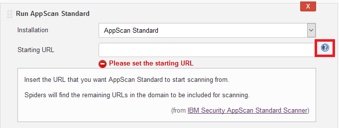
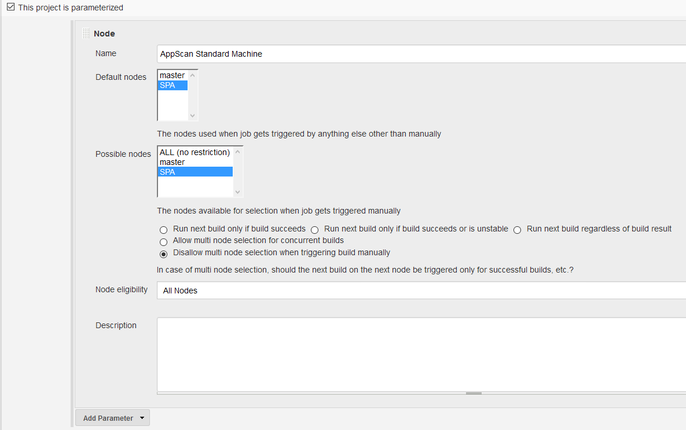
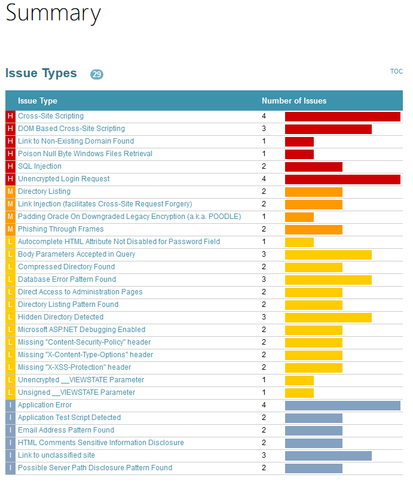
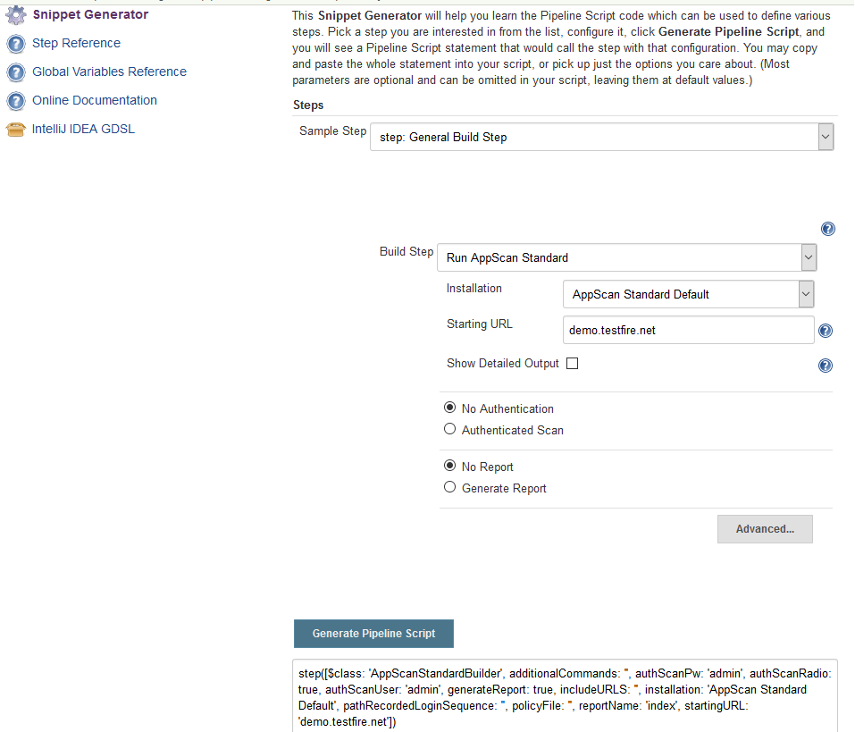

# Version History

## version 2.8

-   Fixed a NullPointerException while using "IncludeURLs" in advanced
    section

## version 2.7

-   Fixed Jenkins required core
-   Removed unnecessary dependency

## version 2.6

-   Fixed pipeline support and added respective how-to at the bottom of
    this page

# Project Description

The purpose of this plugin is to allow Jenkins to perform dynamic
analysis with IBM AppScan Standard with minimal configuration.

AppScan Standard is a security tool provided by IBM that will scan
application for vulnerabilities in run-time.

IBM Security AppScan Standard supports:

-   **Broad coverage** to scan and test for a wide range of application
    security vulnerabilities.
-   **Accurate scanning and advanced testing** that delivers high levels
    of accuracy.
-   **Quick remediation** with prioritized results and fix
    recommendations.
-   **Enhanced insight and compliance** that helps manage compliance and
    provides awareness of key issues.

Configuring AppScan Standard to perform automated scanning with custom
batch jobs or shell scripts can be a time-consuming and error-prone
process.

This Jenkins plugin greatly simplifies the process of automating AppScan
Standard by providing global settings and simple scan configuration
within Jenkins.

For more information on IBM AppScan Standard, please visit the official
IBM site at
<http://www-03.ibm.com/software/products/en/appscan-standard>

# Prerequisites

This plugin requires the following:

-   AppScan Standard installed with a valid license on a node (slave) or
    master.

# Plugin Setup

To download and install AppScan Standard plugin go to **Manage Jenkins**
and then to **Manage Plugins**

-   Select the **Available Plugins** tab
-   Search for **AppScan Standard**
-    
    {width="539"
    height="233"}
-   Select and install. 

# Plugin Configuration

1.  From the Jenkins homepage, click **Manage Jenkins** and then
    **Global Tool Configuration**
2.  
3.  Scroll down the page and locate the section titled AppScan Standard
4.  Click **Add AppScan Standard**
5.  Fill out the AppScan Standard form
6.  {width="640"
    height="223"}

&nbsp;

1.  1.  **Name**: A name for this instance of AppScan Standard. This is
        just to help manage environments that may have multiple
        installation
    2.  **AppScan Standard Installation Directory**: The path to the
        installation directory. Note: the default value is C:\\Program
        Files (x86)\\IBM\\AppScanStandard\\

2.  Click **Save**

# Using the plugin

1.  Create a new job or access an existing job
2.  Select **Configure**
3.  Select "**Add build step**" and select "**Run AppScan Standard**"
4.   
    
5.  Complete the fields that appear:
6.   
    
7.   **Installation** will show the name you provided for the
    installation on the global configuration screen.
    1.  1.   If you have not added an installation, please go the the
            Jenkins Global Tool Configuration link under Manage Jenkins.
        2.   If you only have one installation configured, the
            installation should be selected for you. If you plan to
            execute AppScan Standard on multiple Jenkins nodes, you may
            need to configure multiple installation paths.

    2.  **Starting URL** is the URL AppScan Standard will use to run the
        spiders on to find compile a list of URIs to scan.
    3.  **Authenticated Scan** will scan the website logged in as the
        provided account, this will provide better scanning results.
        1.  **Recorded Login Sequence** uses a recorded login sequence
            (you must generate it using AppScan Standard previously) to
            login.
        2.  **Form Based Authentication** tries to login automatically
            using the credentials provided, this method may fail
            depending on your website's authentication configuration.
    4.  **Generate Report** will generate and save a report with the
        vulnerabilities found by AppScan Standard.
        1.  **Report title** the generated report will be saved using
            this title for the name.
        2.  **HTML Report** saves the report in HTML format.
        3.  **PDF** saves the report in PDF format.
            1.  You can save both formats in one run.
    5.  **Advanced** configurations that can be applied to the scan
        1.   
            
        2.  **Include URLs for Scanning** allows you to manually include
            URLs for scanning in case the spiders miss them
        3.  **Test Policy File Path** will use the specified test policy
            instead of the default options
        4.  **Additional Commands** can be used to execute additional
            options available in the command line interface that are not
            available in plugin's graphical user interface.
    6.  If you need help filling in any field, check the **help**
        description by pressing the **? icon**
        1.   
            {width="563"
            height="214"}

8.  Click **Save** at the bottom
9.  Run the job.

# Using Nodes to run AppScan Standard Plugin

If you have AppScan Standard installed on a node you must configure the
build to run on that node so that the plugin can reach the installation.

First you must set that machine as a node (slave), you can follow [this
guide to do
so](https://wiki.jenkins.io/display/JENKINS/Step+by+step+guide+to+set+up+master+and+agent+machines+on+Windows).

Afterwards you can use the [Node and Label Parameter
Plugin](https://wiki.jenkins.io/display/JENKINS/NodeLabel+Parameter+Plugin),
following the guide provided in its wiki achieving this goal should be
straightforward.

Setting a parameter on the build would look something like the image
below.

# Using HTML Publisher Plugin with AppScan Standard Plugin

To take full advantage of this plugin, you may want to combine it with
[HTML Publisher
Plugin](https://wiki.jenkins.io/display/JENKINS/HTML+Publisher+Plugin)

If you already have HTML Publisher installed, this can be achieved in 2
simple steps:

1.  Select **Generate a Report**, insert a **Report Title** and check
    **HTML Report**
    1.  
2.  In the **Post-build Actions** add **Publish HTML reports**, press
    **Add** and fill it in to match the settings from AppScan Standard
    Plugin (**report title must match Index page\[s\]**)
    1.  

When the build completes you will have a new item in the job's page,
press it to access the report generated by AppScan Standard.

  
The expected result should be similar to the image below **if you allow
CSS in Jenkins**, if you only see text then CSS is most likely blocked
(set by default), [this link explains how to change that
option.](http://stackoverflow.com/questions/35783964/jenkins-html-publisher-plugin-no-css-is-displayed-when-report-is-viewed-in-j)

If you change the CSS options, they won't be applied to the current
report, you must re-run the build/scan.

  

# Running AppScan Standard in a Pipeline

1.  Navigate to "Pipeline Syntax" (follow a, b or c below)  
    1.  (create a pipeline job, save and it will be on the left side
        menu)
    2.  (navigate to an existing pipeline job, it will be on the left
        side menu)
    3.  (navigate to
        [http://JENKINS-URL-HERE/pipeline-syntax/)](http://localhost:8080/pipeline-syntax/)
2.  In "Steps" find "step: General Build Step"
3.  in "Build Step" find "Run AppScan Standard"
4.  Configure AppScan Standard plugin as usual
5.  Press "Generate Pipeline Script" and copy the resulting script
6.  Paste the script in your pipeline inside a node

The end result would look like the image below.

{width="957"
height="819"}

  

A resulting script looks something like the one below, you can use this
one as your starting point.

[TABLE]

# Scheduled Tasks for version 2.9

-   Implement Quality Gate support for AppScan Standard (fails build on
    % of errors)

# Compatibility

Version 2.8 of this plugin is compatible with:

-   Jenkins 2.0 and newer
-   IBM Security AppScan Standard 9.0.3.x
