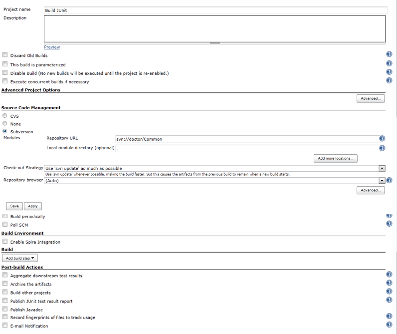
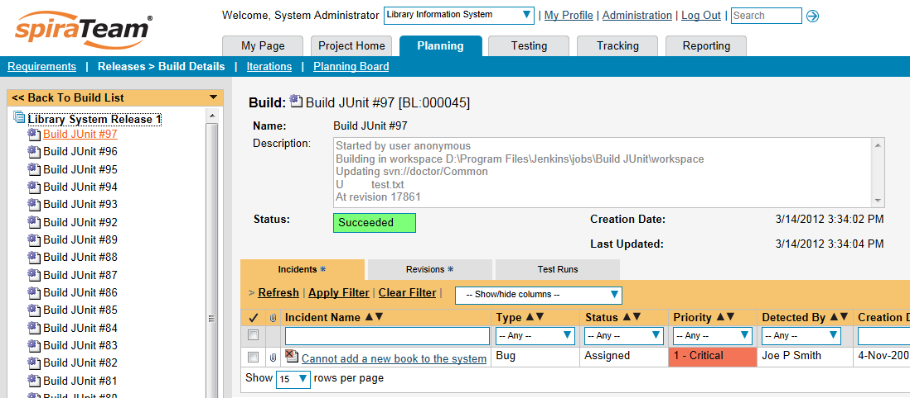
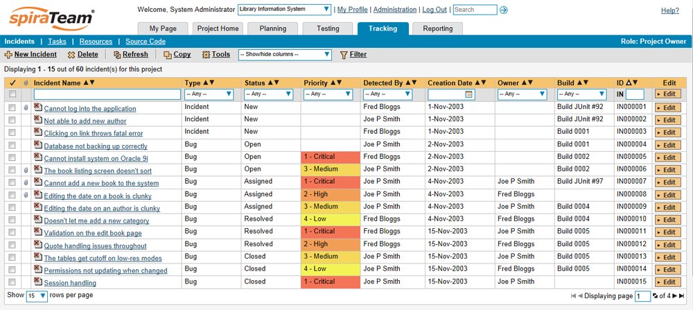

This section outlines how to use SpiraTest, SpiraPlan or
SpiraTeam (hereafter referred to as SpiraPlan) in conjunction with the
Jenkins continuous integration build server. 

When you use the SpiraPlan plugin for Jenkins, it will allow you to
associate each Jenkins project with a corresponding project and release
in SpiraPlan. Then, each time Jenkins creates a new build, a new build
artifact will be created in SpiraPlan. Each build in SpiraPlan will be
automatically linked to the incidents fixed, source code revisions
committed, and any SpiraPlan tokens in the Jenkins changelog will be
parsed and turned into SpiraPlan artifact hyperlinks.

Now that the plugin has been installed, you need to go back to the
Jenkins homepage and click on the “Manage Jenkins” hyperlink followed by
the “Configure System” hyperlink. This will bring up the main Jenkins
configuration page. Scroll down to find the “**Spira Integeration**”
section:

 

Enter in the **URL** you use to access your instance of SpiraPlan,
together with a valid **username** and **password**. Once you have
entered the values, click on the \[Test Connection\] button to verify
that Jenkins can connect to SpiraPlan successfully.

Once it has connected successfully, click the \[Save\] button at the
bottom of the screen to save your connection settings.

## Configuring a Jenkins Job

Now that you have setup the global SpiraPlan settings in Jenkins, next
you need to associate each of your Jenkins Jobs with their corresponding
SpiraPlan Project and Release/Iteration. To do this, click on the name
of the Jenkins Job and then click on the “Configure” hyperlink for that
Job:

 

Under the section “**Build Environment**” select the checkbox marked
“**Enable Spira Integration**”. That will display the SpiraPlan
configuration panel for this Job:

 

Now you need to enter the following values:

-   **Project ID** – The numeric ID of the SpiraPlan Project that the
    Build belongs to. (e.g. for Project PR00001 just enter 1)
-   **Release Version Number** – The version number of the SpiraPlan
    Release/Iteration that the Build belongs to. (e.g. for Release
    RL0004 with version number 1.0.0.0 you'd enter just 1.0.0.0)

Once you have entered in the Project ID and Release version number,
click the \[Verify Release\] button and the plugin will connect to
SpiraPlan and verify that the project exists, that the current user can
connect to that project, and that the specified release/iteration exists
in the project.

Once it has verified successfully, click the \[Save\] button at the
bottom of the screen to save your Job configuration settings. You are
now ready to use Jenkins with SpiraPlan.

## Viewing the Build Results in SpiraPlan

Now that you have associated your Jenkins job with a specific SpiraPlan
project and release/iteration, you can now use Jenkins to manage your
software builds and have the results of the build be reported back into
SpiraPlan. For example when the ‘Build JUnit’ job illustrated in the
previous section is executed, it will report back the following result
in Jenkins:

 

The corresponding build entry will also be created in SpiraPlan under
the specified project and release/iteration:

 {height="250"}

If you have configured your Project Home to include the list of recent
builds, the build information will also be displayed on the Project Home
dashboard:

  
Clicking on either of the hyperlinks will allow you to navigate to the
Build details page inside SpiraPlan:

 {height="250"}

This page will display the status (success / failure) and details of the
build (from the Jenkins Console Output) together with a list of the
associated incidents, test runs and source code revisions. The following
section will explain how to use your Source Code Management (SCM) system
to take advantage of the SpiraPlan plugin and automatically link
incidents and source code revisions to the build information.

## Working with Source Code Changesets

When your developers commit changes to your application’s source into
the SCM repository, they should make sure to link the commit to the
appropriate artifacts in SpiraPlan. For example they may want to record
that the revision fixes a specific incident or implements a specific
feature (requirement).

Linking an artifact is very simple. All the developer needs to do is
enter the artifact token in the following format:

**\[PREFIX:ID\]**

The first half, the Artifact Identifier, is a two-letter code that is
used throughout SpiraPlan, and is visible on almost every page in the
application. For example, a requirement’s identifier is “**RQ**”.
Incidents are “**IN**”, and tasks are “**TK**”. The artifact ID is the
number of the artifact. So by creating a commit message that reads:

*Due to requirement \[RQ:12\], the code for .toString in class XMLparser
was modified. This also fixed Incident \[IN:1034\].*

SpiraPlan will automatically detect the tokens and will include links to
them under the Associations tab for each revision detail in SpiraPlan.

In addition, when Jenkins creates the next build (that includes this
revision), the plugin will automatically parse the revision message and
convert the tokens into hyperlinks to the corresponding SpiraPlan
artifact. That way, when developers view the build changelog in Jenkins,
it will automatically include links to the SpiraPlan items:

 {height="250"}

Meanwhile, inside SpiraPlan, the system will use the same information to
automatically link the list of associated revisions to the build record:

 

If the commit message contains Incident tokens, the plugin will also
automatically link those incidents to the appropriate build:

 

Similarly when you view the list of incidents inside SpiraPlan you will
now be able to sort and filter the list by the associated build:

 {height="250"}

Congratulations! You are now able to use SpiraPlan and Jenkins to be
able to manage your builds and have the build status integrated into
your SpiraPlan project dashboard.

## Scheduling Test Sets Upon Successful Builds

One additional feature of the integration with SpiraTest and SpiraPlan
(hereafter just SpiraTest) is the ability to have SpiraTest
automatically schedule the execution of a test set whenever a build
passes.

To do that, make sure the Test Set is associated with the SpiraTest
release or iteration that is being built and then set the **Schedule on
Build** field to “Yes” and optionally enter in the delay (after the
build succeeds) that you want the test set to be scheduled for:

 {height="250"}

This means that you don’t need to separately manage your build schedule
in Jenkins and your test automation schedule in SpiraTest.
