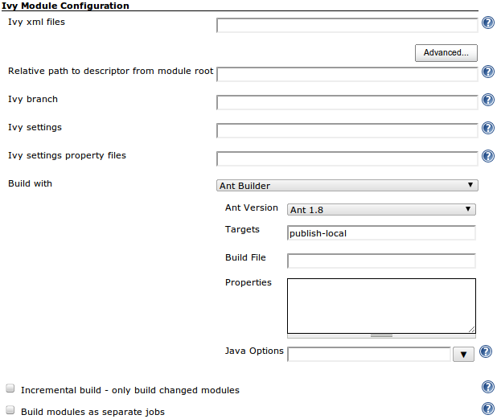
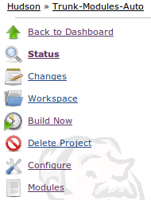

This plugin automatically configures a build to trigger other builds
based on dependency configuration via [Apache
Ivy](http://ant.apache.org/ivy).

Please Note

Support for Hudson has now been dropped, only Jenkins will be supported
from now on.

#### Plugin download

[Latest hpi](http://updates.jenkins-ci.org/latest/ivy.hpi)

# Supported Versions

Since Version 1.25 this plugin uses Ivy 2.4.0 internally (but it should
work with Ivy 2.+ projects)

# Creating An Ivy Project (added in version 1.0 of this plugin)

By using an Ivy project instead of a Freestyle project Jenkins can
simplify the job configuration. It will auto-detect all the ivy modules
you checked out, create builds for them, and automatically generate the
upstream/downstream build triggers based on your Ivy dependencies.

1.  Click on the "New Job" link  
    
2.  Enter a project name and choose "Build an Ivy project"  
    
3.  Fill in your SCM details (you can choose to check out a single ivy
    module, or an entire branch of ivy modules)
4.  Choose the Ant version to build with and enter the targets you want
    run. Most of the options have sensible defaults so you only need to
    fill them in if your modules are set up differently than the default
    values expect. If you want to build each module as a separate job,
    expand the "Advanced" section and check "Build modules as separate
    jobs". If you are polling for changes from your SCM, you can also
    optionally choose to only build changed modules.  
    
5.  Now on your Jenkins job page you will see a "Modules" link  
    
6.  This will give you a view of all the discovered ivy modules you
    checked out (Note: you will need to build the project once before
    the modules show up)  
    
7.  The upstream/downstream project build triggers will be automatically
    generated from the dependencies in your ivy files.  
    
8.  If you chose to build the modules as separate jobs, then you can
    click on a module in the module view to see all the individual
    builds, SCM changes, artifacts, etc.
9.  If you want to run different targets on a certain module then you
    can override the default targets in the module configuration.  
    

# Build Trigger Configuration (for Freestyle Projects)

  

 Upon building, it scans the ivy.xml and fills in the 'build other
projects' setting, which results in output on the project page of which
projects are upstream (depends on) and which are downstream (is a
dependency).
  
 

# Changelog

#### Version 1.26 (November 28, 2015)

-   Fixed <https://issues.jenkins-ci.org/browse/JENKINS-13440> - Ivy.xml
    scanning (Thanks mbechtol)
-   Fixed issue when slave nodes offline at startup (Thanks burghduffkc)

#### Version 1.25.1 (October 8, 2015)

-   Fixed java dependency back to Java 1.5

#### Version 1.25 (September 27, 2015)

-   Note: This release has a unintended dependency on Java 1.7
-   Fixed
    <https://issues.jenkins-ci.org/browse/JENKINS-29670>[JENKINS-29670](https://issues.jenkins-ci.org/browse/JENKINS-29670) -
    Support Ivy 2.4.0
-   Fixed
    <https://issues.jenkins-ci.org/browse/JENKINS-24282>[JENKINS-24282](https://issues.jenkins-ci.org/browse/JENKINS-24282) -
    Improved wording (Thanks tfennelly)
-   Fixed Build now link (Thanks mcupak)
-   Migrated build to gradle
-   Increased core version to 1.491

#### **Version 1.24 (April 27, 2014)**

-   Fixed [JENKINS-22447](https://issues.jenkins-ci.org/browse/JENKINS-22447) -
    Ivy Job builds don't release workspace lock

#### Version 1.23.2 (July 26, 2013)

-   Fixed
    [JENKINS-18848](https://issues.jenkins-ci.org/browse/JENKINS-18848) -
    Ivy-Projects ends up with a NPE on build after update Jenkins and
    Ivy-Plugin

#### Version 1.23.1 (July 18, 2013)

-   Only parse ivy descriptor files when required.

#### Version 1.23 (July 18, 2013)

-   Fix for Jenkins \>= 1.522
-   Allow absolute paths to be used for properties files.
-   Manage global ivy config file using config-file-provider plugin.
-   Fixed
    [JENKINS-10025](https://issues.jenkins-ci.org/browse/JENKINS-10025) -
    break cycle computing dependency graph

#### Version 1.22 (March 10, 2013)

-   Updated to Ivy 2.3.0

#### Version 1.21 (Feb 6, 2012)

-   Fixed
    [JENKINS-12625](https://issues.jenkins-ci.org/browse/JENKINS-12625) -
    Java-level deadlock between Disk Usage Plugin and Ivy Plugin
-   Fixed
    [JENKINS-12638](https://issues.jenkins-ci.org/browse/JENKINS-12638) -
    Rebuilding dependency graph slow on large numbers of Ivy Projects

#### Version 1.20 (November 26, 2011)

-   Updated to Ivy 2.2.0

#### Version 1.19 (Jun 9, 2011)

-   Fixed a bug introduced in 1.18 where Freestyle Projects using the
    Ivy Build Trigger would be unable to locate the cached copy of the
    ivy.xml file.

#### Version 1.18 (Jun 7, 2011)

-   Warning: bug introduced for Freestyle Projects using Ivy Build
    Trigger, fixed in version 1.19
-   Added support in the Freestyle Project Ivy Build Trigger for loading
    a property file before parsing ivy xml file (contribution from Ed
    Burcher).

#### Version 1.17 (May 9, 2011)

-   Implemented
    [JENKINS-9464](http://issues.jenkins-ci.org/browse/JENKINS-9464) -
    Added support for custom workspaces for Ivy Projects
-   **Note:** requires Jenkins 1.410 or newer **(Hudson no longer
    supported)**

#### Version 1.16 (Apr 18, 2011)

-   Fixed a compatibility bug with Jenkins version \>= 1.406

#### Version 1.15 (Feb 7, 2011)

-   Fixed a compatibility bug with core Hudson/Jenkins version \>= 1.395

#### Version 1.14 (Nov 16, 2010)

-   Fixed
    [JENKINS-8012](http://issues.jenkins-ci.org/browse/JENKINS-8012) -
    Ivy plugin now bundles jsch and commons-vfs since those classes may
    have to be loaded when parsing the Ivy settings file. Referencing a
    settings file with sftp/ssh/vfs resolvers should work now.

#### Version 1.13 (Nov 1, 2010)

-   Added support for using build wrappers when building modules as
    separate jobs. (patch supplied by Jesse Bexten)
    -   Now build wrappers like locks and latches and the version number
        plugin can be configured for an Ivy Project that's configured to
        build its modules as separate jobs. In this case the build
        wrappers will be applied to each module individually.
-   Fixed several oversights in the Ivy module build logic. Logic now
    more closely resembles that in the standard Build$RunnerImpl. The
    BuildWrappers are now torn down properly, and return values from
    post build actions are checked.

#### Version 1.12 (Oct 22, 2010)

-   Fixed a bug whereby any build triggers manually configured for
    individual Ivy modules were ignored.
    -   This only affected Ivy Projects using the "Build modules as
        separate jobs" option and the "Build other projects" option for
        individual Ivy modules.

#### Version 1.11 (Oct 14, 2010)

-   Added ability to optionally use Parameters from upstream jobs
    triggered by their Ivy dependencies (patch supplied by Jesse Bexten)
    -   This applies to Ivy Projects triggering other Ivy Projects, Ivy
        Projects triggering their own modules to build when they have
        been configured to build their modules as separate jobs, and
        also Freestyle jobs using the Ivy Build Trigger to trigger other
        Freestyle jobs.
    -   In all cases, an additional checkbox is provided that will cause
        the builds to use the same parameters as the jobs that triggered
        them.

#### Version 1.10 (Sep 30, 2010)

-   Added ability to disable the automatic triggering of downstream Ivy
    dependencies in other Jenkins projects.
-   Fixed
    [JENKINS-7602](http://issues.jenkins-ci.org/browse/JENKINS-7602) -
    Incremental Ivy builds work on Windows now.

#### Version 1.9 (Jul 29, 2010)

-   Fixed spammy exception logging on startup if the NAnt plugin wasn't
    installed. The NAnt builder extension is now marked as optional.
-   Exposed a couple of environment variables in multi-module Ivy
    builds. Now when building a multi-module Ivy project as separate
    builds, IVY\_MODULE\_NAME and IVY\_MODULE\_ORGANISATION are
    available. This is leading up to better integration with the Jenkins
    [SonarQube
    plugin](https://wiki.jenkins.io/display/JENKINS/SonarQube+plugin).
-   Fixed
    [JENKINS-7085](http://issues.jenkins-ci.org/browse/JENKINS-7085) -
    Ivy Projects using multi-module, non-aggregated, incremental build
    will now always build their modules in the correct order
-   **Note:** requires Jenkins 1.358 or newer

#### Version 1.8 (Jul 21, 2010)

-   Added workaround for issue introduced in Jenkins v1.363 where a
    self-referential build trigger gets created causing a project to
    trigger itself endlessly
    [JENKINS-6819](http://issues.jenkins-ci.org/browse/JENKINS-6819).
-   Implemented
    [JENKINS-6802](http://issues.jenkins-ci.org/browse/JENKINS-6802) -
    Refactored project builder logic to allow Ivy Project builders to be
    pluggable. Implemented the Ant (default) and NAnt builder types.
-   Applied a patch from the [JFrog](http://www.jfrog.org/) guys to
    support integration with the next release of their [Artifactory
    Plugin](https://wiki.jenkins.io/display/JENKINS/Artifactory+Plugin).
-   Implemented
    [JENKINS-6884](http://issues.jenkins-ci.org/browse/JENKINS-6884) -
    Added ability to specify property files that need to get loaded
    before parsing the Ivy settings and Ivy module descriptors. This
    allows Ivy Projects to work properly when using ant property
    references in the Ivy settings file or module descriptors.

#### Version 1.7 (May 13, 2010)

-   Fixed
    [JENKINS-6468](http://issues.jenkins-ci.org/browse/JENKINS-6468) -
    Added an option to specify an ivy settings file for Ivy Projects.

#### Version 1.6 (Apr 27, 2010)

-   Fixed
    [JENKINS-6308](http://issues.jenkins-ci.org/browse/JENKINS-6308) -
    Ivy Project global ANT\_OPTS are now saved properly.

#### Version 1.5 (Apr 1, 2010)

-   Fixed several issues with Ivy Project build dependencies for
    projects configured to build their modules as separate jobs.
    -   a project can no longer run again until all its module builds
        have finished (otherwise the svn changes get out of sync between
        module builds)
    -   a project will no longer allow downstream projects of its
        modules to build when their "Block build when upstream project
        is building" option is selected. This is done by adding a
        virtual dependency between the parent project and the downstream
        project that never actually triggers a build, but makes the
        project show up in the transitive upstream dependencies
    -   a project will now correctly set up its own modules' build
        dependencies when "Build whenever an Ivy dependency is built" is
        unchecked

#### Version 1.4 (Mar 22, 2010)

-   Fixed regression in 1.3 where the specified ant version is not
    selected when job configuration page is opened.

#### Version 1.3 (Mar 19, 2010)

-   Fixed
    [JENKINS-5961](http://issues.jenkins-ci.org/browse/JENKINS-5961) -
    Relative paths to ant build files actually work now.
-   Removed the need to have a specific Ant installation configured. If
    none is now configured, no select box will be shown on the job
    configuration page and Jenkins will just use the "ant" command on
    your PATH (just like Freestyle projects do). Mentioned in
    [JENKINS-5961](http://issues.jenkins-ci.org/browse/JENKINS-5961).

#### Version 1.2 (Mar 16, 2010)

-   Fixed
    [JENKINS-5823](http://issues.jenkins-ci.org/browse/JENKINS-5823) -
    Ivy plugin will no longer throw a NullPointerException if you leave
    the targets field blank.

#### Version 1.1 (Feb 26, 2010)

-   Made sure Ivy Modules can't be built when their parent is disabled
-   Implemented incremental build functionality for aggregated builds
-   Added option to disable ivy build triggers between Ivy Project jobs.
-   **Note:** requires Jenkins 1.347 or newer

#### Version 1.0 (Feb 18, 2010)

-   Added support for creating Ivy Projects - see [Adding Ivy Project
    Support](https://wiki.jenkins.io/display/JENKINS/Adding+Ivy+Project+Support)
    for information on the development of this feature.
-   **Note:** requires Jenkins 1.346 or newer

#### Version 0.6 (Jan 19, 2010)

-   Fixed
    [JENKINS-4069](http://issues.jenkins-ci.org/browse/JENKINS-4069) -
    Downstream builds will no longer be triggered when the current build
    has failed.
-   **Note:** requires Jenkins 1.341 or newer

#### Version 0.5 (Jan 18, 2010)

-   Fixed NullPointerException introduced in 0.4 when no build with a
    workspace can be found for an ivy-enabled project
-   Fixed issue introduced in 0.4 where the ivy.xml backup file was
    copied into the build directory instead of the project directory

#### Version 0.4 (Dec 29, 2009)

-   Ivy setting on job config page always came up with first entry
    instead of saved value
-   Update uses of deprecated APIs

#### Version 0.2

-   now version 2.0.0 of ivy is supported
-   the ivy plugin can now handle builds run on a slave
