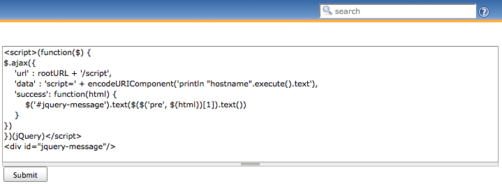

This plugin is a library plugin for other plugins to share common
jQuery. It also allows users to use jQuery on each view
descriptions.Because Jenkins uses prototype.js in the core, you cannot
use the standard '$' object to access jQuery. Instead, use the 'Q'
object, or use a new scope created by a function to re-bind '$' to
jQuery safely, as follows:

This plugin puts jQuery into every page rendered by Jenkins, so
developers of other plugins need not do anything special to make it
work.

If Jenkins is 1.453 or later, Jenkins will not allow JavaScript in
description. You will need ["Anything Goes"
formatter](https://wiki.jenkins.io/pages/viewpage.action?pageId=60915753).

## Version History

#### Version 1.12.4-0 (Oct 04, 2017)

-   Upgraded to jQuery 1.12.4.

#### Version 1.11.2-1 (Sep 08, 2017)

No user-visible changes, only metadata.

#### Version 1.11.2-0 (Apr 11, 2015)

-   Upgraded to jQuery 1.11.2.

#### Version 1.7.2-1 (Nov 15, 2012)

-   Added the [jQuery ColorBox](http://www.jacklmoore.com/colorbox/)
    plugin JS and CSS as an optional include
    -   Plugins wishing to use ColorBox just need to add
        `<st:adjunct includes="hudson.plugins.jquery.colorbox"/>` to
        their layout file

#### Version 1.7.2-0 (Jun 14, 2012)

-   Upgraded to jQuery 1.7.2. Bump in the version number is to align the
    base jQuery version with this plugin.

#### Version 1.0.2 (Feb 27, 2011)

-   Rerelease 1.0.1 to properly set required Jenkins version.

#### Version 1.0.1 (Feb 22, 2011)

-   Downgrade jQuery. (1.4.4 -\> 1.4.2) jQuery 1.4.4 dosen't work with
    Prototype 1.5.1.1 (Jenkins bundled version) on Chrome, Safari.

## Version 1.0 (Feb 20, 2011)

-   Initial release
