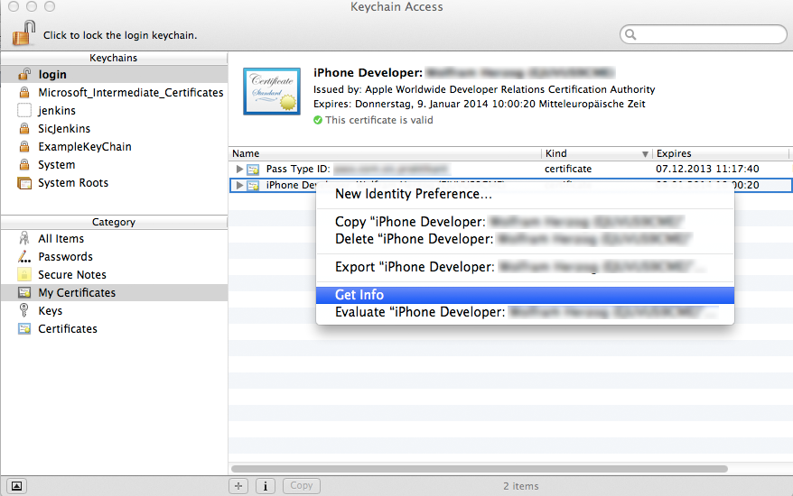
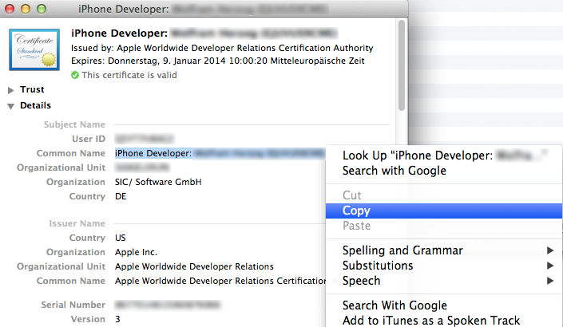

Description

This plugin integrates a keychains and mobile provisioning profiles
management for iOS and OSX projects into Jenkins. Simply upload keychain
and provisioning profile files and configure your build job to use them.
When the build is executed, than the keychain and provisioning profile
files are automatically distributed to the Jenkins node (master or
slave). There is no need to manage these files manually on each Jenkins
node.  
Status: In Progress

# Configuration

## Main plugin configuration

1.  Go to the "Manage Jenkins" page.
2.  Click on "Keychains and Provisioning Profiles Management" and the
    main plugin configuration page is shown.


### Upload keychain and provisioning profile files section

1\. Click on "Choose File" and select the keychain or provisioning
profile file.

2\. Click on "Upload". The keychain or provisioning profile file is
automatically uploaded and stored on the jenkins.


### Manage keychains section

**Filename** - The name of the keychain. The name is automatically
filled by jenkins.

**Password** - Give the correct password for the keychain.

**Description** - Specify a short description for the keychain.

**Identities** - Lists all added code signing identities. 

**Delete/ Add Code Signing Identity** - You can add more than one "Code
Signing Identity" to the same keychain and also remove a code signing
identity from the keychain.

**Delete Keychain** - Will delete your complete keychain after the
configuration is saved.


#### Manage code signing identities section

1\. Open the program "Keychain Access“.

2\. Select by category "My Certificates“ and select your certificate.



3\. At next, click "get info" and copy the line "Common Name". This is
the common name of the code signing indentity.

 


### Manage provisioning profiles

1. Only if iOS or OSX projects are to be built on the master, than type
in the directory path where provisioning profiles are stored, that is
optinal.  
    Generally: 

``` syntaxhighlighter-pre
/Users/<USERNAME>/Library/MobileDevice/Provisioning Profiles
```


## Node configuration

1.Only if iOS or OSX projects are to be built on this node, than type in
the directory path where provisioning profiles are stored on the node.  
   Generally: 

``` syntaxhighlighter-pre
/Users/<USERNAME>/Library/MobileDevice/Provisioning Profiles
```


## Build job configuration

### Build environment configuration section

There are two pre-build steps added to the job configuration page.

#### Keychains and Code Signing Identities

**Keychain and Code Signing Identities** - Mark this checkbox to use
keychains and code signing identities.

**Overwrite existing keychains** - Mark this checkbox to override
existing keychains on the node.

**Delete copied keychains after build** - Mark this checkbox, if copied
keychains are to be deleted after the build.

**Keychain** - Select the keychain.

**Variable Prefix** - If more than one keychain is to be used, than set
a prefix for the variable names to avoid variable name collisions.

**Variables -** Get the variable names. They can be used in other build
steps.

**Delete** - Delete keychain configuration.

**Add Keychain** - Add keychain configuration.


#### Mobile Provisioning Profiles 

**Mobile Provisioning Profiles** - Mark this checkbox to use
provisioning profiles.

**Overwrite existing provisioning profiles** - Mark this checkbox to
override existing provisioning profiles on the node.

**Delete copied provisioning profiles after build** - Mark this
checkbox, if copied provisioning profiles are to be deleted after the
build.

**Provisioning Profile** - Select a provisioning profile.

**Variable Prefix** - If more than one provisioning profile is to be
used, than set a prefix for the variable names to avoid variable name
collisions.

**Variable** - Get the variable names. They can be used in other build
steps.

**Delete** - Delete provisioning profile configuration.

**Add Provisioning Profile** - Add provisioning profile configuration.


### Build step integration

Next, the integration of the "Keychains and Provisioning Profiles
Plugin" into other build steps is explained on the example of the
[Jenkins Xcode
Plugin](https://wiki.jenkins-ci.org/display/JENKINS/Xcode+Plugin).

**Custom xcodebuild arguments** - Give a reference to the provisioning
profile. 

``` syntaxhighlighter-pre
 PROVISIONING_PROFILE=${PROVISIONING_PROFILE}
```


**Unlock Keychain** - Mark the checkbox to unlock the keychain.

**Keychain path** - Type in the variable name for the keychain path.

**Keychain password** - Type in the variable name for the keychain
password.


# Changelog

**Release 1.0**

-   Initial Release
