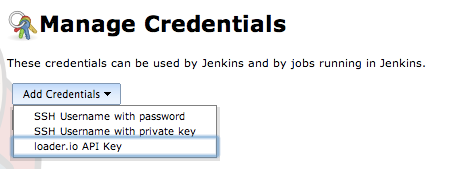
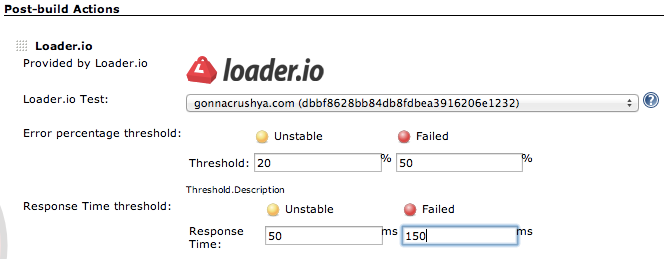
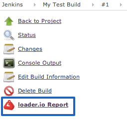
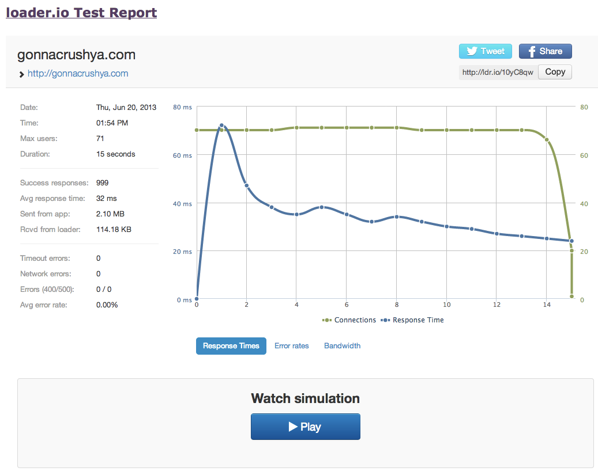

# loader.io Plugin

Simple cloud-based load testing for your web apps/apis with thousands of
connections via the [loader.io](http://loader.io/) API - by [SendGrid
Labs](http://labs.sendgrid.com/)

# Installation

1\) Make sure you have all the latest plugins available: visit
/pluginManager/advanced, select 'check now'

2\) Get your free loader.io account for load testing:
[http://loader.io](http://loader.io/)

3\) Make note of your loader.io API key: <http://loader.io/settings>

  
4) Goto Manage Jenkins \> Manage Plugins \> Available & locate the
loader.io plugin and install it

5\) Next, you need to add your loader.io API key to the stored
credentials (Manage Jenkins \> Manage Credentials)

Test your API key, Once verified, click Save.

# Using loader.io for post build load tests

\* Note: You'll need to first complete a successful test using your
loader.io acct ([http://loader.io](http://loader.io/)), once completed
your load test config will be available in the plugin

1\) In your build config, select the Post-build action "loader.io"

2\) Select your test template, enter both the Error % & Response time
thresholds. Then click Save.

# Viewing your loader.io load test results

When load tests are running during your Post-build actions you can view
the Console output and monitor the progress

When your build is complete, you can view the report of the loader.io
load test

# **Changelog:**

#### **v1.0**

-   Initial release
