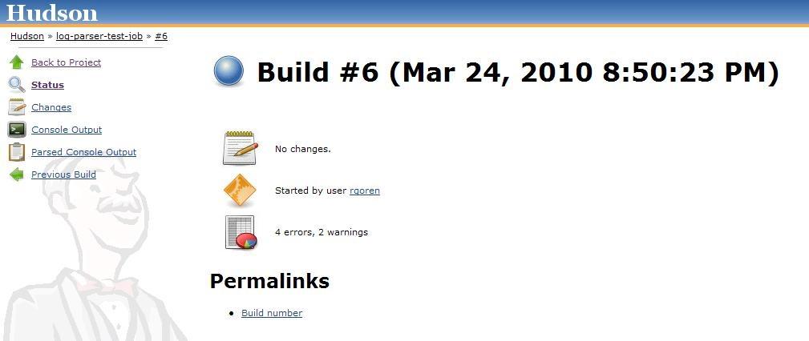
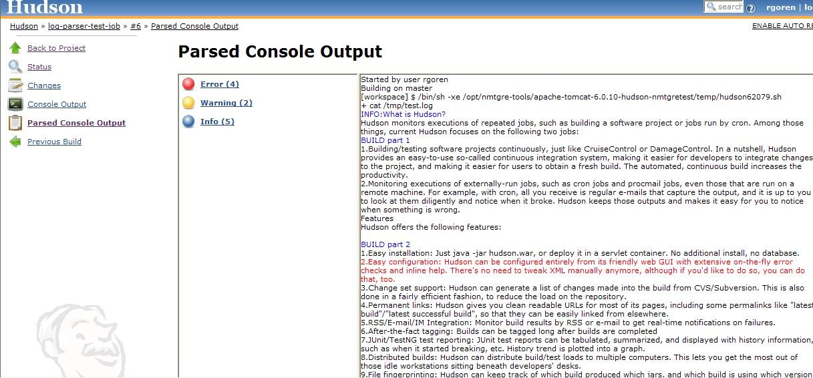
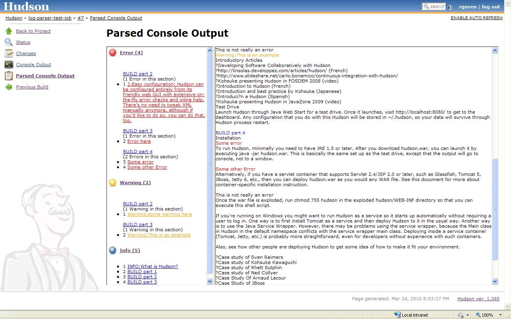

Parse the console output and highlight error/warning/info lines.

## Description

The log-parser plugin parses the console log generated by the Jenkins
build. Parsing the console log allows for the following features:

-   highlighting lines of interest in the log (errors, warnings,
    information)
-   dividing the log into sections
-   displaying a summary of number of errors , warnings and information
    lines within the log and its sections.
-   linking the summary of errors and warnings into the context of the
    full log, making it easy to find a line of interest in the log
-   showing a summary of errors and warnings on the build page

## Parsed log example

### Summary at build level

This shows a summary of errors and warnings on the build page



### The parsed log

This is an example of a parsed log of a build.  
It is accessible from the "Parsed Console Output" link on the left side
of the build page :

  
  

The left side of the report can be expanded to browse the
errors/warning/info lines. These lines are links to the full log on the
right, where they can be easily located. Clicking on a certain error
will bring you right to it on the full log which appears on the right
side of the screen. The log is also divided into logical sections (as
defined in the parsing rules configuration described below). In the
summary section on the left you can see the errors/warnings as they
appear in the log sections. This can help understand in what part of the
build there is an error/warning. Both summary and log sections are
scrollable and expandable.

  
  

## Configuration

Several parsing options are configured at the global level.

### Global Configuration

#### Parsing rules options

Appears in the global Jenkins configs as section "Console Output
Parsing"  
Configure pairs of logical names (project, description, etc.) and
parsing rule files.  
Later on, when a job is configured for log parsing, you will be able to
choose one of these configurations to implement as the parsing rules for
that job. (See "Job Configuration")

  
  

For each parsing rules option, specify :  
Parsing rule name - logical name which will be displayed in the job
level configuration as an option  
Parsing Rules File - A file with the parsing rules implemented in this
option. (See "Parsing rules files" to learn more about the syntax of
these files.)

#### Parsing rules files

##### Format

Each line in the file specifies a level (ok/error/warn/info/start) and a
regular expression (based on
[java.util.regex.Pattern](https://docs.oracle.com/javase/7/docs/api/java/util/regex/Pattern.html))
delimited by slashes ("/") to look for in order to mark the line as
matching that level.

-   **ok/error/warn**  
    Used to identify problem lines.

&nbsp;

-   **info**  
    These lines are highlighted blue in the report. They are used to
    create a set of links into the report for quick access to certain
    sections.

&nbsp;

-   **start**  
    Like **info** lines, they are highlighted blue in the report, and
    appear in the set of quick access links to the report. In addition,
    they are used for grouping the list of errors and warnings found in
    that section.

For example, the following line in the parsing rules file means that a
line including the word "ERROR" will be marked as an error line:

``` syntaxhighlighter-pre
error /ERROR/
```

-   Case insensitive matches  
    The notation supports the Java regex embedded flag expression. To
    perform a case-insensitive match, use **(?i)** notation.  
    **Example:** to match lines starting with the case-insensitive word
    'error', use:
    ``` syntaxhighlighter-pre
    error /(?i)^error /
    ```

&nbsp;

-   If a line matches several rules, the first one applies.  
    So for the following set of rules :
    ``` syntaxhighlighter-pre
    ok /^javadoc:/
    error /Error/
    ```

    And the following line in the build log:
    ``` syntaxhighlighter-pre
    javadoc: Error : could not find something
    ```

    The line will be considered "ok", and will not be highlighted as an
    error, since the `^javadoc:` pattern is matched first.

&nbsp;

-   Lines starting with a '\#' character, and blank lines will be
    ignored to allow comments and spacing.

Example parsing rules file:

``` syntaxhighlighter-pre
ok /not really/

# match line starting with 'error ', case-insensitive
error /(?i)^error /

# list of warnings here...
warning /[Ww]arning/
warning /WARNING/

# create a quick access link to lines in the report containing 'INFO'
info /INFO/

# each line containing 'BUILD' represents the start of a section for grouping errors and warnings found after the line.
# also creates a quick access link.
start /BUILD/
```

### Job Configuration

1.  Go to menu: Jenkins -\> [job
    name](https://wiki.jenkins.io/display/JENKINS/Log+Parser+Plugin#) -\>
    Configure
2.  Go to section : Post-build Actions
3.  Check the "Console output (build log) parsing" checkbox.
4.  "Mark build Unstable on Warning" option: check to have parsed
    warnings mark the build 'unstable'.
5.  "Mark build Failed on Error" option : check to have parsed errors
    mark the build 'failed'.
6.  "Select Parsing Rules" : select the set of rules to use for parsing
    the logs of this job's builds  
    (Notice that this list is derived from the global configuration )

  
  

## Changelog

### Version 2.0 (October 20, 2015)

-   [\[JENKINS-29308\]](https://issues.jenkins-ci.org/browse/JENKINS-29308) Update
    project configuration. Clean up.
-   [\[JENKINS-27208\]](https://issues.jenkins-ci.org/browse/JENKINS-27208) Make
    Log Parser Plugin compatible with Workflow.

### Version 1.0.8 (December 14, 2010)

-   Bug fix: Strip encoded ConsoleNote from log prior to parsing and
    display
    ([JENKINS-7263](https://issues.jenkins-ci.org/browse/JENKINS-7263)).
-   Enhancement: Allow marking builds with warnings as unstable
    ([JENKINS-7853](https://issues.jenkins-ci.org/browse/JENKINS-7853)).
-   Bug fix: Links to style sheets should be relative to Hudson root url
    ([JENKINS-8268](https://issues.jenkins-ci.org/browse/JENKINS-8268)).

## Useful parse lines

This section collects some useful additional parse-statements
contributed by users of the Log Parser Plugin

##### JaCoCo code coverage fails to read class-data

``` syntaxhighlighter-pre
error /Execution data for class .* does not match./
```
