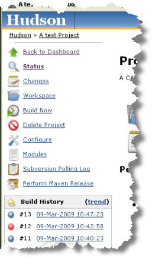
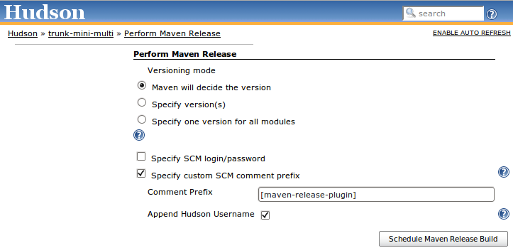

This plugin allows you to perform a release build using the
[maven-release-plugin](http://maven.apache.org/plugins/maven-release-plugin/)
from within Jenkins.

# Project Configuration

On the job configuration page, enable the "Maven release build" under
the Build Environment heading and add whatever release goals and options
your require.  


# Performing a Release Build

Follow the "Perform Maven Release" link  
  
and choose "Schedule Maven Release Build".  


# Using with Nexus Staging

Nexus staging will create a new Stage for each unique IP Address, deploy
users and HTTP User agent.

For a particular Jenkins slave the first two will be the same for all
builds - so you need to configure Maven to use a unique HTTP User-Agent
for the deploy.

To do this make sure your maven settings contains something like the
following where the id matches the id for the release repository in the
deployment section of your project:

``` syntaxhighlighter-pre
  <server>
    <id>nexus</id>
    <username>my_login</username>
    <password>my_password</password>
    <configuration>
      <httpHeaders>
        <property>
          <name>User-Agent</name>
          <value>Maven m2Release (java:${java.vm.version} ${env.BUILD_TAG }</value>
        </property>
      </httpHeaders>
    </configuration>
  </server>
```

# FAQ

If your build fails with the following:

> [INFO](https://wiki.jenkins.io/display/JENKINS/M2+Release+Plugin#)
> Executing: mvn clean verify --no-plugin-updates --batch-mode -P
> null,null  
> 'mvn' is not recognized as an internal or external command,  
> operable program or batch file.

Then this is a [maven bug](http://jira.codehaus.org/browse/MRELEASE-359)
not a Jenkins plug-in bug.  
The solution is to upgrade to version 2.0-beta-8 or later of the
maven-release-plugin in your project.

  

Some users with CVS (cvs+ssh) have reported that a release just hangs
while accessing the ssh server
([JENKINS-4783](https://issues.jenkins-ci.org/browse/JENKINS-4783)). The
solution is to use the native CVS client and append
"-Dmaven.scm.provider.cvs.implementation=cvs\_native" to the release
arguments.

The use of this plugin requires that Maven can tag your code.  You may
need to use cvs/svn etc from the CI account on the server that is
performing the release so the native tools used by maven have the
required authentication information.  (this is outside of Jenkins SCM
authentication)

# Help and Support

For Help and support please use the [Jenkins
Users](https://groups.google.com/group/jenkinsci-users) mailing list.  
To report a bug please [check the bug
tracker](http://issues.jenkins-ci.org/secure/IssueNavigator.jspa?mode=hide&reset=true&jqlQuery=project+%3D+JENKINS+AND+status+in+(Open,+%22In+Progress%22,+Reopened)+AND+component+%3D+m2release)
to see if the issue has been reported before [creating a new
issue](http://issues.jenkins-ci.org/secure/IssueNavigator.jspa?mode=show&createNew=true).  
**The comment list below is not monitored.**

# Version History

## 0.16.0 (Not yet released)

build from [source](https://wiki.jenkins.io/display/JENKINS/Source+code)
or download from
[here](https://jenkins.ci.cloudbees.com/job/plugins/job/m2release-plugin/lastStableBuild/org.jenkins-ci.plugins.m2release$m2release/)
if interested

-   Fix
    [JENKINS-35261](https://issues.jenkins-ci.org/browse/JENKINS-35261)
    SCM username/password env variables don't work with SECURITY-170.
-   Fix
    [JENKINS-16043](https://issues.jenkins-ci.org/browse/JENKINS-16043)
    NullPointerException with {{FileParameter}}s
-   remove "Default versioning mode" from the UI as it does nothing
    currently.

## 0.15.0 (31 July 2019)

Security fixes
([announcement](https://jenkins.io/security/advisory/2019-07-31/))

-   Fix SECURITY-1435 [Credentials stored in plain
    text](https://jenkins.io/security/advisory/2019-07-31/#SECURITY-1435)
-   Fix SECURITY-1184 [Stored XSS
    vulnerability](https://jenkins.io/security/advisory/2019-07-31/#SECURITY-1184)
-   Fix SECURITY-1098 [CSRF
    vulnerability](https://jenkins.io/security/advisory/2019-07-31/#SECURITY-1098)

## 0.14.0 (31 March 2014)

-   fix
    [JENKINS-20027](https://issues.jenkins-ci.org/browse/JENKINS-20027)
    Exception thrown when Dashboard View plugin is not installed [PR
    \#23](https://github.com/jenkinsci/m2release-plugin/pull/20)
-   ReleaseCause is now a UserIdCause
-   fix [JENKINS-20753](https://issues.jenkins-ci.org/browse/JENKINS-20753)
    Remove unused "Append Hudson Build Number" option [PR
    \#21](https://github.com/jenkinsci/m2release-plugin/pull/21)
-   integrate
    [JENKINS-21063](https://issues.jenkins-ci.org/browse/JENKINS-21063)
    Indicate in icon (or tooltip) if a release build failed [PR
    \#17](https://github.com/jenkinsci/m2release-plugin/pull/17)

## 0.13.0 (23 December 2013)

-   **Note** the plugin now requires
    -   Jenkins 1.509 or higher

&nbsp;

-   Minor tweaks to UI ([pull
    \#20](https://github.com/jenkinsci/m2release-plugin/pull/20) thanks
    to [Anders Hammar](https://github.com/andham))
-   Fix
    [JENKINS-20983](https://issues.jenkins-ci.org/browse/JENKINS-20983)
    Improve help text for "Preselect append Jenkins username" option
    ([pull \#19](https://github.com/jenkinsci/m2release-plugin/pull/19)
    thanks to [Anders Hammar](https://github.com/andham))
-   Fix
    [JENKINS-21060](https://issues.jenkins-ci.org/browse/JENKINS-21060)
    Improve help text of "Number of successful release... ([pull
    \#18](https://github.com/jenkinsci/m2release-plugin/pull/18) thanks
    to [Anders Hammar](https://github.com/andham))
-   Fix
    [JENKINS-21088](https://issues.jenkins-ci.org/browse/JENKINS-21088)
    Normalize line endings in repo ([pull
    \#16](https://github.com/jenkinsci/m2release-plugin/pull/16) thanks
    to [Anders Hammar](https://github.com/andham))
-   Fix
    [JENKINS-20980](https://issues.jenkins-ci.org/browse/JENKINS-20980)
    Change "Hudson" to "Jenkins" in displayed text ([pull
    \#15](https://github.com/jenkinsci/m2release-plugin/pull/15) thanks
    to [Anders Hammar](https://github.com/andham))
-   Fix
    [JENKINS-20937](https://issues.jenkins-ci.org/browse/JENKINS-20937)
    The SCM credentials used are recorded in the job's builds storage
    (in build.xml). (pull \#13 thanks to [Jess
    Glick](https://github.com/jglick))
-   Change permalink to use PeepholePermalink to be more performant in
    the face of lazy loading.
-   Fix
    [JENKINS-10914](https://issues.jenkins-ci.org/browse/JENKINS-10914)
    Do not run incremental build in release build. ([pull
    \#12](https://github.com/jenkinsci/m2release-plugin/pull/12) thanks
    to [Robert Kleinschmager](https://github.com/barclay-reg))
-   Fix
    [JENKINS-20791](https://issues.jenkins-ci.org/browse/JENKINS-20791)
    ReleaseCause should extend UserIdCause. ([pull
    \#14](https://github.com/jenkinsci/m2release-plugin/pull/14) thanks
    to [Anders Hammar](https://github.com/andham))

## 0.12.0 (25th July 2013)

-   Fix Nexus integration after Sonatype changed public API (again) in
    2.6

## 0.11.0 (4th July 2013)

-   Drop Hudson support. The Hudson community now build and maintain
    their own fork.
-   **Note** the plugin now requires
    -   Jenkins 1.466 or higher

&nbsp;

-   Fix Nexus integration after Sonatype changed public API in 2.4

## 0.10.0 (26th Apr 2013)

-   Feature: Add a release view to the [Dashboard
    View](https://wiki.jenkins.io/display/JENKINS/Dashboard+View) portlet
    ([pull \#5](https://github.com/jenkinsci/m2release-plugin/pull/5)
    thanks to [Larry Shatzer](https://github.com/larrys))
-   Fix
    [JENKINS-12895](https://issues.jenkins-ci.org/browse/JENKINS-12895)
    Drop nexus stage if build is not a success.
-   Fix
    [JENKINS-10042](https://issues.jenkins-ci.org/browse/JENKINS-10042)
    prevent NPE if closing a nexus stage fails.
-   Fix
    [JENKINS-12076](https://issues.jenkins-ci.org/browse/JENKINS-12076)
    Add ability to specify number of release builds to keep. ([pull
    \#10](https://github.com/jenkinsci/m2release-plugin/pull/10) thanks
    to [David Venable](https://github.com/dlvenable))
-   Fix
    [JENKINS-13465](https://issues.jenkins-ci.org/browse/JENKINS-13465)
    Unable perform release: ClassCastException: net.sf.json.JSONNull
    cannot be cast to net.sf.json.JSONObject.

## 0.9.1 (1st Mar 2012)

-   Fix
    [JENKINS-12812](https://issues.jenkins-ci.org/browse/JENKINS-12812)
    dryRun switch broken.

## 0.9.0 (13th Feb 2012)

-   **Note** the plugin now requires
    -   Jenkins 1.442 or higher
    -   Jenkins LTS 1.424.2 or higher
    -   Hudson with the maven-plugin 2.2.1 or higher
-   Fix
    [JENKINS-10127](https://issues.jenkins-ci.org/browse/JENKINS-10127) -
    M2 Release plugin ignores parameters from a parameterized build
    (thanks to Dominik Bartholdi for the patch)
-   Fix
    [JENKINS-4690](https://issues.jenkins-ci.org/browse/JENKINS-4690) -
    Be able to arbitrary paramterize m2 releases (thanks to Dominik
    Bartholdi for the patch)
-   Fix
    [JENKINS-4500](https://issues.jenkins-ci.org/browse/JENKINS-4500) -
    Make it possible to select a node to do the release on (together
    with the nodelabel-plugin) (thanks to Dominik Bartholdi for the
    patch)
-   Fix
    [JENKINS-4958](https://issues.jenkins-ci.org/browse/JENKINS-4958) -
    add switch for -DdryRun=true (thanks to Dominik Bartholdi for the
    patch)

## 0.8.1 (2nd November 2011)

-   Fix
    [JENKINS-11238](https://issues.jenkins-ci.org/browse/JENKINS-11238)
    Prevent log spam from when upgrading from an old version with a
    default versioning mode. (Patch from Richard Mortimer aka oldelvet)
-   Fix
    [JENKINS-10661](https://issues.jenkins-ci.org/browse/JENKINS-10661)
    Impossible to assign the permission release using project based
    matrix security

## 0.8.0 (4th October 2011)

-   Fix
    [JENKINS-8293](https://issues.jenkins-ci.org/browse/JENKINS-8293) -
    Disable auto refresh for the "Perform" screen to prevent entered
    password being removed. (Thanks to oldelvet for the patch)
-   Fix
    [JENKINS-7295](https://issues.jenkins-ci.org/browse/JENKINS-7295)
    [JENKINS-5171](https://issues.jenkins-ci.org/browse/JENKINS-5171) -
    Ability to override the SCM tag to use.
-   Removed ability to specify version for each module (it would faile
    to work correctly if Jenkins was not building every comit).
-   Removed ability to let maven devide the versioning (the version is
    needed for things like tooltips).

## 0.7.1 (10th March 2011)

-   Update plugin to show dependency on Jenkins \>= 1.400 (to pick up
    the fixes below)

## 0.7.0 (10th March 2011)

-   Fix
    [JENKINS-8289](https://issues.jenkins-ci.org/browse/JENKINS-8289) -
    enforce dev Version to be a snapshot
-   Fix
    [JENKINS-7837](https://issues.jenkins-ci.org/browse/JENKINS-7837) -
    release does not use the maven installation it was configured with
    but whatever is on the path. (NB fixed in core - requires
    Jenkins \>= 1.400)
-   Fix
    [JENKINS-8092](https://issues.jenkins-ci.org/browse/JENKINS-8092) -
    Maven release plugin cannot find mvn command. (NB fixed in core -
    requires Jenkins \>= 1.400)
-   add permalink to last release.

## 0.6.1 (17th September 2010)

-   Fix
    [JENKINS-7492](https://issues.jenkins-ci.org/browse/JENKINS-7492) -
    Fix internal error which occurs under tomcat but not winston due to
    a double redirect.

## 0.6.0 (16th September 2010)

-   Fix
    [JENKINS-3876](https://issues.jenkins-ci.org/browse/JENKINS-3876) -
    Add an icon to release builds.
-   Fix
    [JENKINS-6791](https://issues.jenkins-ci.org/browse/JENKINS-6791) -
    Scheduling a release will fail silently if a build is already in the
    queue.

## 0.5.3 (12th July 2010)

-   Fix NPE when trying to close nexus state.

## 0.5.2 (8th July 2010)

-   Re-Fix
    [JENKINS-6873](https://issues.jenkins-ci.org/browse/JENKINS-6873) -
    After scheduling a release build a HTTP 404 error page can be
    displayed.

## 0.5.1 (30th June 2010)

-   Fix
    [JENKINS-6887](https://issues.jenkins-ci.org/browse/JENKINS-6887) -
    NPE during release when version is decided by Maven.
-   Fix
    [JENKINS-6873](https://issues.jenkins-ci.org/browse/JENKINS-6873) -
    After scheduling a release build a HTTP 404 error page can be
    displayed.

## 0.5.0 (25th June 2010)

-   Fix
    [JENKINS-6630](https://issues.jenkins-ci.org/browse/JENKINS-6630) -
    plugin closes incorrect nexus stage

## 0.4.0 (26th May 2010)

-   Fix
    [JENKINS-5295](https://issues.jenkins-ci.org/browse/JENKINS-5295) -
    plugin now allows you to pass SCM username/password to maven.
-   Fixed to work with Nexus 1.5.0 (authorization was not occuring
    correctly).
-   Added support for specifying an exact version to use across all
    modules
    ([JENKINS-3429](https://issues.jenkins-ci.org/browse/JENKINS-3429)).
-   Added support for specifying scmCommentPrefix ([issue
    \#4127](http://issues.jenkins-ci.org/browse/JENKINS-4127) ).
-   Added support for appending the Jenkins username to the
    scmCommentPrefix (optional).
-   Added config settings (per project) which option(s) should be
    enabled by default for the Release Action.

## 0.3.4 (29th December 2009)

-   Fix help pages not showing up when Jenkins runs on a case sensitive
    file system.
-   Use POST instead of GET to avoid long form URLs.

## 0.3.3 (21th August 2009)

-   Fix
    [JENKINS-4172](https://issues.jenkins-ci.org/browse/JENKINS-4172)
    that prevented Jenkins upgrades working correctly.

## 0.3.2 (24th July 2009)

-   (0.3.0 & 0.3.1 were not released)
-   Jenkins doesn't set the MAVEN\_OPTS variable so added a workaround
    in the plugin
    [JENKINS-3644](https://issues.jenkins-ci.org/browse/JENKINS-3644)
-   Added a sepcific security right to allow fine grained release
    permissions.
-   Added support for closing [Nexus
    Pro](http://www.sonatype.com/products/nexus) staging repository
    after a release.
-   Added some synchronization to protect against a theoretical race
    condition.
-   Fix
    [JENKINS-4065](https://issues.jenkins-ci.org/browse/JENKINS-4065)
    that caused the release plugin to blow up when releases where
    n-SNAPSHOT.

## 0.2.0 (23rd March 2009)

-   Added support for Jenkins Security (only users who can perform a
    manual build can trigger a release build).
-   Release goals now default to
    `-Dresume=false release:prepare release:perform.`
-   Added support for specifying exact versions to use.
-   Added support for appending Jenkins build number as maven build
    number qualifier.
-   Integrated with Jenkins security.  Users require "Build" rights in
    order to create a release
-   Requires Jenkins \>= 1.292.

## 0.1.0 (16th March 2009)

-   Initial version.
-   Can only use the auto versioning feature of the
    [maven-release-plugin](http://maven.apache.org/plugins/maven-release-plugin/).
-   Tested with a simple single module project, in a master only Jenkins
    environment.
-   Requires Huson \>= 1.288.

# TODO

In no order:

-   Integrate with Jenkins security model.
-   Add support for specifying exact versions to use.
-   Add support for auto-versioning with Jenkins build number as maven
    build number qualifier.
-   Add a sepcific security right to produce a release build.
-   Add support to clean workspace before a release build is performed
    for the case where Jenkins uses update
    ([JENKINS-3925](https://issues.jenkins-ci.org/browse/JENKINS-3925)).
-   **work in progress:** Add support to clean local maven repository
    before a release build is performed. Useful for guaranteeing the
    release is buildable from scratch.
-   Update wiki and add help for latest features.
-   Check compatability with Jenkins master/slave.
-   Check compatability with multi-module projects.
-   Add some feedback onto the build history to show release builds
    (like the [Release
    Plugin](https://wiki.jenkins.io/display/JENKINS/M2+Release+Plugin#)).
-   Get jenkins to recognize the releases as build artifacts.
-   See if we can do something in the freestyle for maven builds.
-   Nexus support
    -   rewrite support from ground up to avoid closing incorrect
        repository
    -   Add support for closing [nexus
        pro](http://www.sonatype.com/products/nexus) staging repos on
        succesful build completion.
    -   Add support (if possible) for changing the User agent to support
        grouping into a [nexus
        pro](http://www.sonatype.com/products/nexus) staging repo.
    -   Add support for removing a [nexus
        pro](http://www.sonatype.com/products/nexus) staging repo on a
        failed build.
    -   Add support for auto promoting a [nexus
        pro](http://www.sonatype.com/products/nexus) staging repo on a
        successful build.
