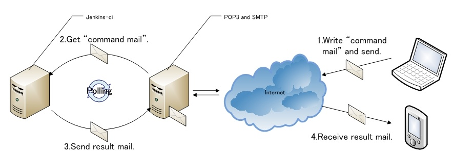
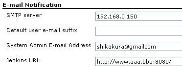
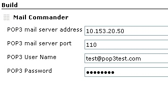
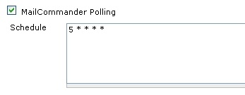
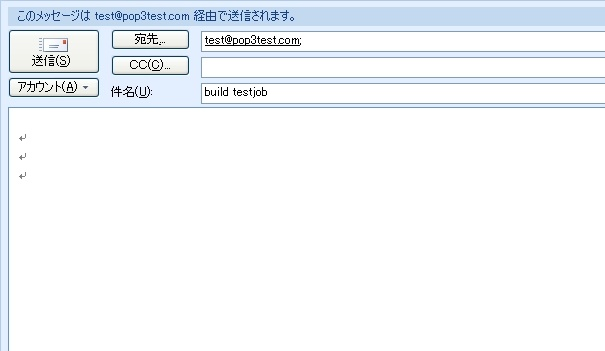

The current version of this plugin may not be safe to use. Please review
the following warnings before use:

-   [Passwords stored in plain
    text](https://www.jenkins.io/security/advisory/2020-11-04/#SECURITY-2085)

# Mail Commander Plugin

This plugin is provide function that command with e-mail. Write CLI
command to e-mail subject and send to pre setting address. Mail
Commander recieve e-mail from pre setting address, and read e-mail
subject as CLI command, execute it.

## Overview

1.  You write a mail with CLI command subject and send to a address
    which is configured by mail commander.
2.  Jenkins get a "command mail" from POP3 Server and read subject, then
    execute a CLI Command.
3.  Send a mail of job result to command sender. To decide mail address
    , use recieve mail's from address.
4.  You recieve a mail with result.

     ※ Notice

     You can recieve result that is CLI command' s result not a build
result.

## Howto use

1.  Install "mail commander" from menu 'Jenkins\>\>Plugin
    manager\>\>mail commander'.

          Please configure E-mail Notification ( Menu 'Manage Jenkins
\>\> Configure System \>\> E-mail Notification ) SMTP server, System
Admin E-mail Address and Jenkins URL.

         

               
  
     2.   You configure job parameter. Parameter have three points that
is build, post build action, and build trigger.

         \<Step 1. Build\> please select "Mail Commander" and set
parameter.

                

         \<Step 2. Post Build Action\> please check "MailCommander
Notification".

                

        \<Step 3. Build Triggers\> please check "MailCommander Polling"
and schedule.

                

        3.  You can write a CLI command in subject and send a mail to
POP3 User's address. Please remove -s option (ex. "-s http://\\\~
(http://\~)" ) from normal CLI command.

           normal CLI command sample : java -jar jenkins-cli.jar -s
<http://localhost:8080/> build testjob

           Mail commander CLI subject sample  : build testjob

          

## Optional function

-   Mail Commander find "groovy" in subject, it is proccess mail content
    as groovy script.

## Change Log

Release 1.0.0

-   initial release.
