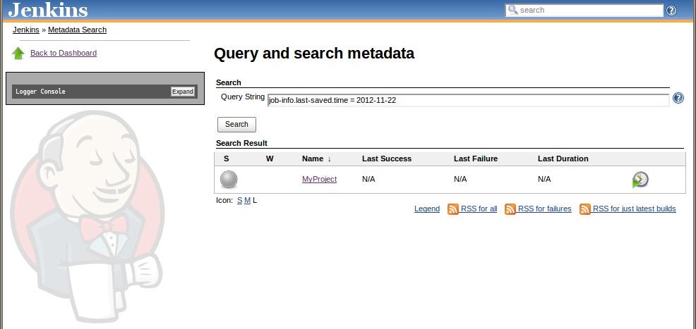

This plugin allows metadata to be added to projects, builds and slaves
in Jenkins.  
Users can add metadata manually on a project or slave via the user
interface. Metadata can also be added programmatically through a
plugin.  
Currently, this can be done when a build starts or when a build ends.
The Metadata can then be searched for.

The main idea of the metadata plugin is to make searching for jobs and
builds to behave more like a database, and act as an enabler for other
plugins.  
Once all the information about a project is gathered in one place,
plugins can be developed to use this information, as well as to provide
information.  
The more plugins that provide information, the more usable data you can
search for.  
As an example of using the information, look at the [External Resource
Dispatcher
plugin](https://wiki.jenkins-ci.org/display/JENKINS/External+Resource+Dispatcher).

### Metadata definitions and values

We differentiate between MetadataDefinitions and MetadataValues. The
idea comes from the parameter setup in Jenkins.  
A MetadataValue is what's set on the configuration page of a project or
slave and is also what is saved for a build.

MetadataDefinitions are used by admins for making sure that certain
metadata exist on all projects.  
A MetadataDefinition is set up through a special configuration page,
configuring a name and default value for the definition.  
Once set, the MetadataDefinition will end up in all projects on the
server, prompting the user to set a value for it when the project is
configured.  
MetadataDefinitions are then converted to MetadataValues.

### Metadata types

-   StringMetadataDefinition/Value: Metadata containing string values.
-   NumberMetadataDefinition/Value: Metadata containing integer numbers.
-   DateMetadataDefinition/Value: Metadata containing date values with
    optional hour/minute/second values.
-   TreeNodeMetadataDefinition/Value: Metadata representing a tree of
    Metadata. Can contain any kind of Metadata as children, including
    other trees.

These are the metadata types currently available. More will be added,
and plugin developers could add their own types.

### Metadata for builds and environment variables.

All MetadataValues for a project will automatically get copied to each
build on that project. Metadata for a project or a build can be  
seen by clicking the "Metadata" link from the project or the build,
respectively.

If "Expose to environment" is checked for a MetadataValue, the value
will also be made available as an environment variable like this:  
TreeNodeMetadataValue with name "my" with one child, a
StringMetadataValue with name "string" and value "value".  
This will be converted to an environment variable called MD\_MY\_STRING
with value "value".  
That is, MD (short for metadata) will be prepended, and each
parent-child bond will be represented by an underscore.  
These environment variables can then be used by the build.

### Search

The search functionality is accessible through the "Metadata search"
link.  
Currently, only searching for projects is supported, but builds and
slaves will be added.  
Searching is done with the syntax metadatavaluename=value &&
othervaluename=value2  
Equals, And and Or (\|\|) are the operators supported so far.

  
*Metadata search view and result.*  
You can also add a metadata filter to a view where you can provide a
search string that will filter out the jobs matching that search.

### Extendability

Plugin developers can add their own MetadataDefinitions and Values, by
extending either AbstractMetadataDefinition/Value directly or  
one of the subclasses. If possible, try to use the existing classes as
much as possible when providing data from your plugin as there is  
no value in lots of definitions/values that do almost the same thing but
with different names.  
Other than writing your own MetadataDefinitions and Values, the main way
of extending the Metadata plugin is through the contributor classes.

#### JobMetadataContributor

This ExtensionPoint can be used when you want to automatically add
Metadata to a project whenever the project is saved. Extend
JobMetadataContributor,  
add @Extension to your class, and implement the getMetaDataFor method.
Return a list of MetadataValues which will then be added to the project.

#### BuildMetadataContributor

This ExtensionPoint can be used when you want to automatically add
Metadata to a build whenever it is finished. Extend
BuildMetadataContributor,  
add @Extension to your class, and implement the getMetadataFor method.
Return a list of MetadataValues which will then be added to the project.

### Roadmap and future

Here is a list of features we would like to see in the Metadata plugin
in the future:

-   Finalized definitions support. The definitions support isn't yet
    fully functional, the conversion to values needs to be done.
-   Search for builds and nodes based on specific metadata.
-   Search for projects with specific metadata in a build of that
    project.
-   More advanced search functionality
-   Search optimization
-   Support for plugins to add metadata to nodes
-   Advanced resource selection criteria
-   More definitions and values
-   Put the metadata into some kind of database

### Change Log

#### Version 1.1.0b (released Dec 16, 2013)

-   Some more work on "definitions"
-   [JENKINS-20113](https://issues.jenkins-ci.org/browse/JENKINS-20113)
    Unable to delete metadata job
-   [JENKINS-20950](https://issues.jenkins-ci.org/browse/JENKINS-20950)
    NPE during Discard Old Data

#### Version 1.0b (released Nov 22, 2012)

Initial beta release
