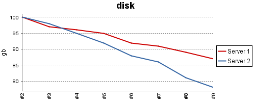
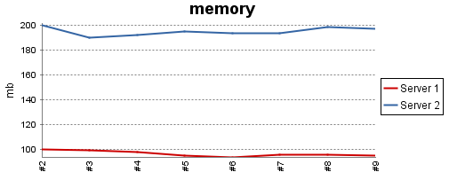

#### Developed by


#### Sponsored by

{width="161"
height="33"}

**The MonKit plugin is used to display charts of data delivered in XML
compliant with**
**[monkit.xsd](http://code.praqma.net/schemas/monkit/1.0.1/monkit.xsd).
Monkit also has a small Java API you can use to produce the XML.**

For clients who wish to see the graphs produced by Monkit. Access to
google API site is required. Since it uses the graphing engine to create
the charts. If you do not have access to the internet from the machine
you're browsing the job, you can use version 0.2.4

The idea of this plugin is, that given any xml complying to the xsd
<http://code.praqma.net/schemas/monkit/1.0.1/monkit.xsd> a chart will be
produced and displayed in the project.

The basic format is given as a set of categories, which contains a set
of observations.

Each category will be displayed as a chart and each observation for a
category will be a graph in that chart.

For example:

``` syntaxhighlighter-pre
<categories>
    <category name="memory" scale="mb">
        <observations>
            <observation name="Server 1">100</observation>
            <observation name="Server 2">200</observation>
        </observations>
    </category>
    
    <category name="disk" scale="gb">
        <observations>
            <observation name="Server 1">41</observation>
            <observation name="Server 2">58</observation>
        </observations>
    </category>
</categories>
```

The formation of the xml can be eased with a small tool, MonKit, which
is written in java and can be found at github
<https://github.com/Praqma/MonKit>.

The charts looks like this:





As an additional feature, MonKit plugin can set the build health. This
can be configured like this:


This should be read as, the category "disk" is at full health at 75 or
above and unstable at 50 and below. The values between these two numbers
are interpolated to a build health percentage.

### Using MonKit

This section will describe how to use MonKit as an API.

For now there's only an API for Java.

#### Java

MonKit can be included in your Maven project if you include our
repository in the distributionManagement section and the dependency in
the dependencies section - like this:

``` syntaxhighlighter-pre
<repositories>
  <repository>
    <id>praqma</id>
    <name>praqma</name>
    <url>http://code.praqma.net/repo/maven</url>
  </repository>
  ...
</repositories>

...

<dependencies>
  <dependency>
    <groupId>net.praqma</groupId>
    <artifactId>monkit</artifactId>
    <version>0.1.6</version>
  </dependency>
  ...
</dependencies>
```

The API works as follows:

1.  Create a MonKit instance.
2.  Add a category
3.  Add an observation
4.  Repeat from 2 or 3
5.  save() it

By default MonKit saves the xml file to the current workspace in a file
called monkit.xml.

The filename can be given as a File argument to the constructor or
save().

Two static methods are available to generate MonKit instances:

-   fromString(String), where String is a velformed valid MonKit xml
    String
-   fromXML(File), where File points to a velformed valid MonKit xml
    File

To exemplify:

``` syntaxhighlighter-pre
MonKit mk = new MonKit();
mk.addCategory("category", "scale");
mk.add("name", "1", "category");
mk.save();
```

The previous code will produce a file called monkit.xml in the current
working directory.

The following code will produce three MonKit instances, merge them,
create a final instance and save it to "myfile.xml" in the current
working directory.

``` syntaxhighlighter-pre
MonKit mk1 = MonKit.fromString("
<categories>
  <category name=\"category\" scale=\"scale\">
    <observation name=\"name1\">7</observation>
    <observation name=\"name2\">10</observation>
  </category><category name=\"category2\" scale=\"scale2\"/>
</categories>
" );
MonKit mk2 = MonKit.fromString("
<categories>
  <category name=\"category\" scale=\"scale\">
    <observation name=\"name1\">8</observation>
    <observation name=\"name4\">11</observation>
  </category><category name=\"category2\" scale=\"scale2\"/>
</categories>
" );
MonKit mk3 = MonKit.fromString("
<categories>
  <category name=\"category2\" scale=\"scale\">
    <observation name=\"name44\">9</observation>
    <observation name=\"name22222\">12</observation>
  </category>
</categories>
" );

MonKit mk = MonKit.merge(mk1,mk2,mk3);

mk.save(new File("myfile.xml"));
```

The Javadoc can be seen at
[http://code.praqma.net/docs/monkit](http://code.praqma.net/docs/monkit/)

## Changelog

##### 1.0.0 (2015, October 23)

-   Fixed an issue with values in the ui. Use long instead of integer to
    hold bigger values.
