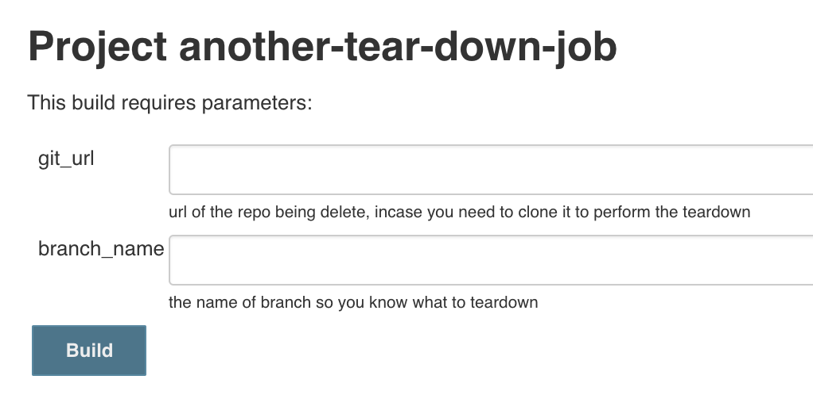

  

This plugin triggers/schedules a job to run when a multibranch workflow
job is disabled or deleted. Essential use case is you have a multibranch
job that spins up some infrastructure like a server, when the job is
deleted this plugin enables you to tear down said infrastructure and
clean up after yourself.

## Basic Setup

There are three ways to use this plugin but they require that you create
a job that accepts a String parameter of \`git\_url\` and
\`branch\_name\`.{height="250"}

### Express Setup

Simply create a job named \`job-tear-down-executor\` the plugin
automatically detects if this job is present and will send all branch
deletions to this job.

### Configure the Job

In the global setting section of Jenkins you can configure the job name
that should be executed if you don't want to call your job
\`job-tear-down-executor\`

{width="800"}

### Customize for your pipeline

If you need more fine tune control of which job to execute you can
include the following in your pipeline. 

**Pipeline Example**

``` syntaxhighlighter-pre
//Scripted Pipelines
properties([branchTearDownExecutor('my-special-job')])

//Declarative Pipelines
options {
  branchTearDownExecutor 'my-special-job'
}
```

  

## Change Log

12 Dec 2018 - 1.1

-   Filter out global shared pipeline library scm's from the teardown
    git\_url variable

26 Oct 2018 - 1.0

-   Initial Version

  
