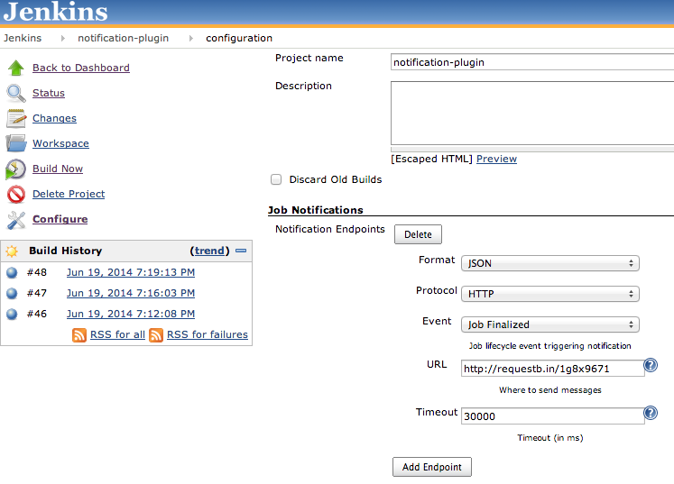
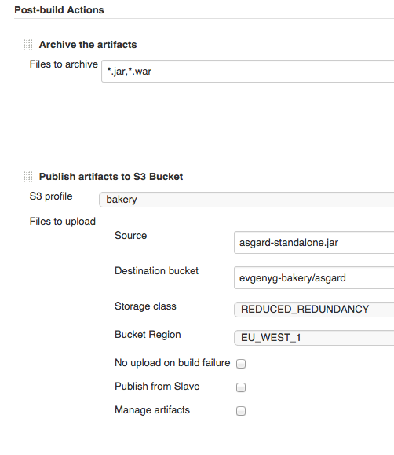

This plugin from [Tikal Knowledge](http://www.tikalk.com/) allows
sending Job Status notifications in JSON and XML formats.  

Job Notifications are defined in job's configuration, in their own
separate section **"Job Notifications"**:



Several notification endpoints can be defined. Each endpoint can be
configured with:

-   **"Format"** : notification payload format, JSON or XML.
-   **"Protocol"**: protocol to use for sending notification messages,
    HTTP, TCP or UDP.
-   **"Event"**: job events that trigger notifications: Job Started, Job
    Completed, Job Finalized or All Events (the default option). The
    difference between job being "completed" and "finalized" is as
    follows: when job is finalized all post-build activities, such as
    archiving artifacts, were executed as well. This is not the case
    with job being merely "completed" which usually involves only
    creation of job's artifacts without post-processing them. If you're
    unsure of which event to use, you can start with "Job Finalized".
-   **"URL"**: URL to send notifications to. It takes the form of
    **"**`http://host`**"** for HTTP protocol, and **"**`host:port`**"**
    for TCP and UDP protocols.
-   **"Timeout"**: Timeout in milliseconds for sending notification
    request, 30 seconds by default.

Example of notification message (you can use
[**requestb.in**](http://requestb.in/) and
[**jsonlint.com**](http://jsonlint.com/) services to aggregate HTTP
requests and validate JSON payload):

``` syntaxhighlighter-pre
{
    "name": "asgard",
    "url": "job/asgard/",
    "build": {
        "full_url": "http://localhost:8080/job/asgard/18/",
        "number": 18,
        "phase": "COMPLETED",
        "status": "SUCCESS",
        "url": "job/asgard/18/",
        "scm": {
            "url": "https://github.com/evgeny-goldin/asgard.git",
            "branch": "origin/master",
            "commit": "c6d86dc654b12425e706bcf951adfe5a8627a517"
        },
        "artifacts": {
            "asgard.war": {
                "archive": "http://localhost:8080/job/asgard/18/artifact/asgard.war"
            },
            "asgard-standalone.jar": {
                "archive": "http://localhost:8080/job/asgard/18/artifact/asgard-standalone.jar",
                "s3": "https://s3-eu-west-1.amazonaws.com/evgenyg-bakery/asgard/asgard-standalone.jar"
            }
        }
    }
}
```

The payload submitted includes the following information:

-   Job's name and URL.
-   Build's number, full URL, phase, and status.
-   SCM URL, branch and commit (only for Git repositories).
-   Artifacts generated. They need to be archived by **"Archive the
    artifacts"** or published to S3 by **"Publish artifacts to S3
    Bucket"** post-build actions. In addition, Jenkins needs to have its
    URL configured in "Manage Jenkins" =\> "Configure System" =\>
    "Jenkins Location" =\> "Jenkins URL".



### AWS S3 Support

If Jenkins [**S3
Plugin**](https://wiki.jenkins-ci.org/display/JENKINS/S3+Plugin) is
installed and artifacts are uploaded to [AWS
S3](http://aws.amazon.com/s3/) by **"Publish artifacts to S3 Bucket"**
post-build action - the plugin will send their downloadable locations as
well.

Note that you need to [edit S3 bucket's
policy](http://docs.aws.amazon.com/AmazonS3/latest/UG/EditingBucketPermissions.html)
(see
[example](http://docs.aws.amazon.com/AmazonS3/latest/dev/example-bucket-policies.html#example-bucket-policies-use-case-2))
to make its artifacts directly "downloadable" by anonymous users. Here's
one possible policy:

``` syntaxhighlighter-pre
{
    "Version": "2008-10-17",
    "Statement": [
        {
            "Effect": "Allow",
            "Principal": {
                "AWS": "*"
            },
            "Action": "s3:GetObject",
            "Resource": "arn:aws:s3:::notification-plugin/*"
        }
    ]
}
```
