Nutanix Calm Jenkins plugin allows you to launch Nutanix Calm blueprint,
provision infrastructure, and services in a multi cloud environment and
subsequently run actions/tasks on those applications.

## Changelog 

### **Version 1.2 (January 03 2019)**

-   Ability to reference the Jenkins Environment variables in the run
    time variables section of blueprint launch and application action
    run in the Jenkins Calm Plugin. 
-   Calm Service IP application variable is exposed as a Jenkins
    environment variable.
-   This release also includes two minor bug fixes.

#### Known Issues

-   Slight performance lag observed in the plugin when used in Windows
    OS chrome browser

### Version 1.1 (November 03 2018)

-   In this release Plugin can be used with Jenkins Freestyle projects
    and Pipeline.  
    Launch Calm Blueprints and run application actions from the Jenkins
    build steps.  
-   The Prism Central credentials are handled by the credentials plugin
    as prescribed by Jenkins.
-   By default, the PC IP/URL expects an SSL certificate. There is an
    exclusive option to override the same.

## License:

-   All source code is licensed under the MIT license.

## Supported Versions:

-   Jenkins versions: 2.107.2 and later
-   Nutanix Calm versions: 5.7.1 and later
-   Google Chrome version:  69.0.3497.100 (Official Build) (64-bit) 

## Plugin Installation:

-   Navigate to Manage Jenkins→ Manage Plugin → Available.  Search for
    Nutanix Calm  
    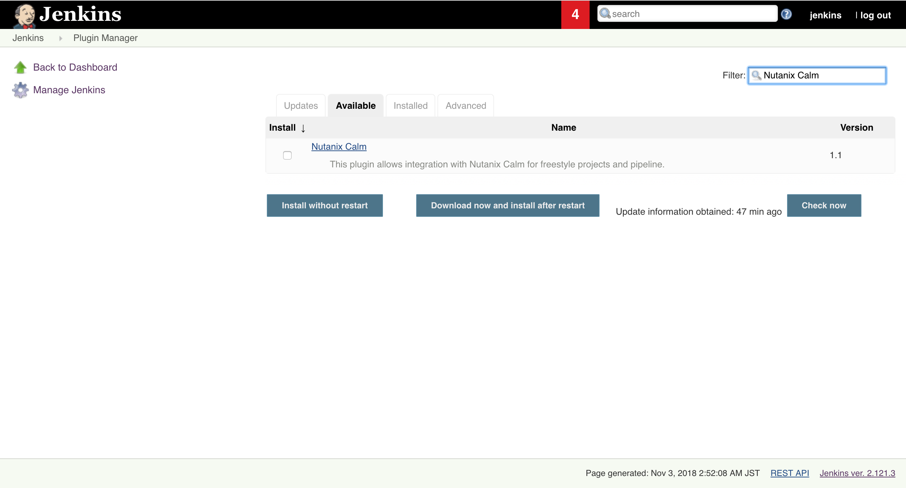{height="400"}
-   To verify that the Nutanix Calm plug-in is successfully installed,
    click Manage Jenkins→ Manage Plugins→ Installed, search for Nutanix
    Calm plugin.   
    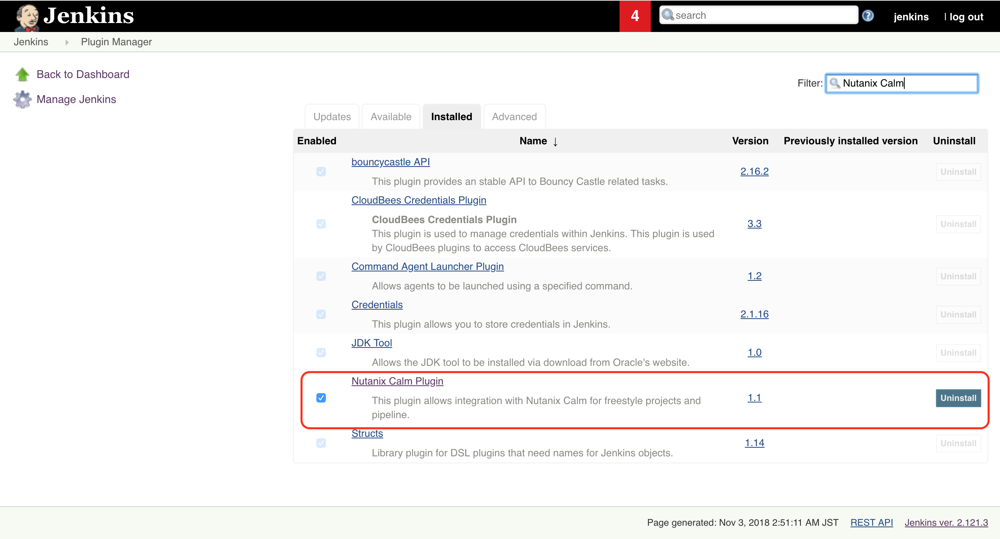{height="400"}  

##  Plugin Configuration:

-   To configure the plugin first Navigate to Manage Jenkins -\>
    Configure System -\> Nutanix Calm Plugin Configuration. Provide the
    Prism Central IP/DNS Name, Username and Password.  
    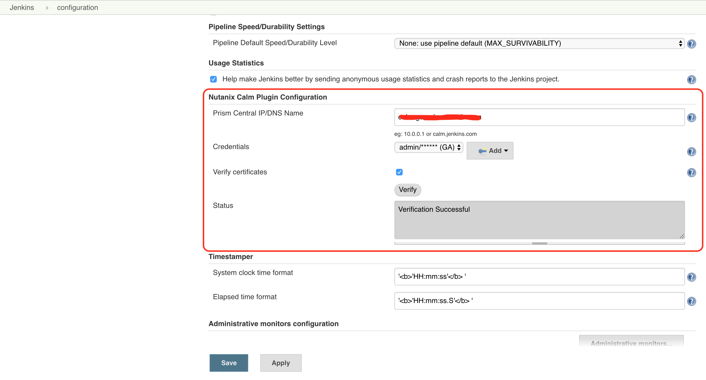{height="400"}

##  Jenkins Freestyle job Setup:

-   Click on New Item. Select Freestyle project. Enter an item name.
    Click OK.  
    {height="400"}  
    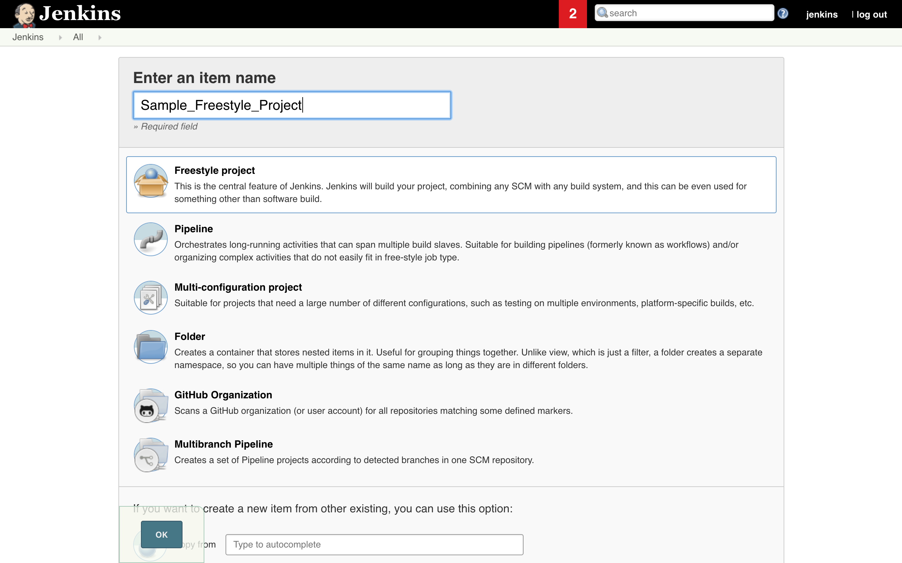{height="400"}  
      
-   Click on Add Build step. Select **Nutanix Calm Blueprint
    Launch**.   
    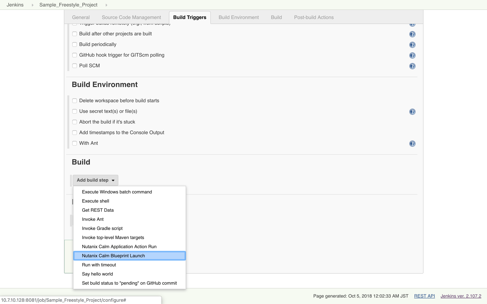{height="400"}  
      
-   In the section
    -   Select the Calm project.
    -   Select the Blueprint to launch. Blueprint description is fetched
        and displayed. 
    -   Select the Application profile.
    -   Modify the values for runtime variables available for that
        application profile. 
    -   Provide an application name. BUILD\_ID is appended by default to
        the application name to uniquely identify it in Calm. 
    -   Select the option if you want Jenkins job to wait for blueprint
        launch to complete before proceeding to the next step.  
        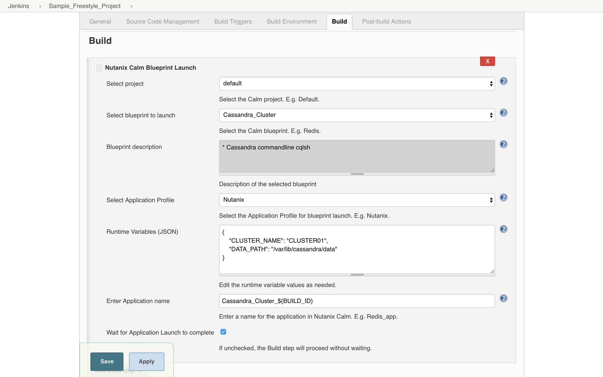{height="400"}  
          
-   To invoke actions defined in the Calm blueprint/ application, click
    on Add Build Step. Select **Nutanix Calm Application Action
    Run**.   
    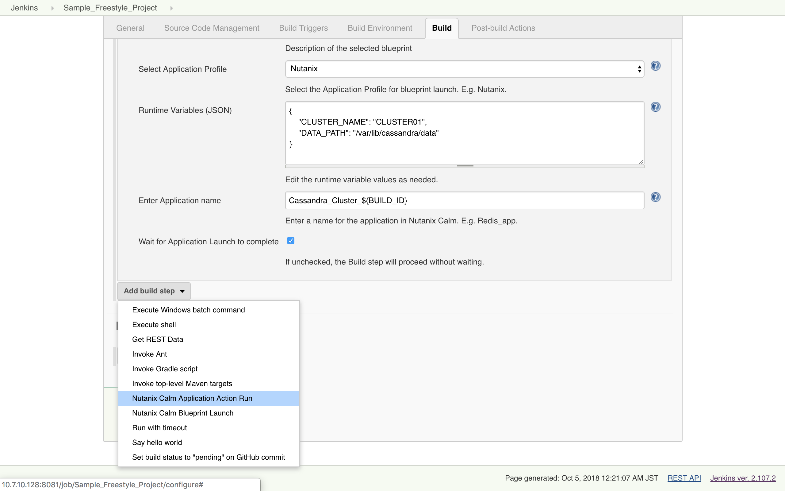{height="400"}  
      
-   In the section 
    -   Select the application name. 
    -   Select the application actions available. 
    -   If necessary, modify the values for the runtime variables
        available.  
        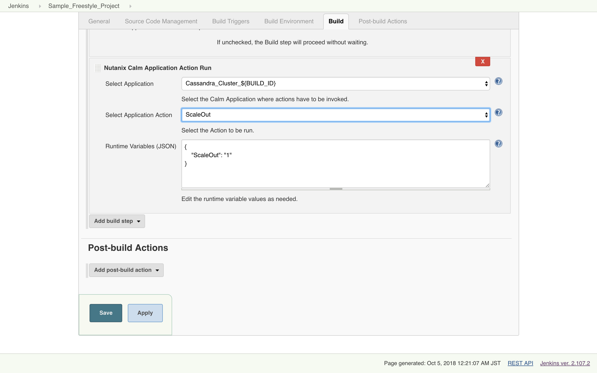{height="400"}  
          
    -   Click on Apply and then Save.
    -   Click on Build Now to run these build steps.   
        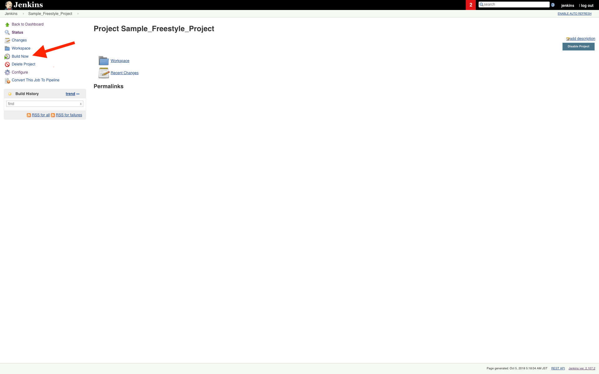{height="400"}

## Jenkins Pipeline:

-   Click on New Item. Select Pipeline. Enter an item name. Click OK.  
    {height="400"}  
      
    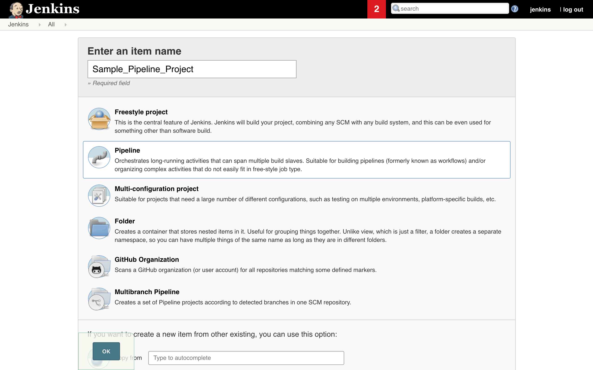{height="400"}  
      
-   Select pipeline script in Pipeline Definition section and to
    generate the pipeline syntax click on the Pipeline Syntax at the
    bottom.   
    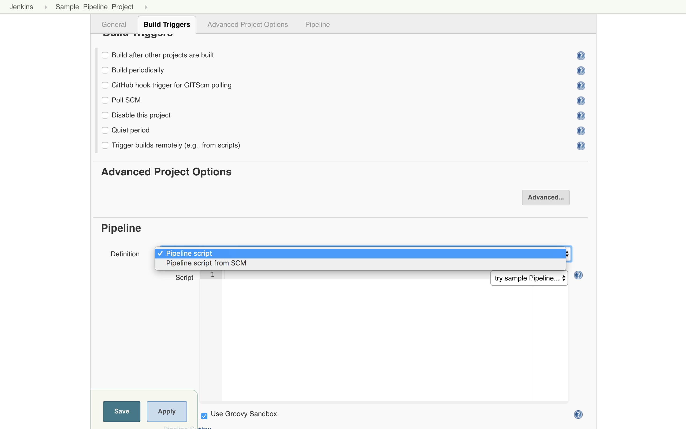{height="400"}  
      
-   In the Pipeline Syntax window, select the General build Step in the
    Sample step dropdown. 
-   Select Nutanix Calm Blueprint Launch in Build Step
-   In the section
    -   Select the Calm project.
    -   Select the Blueprint to launch. Blueprint description is fetched
        and displayed. 
    -   Select the Application profile.
    -   Modify the values for runtime variables available for that
        application profile. 
    -   Provide an application name. BUILD\_ID is appended by default to
        the application name to uniquely identify it in Calm. 
    -   Select the option if you want Jenkins job to wait for blueprint
        launch to complete before proceeding to the next step.
-   Click on Generate Pipeline Script.  
    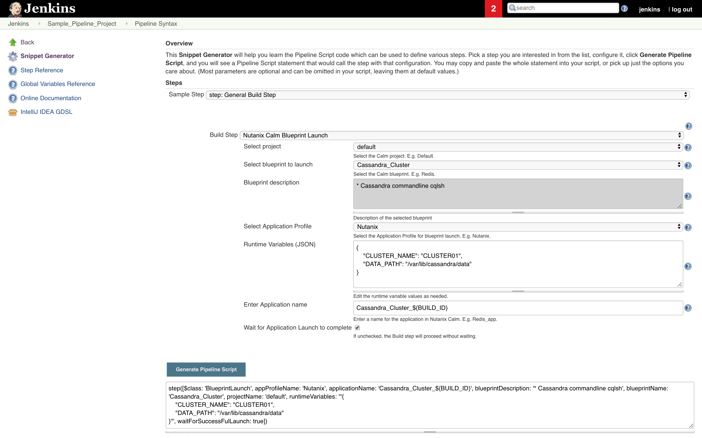{height="400"}   
      
-   Copy and paste the text in the box below into the pipeline script
    box in {} under node.   
    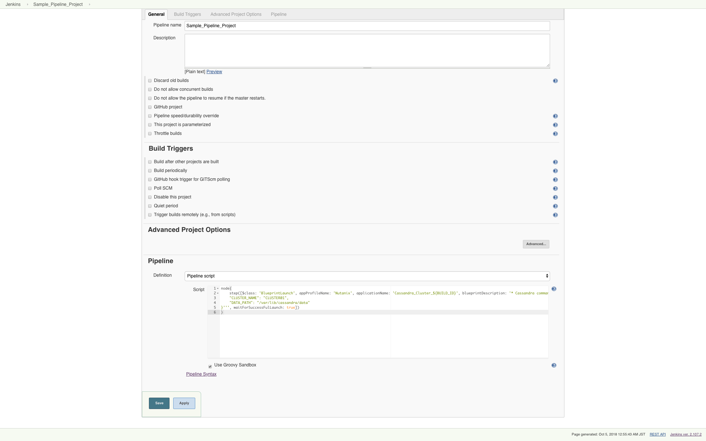{height="400"}  
      
-   Follow same steps to generate the pipeline syntax for **Nutanix Calm
    Application Action Run.**  
    **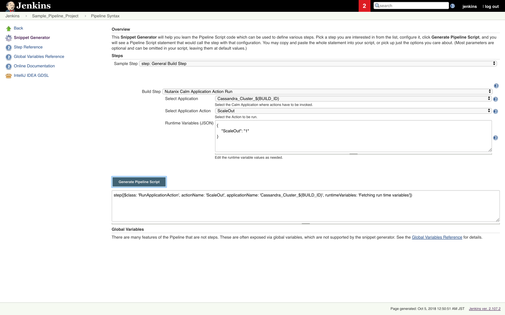{height="400"}  
      
    **
-   Copy and paste the text in the box below into the pipeline script
    box in {} under node. **  
    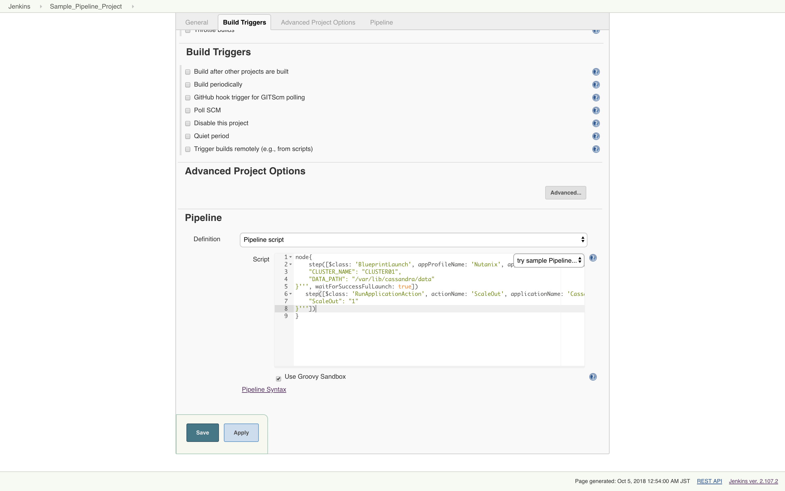{height="400"}  
    **
-   Click on Apply and then Save.

-   CNow we can click on Build Now to run these build steps.   
    **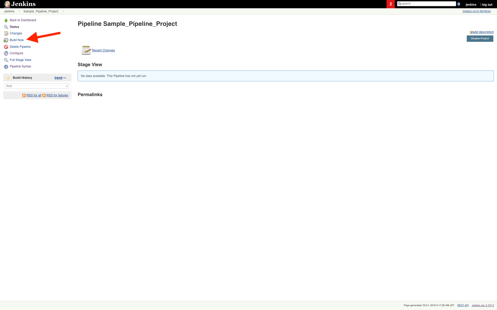{height="400"}  
    **

    **  
    **

-   Pipeline scripts can also be invoked from SCM in Pipeline Definition
    section 

    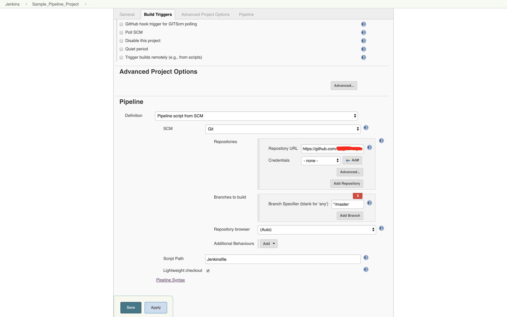{height="400"}  

  

  

  

${CalmServicesIP} is the exposed Jenkins environment variable which
gives the output like InstanceName\_ProviderType=IP For example
{mssqlvm-0-190103-040010\_VMWARE\_VM=10.46.140.18,
iis1-0-190103-040009\_VMWARE\_VM=10.46.141.34,
iis2-0-190103-040009\_VMWARE\_VM=10.46.140.91}

  

  
  
  
  
  
