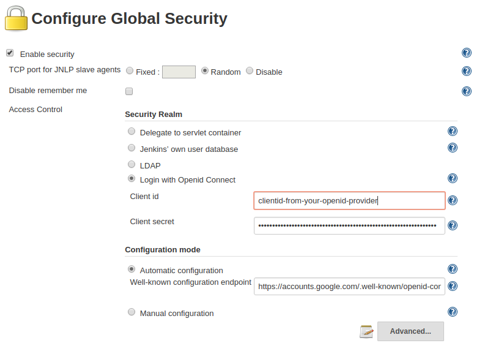

[{width="120"}  
{width="120"}  
](https://ci.jenkins.io/job/Plugins/job/oic-auth-plugin/job/master/)

# {height="185"}

# Summary

Allows users to authenticate using self hosted or public openid connect
providers.

# Open Tickets (bugs and feature requests)

[https://github.com/jenkinsci/oic-auth-plugin/issues](https://github.com/jenkinsci/oic-auth-plugin/issues?q=is%3Aopen+is%3Aissue)

# Changelog

<https://github.com/jenkinsci/oic-auth-plugin/releases/>

### 1.6 

Special release
for [\#46](https://github.com/jenkinsci/oic-auth-plugin/issues/46) which
shouldn't, but might break things - *please report any issues you have
with this version
here: <https://github.com/jenkinsci/oic-auth-plugin/issues/62>*

**In case of any troubles revert to 1.5 and report your issues**

### 1.5

-   Support for configuring by well known
    url (/.well-known/openid-configuration) see
    also <https://openid.net/specs/openid-connect-discovery-1_0.html#ProviderConfig>
-   fixed issue indroduced with jenkins 2.150.2 with logout occurring
    immediately after login
    see: <https://github.com/jenkinsci/oic-auth-plugin/issues/54>
-   Masking client secret to avoid over the shoulder leaking of secret.
-   Nested field mapping - permitting the use of values of non top-level
    keys,
    see <https://github.com/jenkinsci/oic-auth-plugin/pull/36> and <https://github.com/jenkinsci/oic-auth-plugin/blob/6e643be0883b3843876f3522eabb87867677cc83/src/main/java/org/jenkinsci/plugins/oic/OicSecurityRealm.java#L630>
-   Returning a 401 instead of throwing an NullPointerException when
    there's no session at the end of the authentication interaction

### 1.4

-   We can now also look for groups in the UserInfo endpoint when it's
    configured
-   Added documentation about how scripted clients should authenticate
    given this plugin is active
-   Now honoring jenkins proxy settings
    see [JenkinsBehindProxy](http://localhost:8085/display/JENKINS/JenkinsBehindProxy)

### 1.3

-   Bugfix for regression, breaks on absent expires\_in

### 1.2

-   Local Login / escape hatch
-   Fix JEP-200 compatibility
-   Added test harness
-   Using role-based permissions
-   Fix for 1.1 breaking on existing configuration and configuration
    saving issues
-   Add groups at login if provided in the idToken as an array of
    strings
-   Exception with Azure authority needs testing
-   Patched TokenResponse of the google oauth-client for better
    compatibility with openid provider implementations
-   On Logout have the option to log out of OpenId Provider
-   Friendlier error when the user declines authorization

### 1.1

-   fix save not resetting userNameField and scopes to default values
    bug / User name field value not being updated
-   Add new setting to disable sslVerification - for testing purposes
    enhancement
-   Support OIDC UserInfo Endpoint enhancement

### 1.0

initial release

## Configuration

Configuration of this plugin takes a bit of effort as it requires some
knowledge of the openid connect standard as well as the non-standard
configuration of the various identity providers out there. Should you
configure this plugin against a identity provider then please share your
experiences and found caveats through a blog post or by adding it to the
wiki.

Also note that the spec describes a well known configuration location
which will also help discovering your settings
(<https://openid.net/specs/openid-connect-discovery-1_0.html#ProviderConfig>)

  

From 1.5 and onward the well known configuration location may be used to
populate the configuration simplifying the configuration greatly. See
also the following screenshot utilizing the google well known endpoint
for a minimal configuration example: 

{height="250"}

### Using g-suite / google

    Obtain the client id and secret from the developer console: https://console.cloud.google.com/apis/credentials by creating Oauth client id.

Use those to fill the respective fields in the configuration of Jenkins.

    Choose automatic configuration:

    Well-known configuration: https://accounts.google.com/.well-known/openid-configuration

  

see
also: <https://developers.google.com/identity/protocols/OpenIDConnect>

### Using the plugin with Azure AD

See this blog
post <http://www.epiclabs.io/configure-jenkins-use-azure-ad-authentication-openid-connect/>

## Interacting with Jenkins as a non front-end user

TLDR: use an API token instead as described here: [Authenticating
scripted
clients](http://localhost:8085/display/JENKINS/Authenticating+scripted+clients)

Using basic auth for authentication won't work. This is because jenkins
has no knowledge of the password due to the way openid connect works:
Indentifing a user is a three way interaction between the user, Jenkins
and the openid provider.

  

The plugin asks the configured openid provider to confirm the identity
of the user is and does this in a way that both jenkins and the provider
are 'talking' about the same user. The openid connect provider will
likely challenge the user to prove it's identity and might do this by
requesting a username and password but this is entirely up to the
provider. This part is between the user and the openid connect provider,
jenkins (using this plugin) delegates proving ones identity to the
provider and will go with whatever conclusion the provider draws. This
has the benefit that with openid connect the service your trying to
access (in our case Jenkins) never sees a user password, so even if
Jenkins is compromised an attacker can't intercept passwords or other
secrets. Using basic auth would require one to send their password to
Jenkins which would defeat this.

  

Scripted clients can still interact with Jenkins even when the openid
connect plugin is active: they will have to use an API
token. [Authenticating scripted
clients](http://localhost:8085/display/JENKINS/Authenticating+scripted+clients) describes
how to obtain one. 

  
