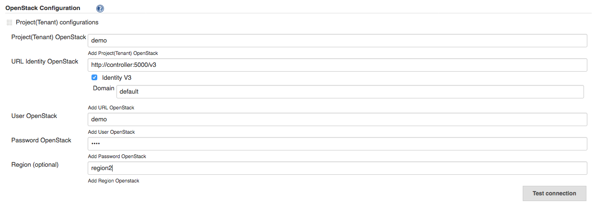
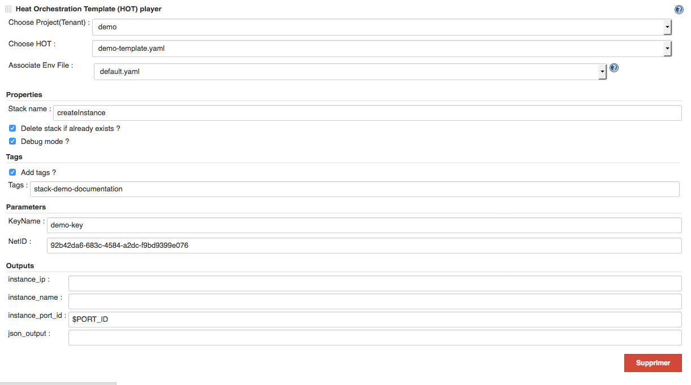

Openstack Heat Plugin allows to interact with OpenStack by using the
Heat API in Jenkins.

## Summary

Openstack Heat is a Jenkins plugin that allows to interact with
OpenStack by using the Heat API.  
When you configure a project, you can add a step build HOT player. At
this time, you can choose a tenant/yaml file/env file from differents
lists.  
When a selection is done, the plugin generates automatically the
interface from the differents parameters (yaml file, env file...) and
you can configure the heat interactions. You can create differents HOT
player steps and exchange data between them.  
When the job is launched, the plugin calls OpenStack via the Heat API
with the configuration and the Jenkins console shows the outputs from
the interaction.

## Installation

The plugin can be install with the differents methods described in the
Jenkins documentation : [Jenkins Plugins - How to install
plugins](https://wiki.jenkins-ci.org/display/JENKINS/Plugins#Plugins-Howtoinstallplugins)

## Usage

### Global configuration

------------------------------------------------------------------------

#### OpenStack Configuration

This section permits to add one or more OpenStack platform(s) by the
button **Add a new Project(Tenant) configuration**.

You need to fill the fields :

-   *Project(Tenant) OpenStack* : Project (Tenant) associated with the
    identification.
-   *URL Identity OpenStack* : Url to access the identity service.
-   *Identity V3* : If the identity uses v3, the check box permits to
    configure the domain.
-   *Domain* : Domain used for the identification when the identity V3
    is checked.
-   *User OpenStack* : User to identify on the project(tenant).
-   *Password OpenStack* : Password associated.
-   Region (optional) : If you want used a specific region on your
    openstack, it's optional  
    {width="1171"
    height="400"}  
    {width="1157"}

*Test connection* : This button permits to test the parameters by
creating a connection.  
*Delete* : This button permits to delete this configuration panel.  
*Add a new Project(Tenant) configuration* : This button permits to add
multiple projects(tenants) to deploy on different OpenStack.

#### OpenStack Time Configuration

This section permits to configure the differents timeout associated with
OpenStack Heat API.

-   *Polling Status OpenStack (s)* : This input allows to put the
    interval in seconds in order that the plugin checks the status of a
    stack in Openstack. By default, the time is 20 seconds.
-   *Timeout Operation OpenStack (s)* : This input allows to put the
    interval in seconds in order that the operation via Heat falls in
    timeout. By default, the time is 15 minutes (900 s).

{width="1024"
height="97"}

#### Heat Orchestration Template (HOT) Loader Settings

This section allows to choose a loader to consume the HOT data.

A loader is divided in two distincts parts:

1.  The configuration to load the files yaml to manage stack, this is
    mandatory.
2.  The configuration to load optional files env to facilitate sending
    parameters via the client OpenStack to manage the stacks.

Currently, it exits two defaults loaders:

##### *LoaderFromDir*

-   *Path to the directory Heat Template* : The absolute path (in the
    same physical machine that hosting Jenkins server) to the repository
    containing the yaml files.
-   *Extension for the Heat Template File* : The extension associated
    with the yaml files.
-   *Test Path Hot* : This button permits to test the yaml files
    configuration.
-   *Use optional path to the directory Env File* : When you check this
    box, you can configure the optional files env.
-   *Path to the directory Env* : The absolute path (in the same
    physical machine that hosting Jenkins server) to the repository
    containing the env files.
-   *Extension for the Env File* : The extension associated with the env
    files.
-   *Default full Env filename* : You can indicate a file by default.
    The plugin tries to find an env file with the same name of the hot
    file else it uses the default or nothing if this field is empty.
-   *Test Path Env* : This button permits to test the env files
    configuration.

{width="1024"
height="360"}

##### *LoaderHttpREST*

We suppose to use an Api REST. So the root url via a Get retrieve the
list of the yaml file and the root url + path to a file via a Get
download this specific file.

-   *Url to access to the Hot API Rest*: The url to access at the list
    of the yaml file, it is the root url. The format is an array json.
    You can find an example (listHots) in the package
    /openstack.heat/src/test/resources/com/arkea/jenkins/openstack/heat/yaml.
-   *Test Url Hot* : This button permits to test the url Hot API Rest
    configuration.
-   *Use optional url to Envs File* : When you check this box, you can
    configure the optional files env.
-   *Url to access to the Env API Rest* : The url to access at the list
    of the yaml file, it is the root url. The format is an array json.
    You can find an example (listEnvs) in the package
    /openstack.heat/src/test/resources/com/arkea/jenkins/openstack/heat/yaml.
-   *Test Url Env* : This button permits to test the url env files
    configuration.
-   *Default full Env filename* : You can indicate a file by default.
    The plugin tries to find an env file with the same name of the hot
    file else it uses the default or nothing if this field is empty.

{width="1024"
height="293"}

### Step configuration

------------------------------------------------------------------------

If the global configuration is done and all is correct, then in a
free-style project you can see the item **Heat Orchestration Template
(HOT) player** in the list build step.

{width="343"
height="203"}

If you have configured many projects, a selectbox appears to choose
which project you want to use. Otherwise, if you have only one project,
it's selected by default without selectbox.

{width="1024"
height="79"}

The Heat Orchestration Template (HOT) player allows to play HOT file to
OpenStack.  
The HOT player load the HOT file choose in the selectbox and generate
dynamically the inputs.  
If the Associate Env File is configured than the selectbox permits to
choose one file env file.  
By default when you choose a HOT file, the selectbox Associate Env File
tries to select the same env file name if it exits or the default env
file if it is configured. In this case, the differents inputs are fills
with the data from env file.  
The inputs are divided in 4 categories :

1.  Properties:
    -   *Stack name* : Corresponding to the the name used in OpenStack.
    -   *Delete stack if already exists ?* : If you want reuse the same
        name for a stack, the plugin destroys the stack if already
        exits.
    -   *Debug mode ?* : If it's checked than the console print all the
        differents values parameters.
2.  Tags
    -   If you checked "Add tags ?", this category permits to add tags
        to the stacks. Input should be a string, multiple tags can be
        added separated by ","
3.  Parameters:
    -   This category is generated dynamically from the differents
        parameters present in the HOT.
4.  Outputs:
    -   This category is generated dynamically from the differents
        outputs present in the HOT.

Variable environment

You can use variable environment in each input. The variable must be
start with "$" without "-".

{width="1024"
height="571"}

Content file

If you fly over the help's icon from the *Associate Env File* when an
entry is selected, you can watch the content of the file.  
{width="1024"
height="156"}

### Post build action

------------------------------------------------------------------------

In the post build action list, you can see the item **Delete HOT player
stacks when build done**.

This task permits to clean the environment by deleting all the stacks
created during the different previous build step in the
job

### Execution

------------------------------------------------------------------------

When the job is launched, you can follow the interactions between
Jenkins and Openstack in the console. If you have checked the debug
mode, the outputs are more verbose.  
If the job have a problem, the console shows the stacktrace.

{width="1024"
height="680"}

When you choose the post build action, the console looks like this :

{width="911"
height="173"}

## Development

You need **Java 7** and **Maven 3** (3.3.1 minimum) to develop on your
computer.  
The first step consists to extract the source via the command **git
clone**.  
If you need to clean the project, you can do that via the command **mvn
clean** and by deleting the work directory.

### Eclipse

If you want import the project under Eclipse, you need to launch **mvn
eclipse:eclipse** under a terminal in the project's directory.  
After, you just import the project via the menu *File/Import.../Existing
Projects into Workspace* under Eclipse.

### Launch

On a terminal, you can launch a jenkins to test the plugin via the
command : **mvn hpi:run -Djetty.port=8080**. You can choose the port.

If you want to debug the plugin, you need to add these options to
**MAVEN\_OPTS** env variable : **-Xdebug
-Xrunjdwp:transport=dt\_socket,server=y,address=8000,suspend=n** and to
create a debug configuration under Eclipse via the menu *Run/Debug
configurations.../Remote Java Application/New*. Select the
*openstack.heat* project.  
After jenkins runs, under Eclipse, launch the previous configuration. If
you put a breakpoint, you can debug the code under Eclipse.

### Test

The source have some tests. If you want to pass them, it's via the
command : **mvn test**.  
If you want to launch a specific test, execute the command : **mvn
-Dtest=ClassNameTest test** where *ClassNameTest* equals the single
class test.

If you want to debug the test, you need to create a debug configuration
under Eclipse via the menu *Run/Debug configurations.../Remote Java
Application/New*. Select the *openstack.heat* project and change the
port to 5005.  
You need to launch the application via the command : **mvn
-Dmaven.surefire.debug test**.  
During the launching, the starter wait a connection to the debug port,
so under Eclipse, launch the previous configuration. If you put a
breakpoint, you can debug the code under Eclipse.

It is possible to combine the twice, for example : **mvn
-Dtest=ClassNameTest -Dmaven.surefire.debug test**

## License

License

  
Copyright 2015 Credit Mutuel Arkea

Licensed under the Apache License, Version 2.0 (the "License");  
you may not use this file except in compliance with the License.  
You may obtain a copy of the License at

<http://www.apache.org/licenses/LICENSE-2.0>

Unless required by applicable law or agreed to in writing, software
distributed under  
the License is distributed on an "AS IS" BASIS, WITHOUT WARRANTIES OR
CONDITIONS OF ANY KIND,  
either express or implied.  
See the License for the specific language governing permissions and
limitations under the License.

## Feedback wanted

Let me know via the maintainer email at the top of the page!

## Version history

### Version 1.5 (November 16, 2017)

-   Roll back to dependency OpenStack4j 3.0.4

### Version 1.4 (November 14, 2017)

-   Bugs fixed : Integer ,default list, size constraints
-   Update dependency OpenStack4j to 3.1.0
-   Add configuration for `http://ci.jenkins.io`

### Version 1.3 (June 28, 2017)

-   Add optional Region to the project configuration
-   Add optional support tag on stack
-   Add optional post build task to clean (delete) all the stacks
    created
-   Bugs fixed : missing env file, multi project
-   Update test, documentation

### Version 1.2 (April 5, 2017)

-   Update dependency and constructor OpenStack to avoid
    java.lang.NoSuchMethodError:
    org.openstack4j.api.heat.StackService.delete
-   Update test, documentation

### Version 1.1 (November 9, 2016)

-   Upgrade constraints (Implementation + test)
-   Add I18n and constants
-   Loader HttpRest Ihm simplified

### Version 1.0 (September 15, 2016)

-   Initial release
