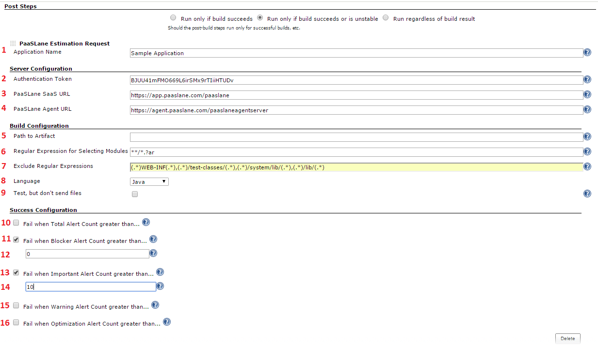

Provides a post build action for submitting artifacts to PaaSLane for
scanning.

# Goal

The PaaSLane Estimate plugin for Jenkins provides a secure submission
capability for users of PaaSLane. a static code analysis platform, and
Jenkins. PaaSLane is a static code analyzer for modernizing and
optimizing applications. When modernizing existing code, PaaSLane can
help to make your application be more performant, more secure, and
easier to maintain. When developing new cloud applications,
[PaaSLane](http://www.paaslane.com/) helps ensure optimal performance
and scalability in the most popular public and private cloud platforms.
PaaSLane automatically spots hundreds of potential issues and
optimizations in your source code, giving you detailed examples and
suggesting remediations to enhance developer productivity. For a free
trial [click here](http://www.paaslane.com/products/paaslane-optimize/)
.

The PaaSLane Estimate plugin is implemented as a *Post Build Action* and
is intended to sweep a directory structure looking for files that match
the specified patterns and securely upload them to PaaSLane for
verification. Once the files are uploaded, they are profiled and then an
estimation report is generated. This report will include overall
conformance with the rules defined, a list of instances of the
violations with their recommended remediation, as well as an estimate
for the remediation.

# Getting started

Install the plugin using the Plugin Manager via the Available tab, and
restart Jenkins

# Job Setup

The PaaSLane Estimate plugin is implemented as a Post Build Action
Plugin as shown below

# Options:

1.  Name - The name field is used to specify the PaaSLane application
    that the artifacts mapped later will be associated with. For
    example, if the name of this field is "My Application" and you match
    3 artifacts, there will be an application "My Application" with 3
    modules that get profiled.
2.  Authentication Token - The "Authentication Token" field contains the
    PaaSLane token associated with a specific user in a specific tenant.
    This token can be gotten by logging into PaaSLane, clicking the
    username dropdown and selecting to "Get Token". Once you have this
    option you should be presented with the time sensitive token.
3.  PaaSLane SaaS URL - The "PaaSLane Agent URL" field specifies the
    root url, including the host, port and context that define the
    location of the PaaSLane profiling environment to use. For most SaaS
    customers, this will be https://app.paaslane.com/paaslane.
4.  PaaSLane Agent URL - The "PaaSLane Agent URL" field specifies the
    root url, including the host, port and context that define the
    location of the PaaSLane profiling environment to use. For most SaaS
    customers, this will be
    https://agent.paaslane.com/paaslaneagentserver. However, customers
    utilizing distributed profiling, will want to get their URL from
    their administrator.
5.  Path to Artifact(s) - This optional value specifies the additional
    path from the workspace directory that should be scanned for
    artifacts to be included in the application. This, paired with
    "Regular Expression for Selecting Modules" and "Exclude Regular
    Expressions" help to specify included artifacts.
6.  Regular Expression for Selecting Modules - This value specifies the
    Ant style regular expression used to search for artifacts residing
    under "Path to Artifact(s)". For examples of Ant Style regular
    expressions, please see
    [examples](http://ant.apache.org/manual/dirtasks.html#patterns).
7.  Excluded Regular Expressions - The "Exclude Regular Expressions"
    field contains a comma separated list of regular expression patterns
    that will be applied to every matched artifact. If any of the
    patterns match the path of the artifact being reviewed, then
    artifact will not be sent to PaaSLane. Examples of these regular
    expressions can be found
    [here.](http://ocpsoft.org/opensource/guide-to-regular-expressions-in-java-part-1/)
8.  Report Config - Name of the Report Config to use when generating the
    Report. If you leave this field blank, PaaSLane will use the Default
    Report Config. To see your existing Report Configs, go to the
    PaaSLane UI, click "Applications", and click "New Report" next to an
    existing application. Under the "Create Report" button, you will see
    a dropdown that contains a list of existing Report Configs. You can
    click "Advanced" to see details and further configure your report.
9.  Language - The "Language" selection specifies which language rules
    should be applied to the artifacts that are uploaded and profiled.
10. Test, but don't send files - The "Test, but don't send files" field,
    when checked, will only display the files that would have been sent,
    based on the parameters. Use this field to get the parameters
    correct.
11. Fail when Total Alert Count greater than - Forces the plugin to
    query the total number of alerts found and if that number exceeds
    the threshold provided below, the build will fail.
12. Fail when Blocker Alert Count greater than - Forces the plugin to
    query the total number of blocker alerts found and if that number
    exceeds the threshold provided below, the build will fail.
13.                                                                - The
    threshold for acceptable number of blocker alerts allowed.
14. Fail when Important Alert Count greater than - Forces the plugin to
    query the total number of important alerts found and if that number
    exceeds the threshold provided below, the build will fail.
15.                                                                - The
    threshold for acceptable number of important alerts allowed.
16. Fail when Warning Alert Count greater than - Forces the plugin to
    query the total number of warning alerts found and if that number
    exceeds the threshold provided below, the build will fail.
17. Fail when Optimization Alert Count greater than - Forces the plugin
    to query the total number of optimization alerts found and if that
    number exceeds the threshold provided below, the build will fail.
