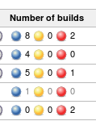
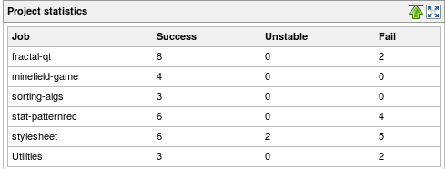

Jenkins uses lazy loading of build records since version 1.485, and
Project Statistics Plugin requires all builds to be loaded every time it
counts them. Depending on the number of builds and amount of memory you
have, this may result in constant loading/discarding of build records
and bad UI performance.

This plugin provides new dashboard-view portlets and new columns for
displaying project statistics for your Jenkins instance.

## Description

Following this [post on the mailing
list](http://groups.google.com/group/jenkinsci-users/browse_thread/thread/9735c79b2bb44c64/67f4c44016113c89?lnk=gst&q=metrics+support#67f4c44016113c89)
I created a new plugin that provides statistics for each project (versus
global statistics that are already provided by the dashboard view plugin
and several others).

## Project statistics

### Number of builds

#### Column 

#### Portlet 

## Version History

### 0.5 (Development)

### 0.4 (2012/09/22)

-   Wrapping elements to make them style-able (thanks to
    [crossman](https://github.com/crossman))
-   FIX JENKINS-15067: a build result can be null if the build is
    currently building (thanks to Michael Pailloncy)
    [JENKINS-15067](https://issues.jenkins-ci.org/browse/JENKINS-15067)

### 0.3 (2011/09/25)

-   NumBuilds portlet: added percentage

### 0.2 (2011/03/28)

-   NumBuilds portlet: replaced job name with job link
-   Updated jenkins version to 1.404 to avoid build warnings with older
    versions

### 0.1 (2011/03/26)

-   Added a new column with the number of builds (Success, Unstable,
    Fail) for the project
-   Added a new portlet that shows a table with the number of builds
    (Success, Unstable, Fail) for the project in the viewwrapping
    elements to make them style-able
