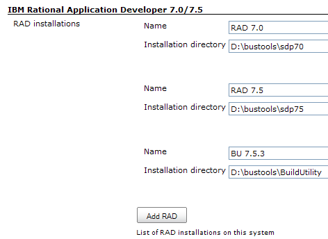
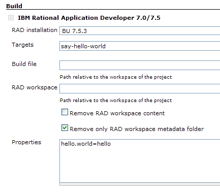

This plugin allows Jenkins to invoke IBM Rational Application Developer
as a build step.

Tutorial regarding the use of this plugin

For a complete tutorial describing how to use this plugin, refer to the
[Enhance continuous integration using Rational Application Developer and
the Hudson build
server](http://www.ibm.com/developerworks/rational/library/10/enhancecontinuousintegrationwiththerationalapplicationdeveloperbuildutility/index.html)
article on [developerWorks](http://www.ibm.com/developerworks/).

Introduction to Rational build utility

The nice [guide to the Rational Build
Utility](http://www.ibm.com/developerworks/rational/library/guide-rational-build-utility/index.html)
details, on [developerWorks](http://www.ibm.com/developerworks/), how to
use the headless feature of Rational Application Developer.

# About this plugin

This plugin is aimed at using the headless capabilities of IBM Rational
Application Developer (RAD) 7.0/7.5, which is Ant-based, to build J2EE
applications designed with RAD.

This plugin currently supports:

-   RAD 7.0 (version 1.x successfully tested with RAD 7.0.0.9 and RAD
    7.0.0.10 – should work with other 7.0.0.x versions)
-   RAD 7.5 (version 1.x successfully tested with RAD 7.5.3, 7.5.4,
    7.5.5, 7.5.5.1, 7.5.5.2 and 7.5.5.3 – should work with other 7.5.x
    versions)
-   RAD build utility (BU) 7.5 (version 1.x successfully tested with BU
    7.5.3, 7.5.4, 7.5.5, 7.5.5.1, 7.5.5.2 and 7.5.5.3 – should work with
    other 7.5.x versions)
-   RAD build utility (BU) 8.0 (version 1.1.4 successfully tested with
    BU 8.0.2 – should work with other 8.0.x version)

BU is the fully headless version of RAD.

# User guide

This plugin works as the built-in Ant builder:

1.  The first thing to do is to define RAD/BU installations in Hudson's
    configuration panel:  
    
2.  Once done, corresponding build steps can be added to the project:  
    

About the WORKSPACE environment variable

RAD uses an environment variable called `workspace` to define the RAD
workspace to use. It means that there's a "competition" (no matter the
case) between this variable and the one defined by Hudson (which refers
to the project's workspace). As a consequence, don't use the `WORKSPACE`
variable within this build step as it doesn't refer to what's expected.

# Additional documentation

-   To get more information on the headless capabilities of RAD 7.0,
    please refer to the [RAD 7.0
    Infocenter](http://publib.boulder.ibm.com/infocenter/radhelp/v7r0m0/topic/com.ibm.etools.ant.tasks.doc/topics/tjant.html)
-   To get more information on the headless capabilities of RAD 7.5,
    please refer to the [RAD 7.5
    Infocenter](http://publib.boulder.ibm.com/infocenter/radhelp/v7r5/topic/com.ibm.etools.ant.tasks.doc/topics/ph-antoverview.html)
-   To get more information on BU 7.5, please refer to the [RAD 7.5
    Infocenter](http://publib.boulder.ibm.com/infocenter/radhelp/v7r5/topic/com.ibm.etools.ant.tasks.doc/topics/trunbuinproduct.html).
-   To get more information on BU 8.0, please refer to the [RAD 8.0
    Infocenter](http://publib.boulder.ibm.com/infocenter/radhelp/v8/topic/com.ibm.ant.tasks.doc/topics/trunbuinproduct.html)
    too.

# Version history

## Version 2.0 (source code not yet opened)

-   Support of WebSphere Message Broker Toolkit

## Version 1.1.4 (03/04/2011)

-   Fixed a bug which was preventing to display RAD installations
    actually used by build steps (the first item in the installations
    list was always selected)

## Version 1.1.3 (02/20/2011)

-   Implemented
    [JENKINS-8652](https://issues.jenkins-ci.org/browse/JENKINS-8652):
    Build logs are now annotated so that the logs for Ant targets can be
    accessed faster
-   Fixed
    [JENKINS-8545](https://issues.jenkins-ci.org/browse/JENKINS-8545):
    RAD Builder refused to work if the RAD installation path on a slave
    node was different than the path on the master node

## Version 1.1.2 (03/27/2010)

-   Improved handling of the `WORKSPACE`/`workspace` environment
    variable: Now, the plugin sets RAD's workspace using `workspace`
    (lower case letters) whether it is running on Windows or Linux

## Version 1.1.1 (01/24/2010)

-   Bug fix: The "Create PROJECT\_WORKSPACE variable" option now works
    fine (previously, this new variable was created at the end of the
    build step rather than at the beginning)

## Version 1.1 (12/04/2009)

-   The "Delete RAD workspace" option is now checked by default
-   Bug fix for the `WORKSPACE` environment variable on Windows: RAD/BU
    expects it to be an absolute path, not a relative one
-   Experimental (not yet tested): New "Create PROJECT\_WORKSPACE
    variable" option to provide a replacement for the `WORKSPACE`
    environment variable

## Version 1.0.1 (10/12/2009)

-   Bug fix for the `WORKSPACE`/`workspace` environment variable on
    Linux
-   Switch to the right `groupId` (org.jvnet.hudson.plugins rather than
    hudson.plugins)

## Version 1.0 (10/11/2009)

If you use version a RAD or a BU installation on Linux, you need to
edit, respectively, `bin/runAnt.sh` or `eclipse/bin/runAnt.sh` to change
the `workspace` environment variable to `WORSKPACE`. Otherwise, RAD/BU
may fail complaining that no valid workspace has been found (depending
on the permissions of the user used to run RAD/BU). This has been fixed
in 1.0.1.

-   Initial release
