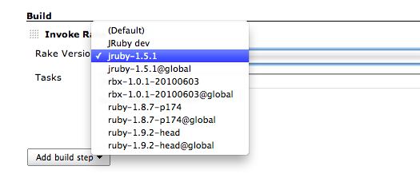
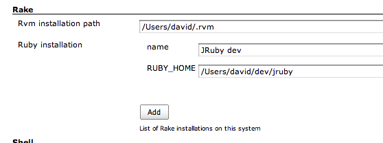

This plugin allows Jenkins to invoke [Rake](http://rake.rubyforge.org/)
tasks as build steps.  
The plugin detects the ruby VM installed on the host and it allows you
to include new instances. You can configure Jenkins to allow that each
project will select the installation that will use.

This plugin works as other builders like Ant builder or Gant builder.
You just need to specify the Rake tasks to run but you can also
configure other Rake options.

##### Rvm integration

Since version 1.7 the Rake plugin also detects the machine's Rvm
installation and collects its Ruby instances to use them as normal
instances:

If your Rvm installation is not in the default directory, $HOME/.rvm,
the path can be modified into the Jenkins' system configuration panel:

### Changelog

##### 1.8.0 (2014/03/13)

-   Minor feature: Reload the gemsets where rake is not found. Thanks to
    Brian Fletcher ([@punkle](https://github.com/punkle)) for pull
    request [\#15](https://github.com/jenkinsci/rake-plugin/pull/15).
-   Minor improvement: Order list of rake installations for the
    dropdown. Thanks to Brian Fletcher
    ([@punkle](https://github.com/punkle)) for pull request
    [\#16](https://github.com/jenkinsci/rake-plugin/pull/16).
-   Minor feature: Add option to use bundle exec. Thanks to Scott Nelson
    ([@sanelson2000](https://github.com/sanelson2000)) for pull request
    [\#17](https://github.com/jenkinsci/rake-plugin/pull/17).

##### 1.7.8 (2013/08/06)

-   Work around JRE bug that prevents the default rake installation from
    being used on Windows
    ([JENKINS-18822](https://issues.jenkins-ci.org/browse/JENKINS-18822))

##### 1.7.7 (2011/08/13)

-   Ensure we search global gemsets for the rake gem, and update path
    accordingly
-   Make sure the global path is added in addition to the gemset path
-   Ensure we include the Ruby bin path (needed by JRuby)

##### 1.7.6 (2011/03/22)

-   Add rvm bin path to the environment path
-   Add initial path to the environment
-   Fix gems bin parent directory

##### 1.7.3 (2010/10/30)

-   Rake Plugin does not properly discover available gemsets. ([issue
    GH-1](https://github.com/jenkinsci/rake-plugin/issues/1))

##### 1.7.2 (2010/10/28)

-   Rake plugin can't always find Rake with rvm installed.
    ([JENKINS-7947](https://issues.jenkins-ci.org/browse/JENKINS-7947))

##### 1.7.1 (2010/09/21)

-   Rake plugin fails when job configured to use (Default) Rake
    installation.
    ([JENKINS-7530](https://issues.jenkins-ci.org/browse/JENKINS-7530))

##### 1.7 (2010/09/18)

-   Autodetect Rvm installation and its Ruby instances.
    [\#rvm](https://wiki.jenkins.io/display/JENKINS/Rake+Plugin#Rakeplugin-rvm)

##### 1.6.3 (2010/04/16)

-   Maintenance release, fixing JENKINS-5110 and JENKINS-6194.

##### 1.5 (2009/03/16)

-   Custom root directory added
-   Bug fixed: when you added several build tasks they copied data from
    the first one.

##### 1.4 (2009/01/20)

-   Some bugs fixed

##### 1.2 (2008/09/18)

-   Rake version selector moved to a separated template in order to use
    it in dependent plugins.

##### 1.1 (2008/08/22)

-   Updated to keep up with changes in Hudson core 1.250
    ([report](http://www.nabble.com/hudson-fails-to-build-td19115807.html))
