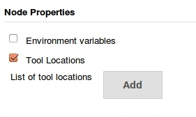
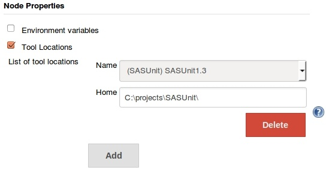
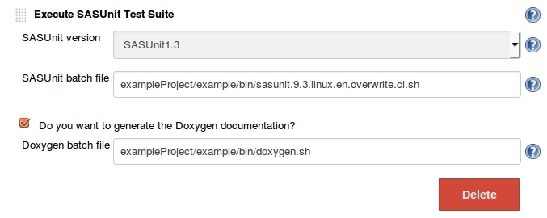

# Overview

This plugin adds support for
[SASUnit](http://sourceforge.net/projects/sasunit/), the unit testing
framework for SAS.

Once installed the execution of SASUnit test suites is available as a
build step.

## Features

-   Execution of SASUnit test suites
-   Optional creation of Doxygen documentation
-   Manage multiple SASUnit installations per node

# Configure the SASUnit Tool Installation

Before a build step can be run successfully, at least one SASUnit
installation must be configured. You are free to configure as many
installations as needed.

To add an installation go to Jenkins-\>Manage Jenkins-\>Configure
System. There you will find the following form field.  
{width="387"
height="108"}  
To add a SASUnit Version press "Add SASUnit".

Configure the installation by providing a

1.  Name for the installation. This name references the installation and
    will be available in the configuration of the build step.
2.  A path to the root directory of the installation. This path will be
    used as a default on all your nodes.

If you got SASUnit installations on different nodes using different
paths e.g. in Linux and Windows environments you can supply node
specific paths for every installation. Therefore go to Jenkins-\>Manage
Jenkins-\>Manage Nodes and configure the node in question.  
{width="232"
height="139"}  
Find the node properties and click "Add". Specify a path as needed for
your node.  
{width="438"
height="230"}

# Configure the SASUnit Plugin

Pick an installed SASUnit version from the drop down and specify a batch
file to start SASUnit. If needed a Doxygen documentation will be created
as well.  
{width="557"
height="223"}
