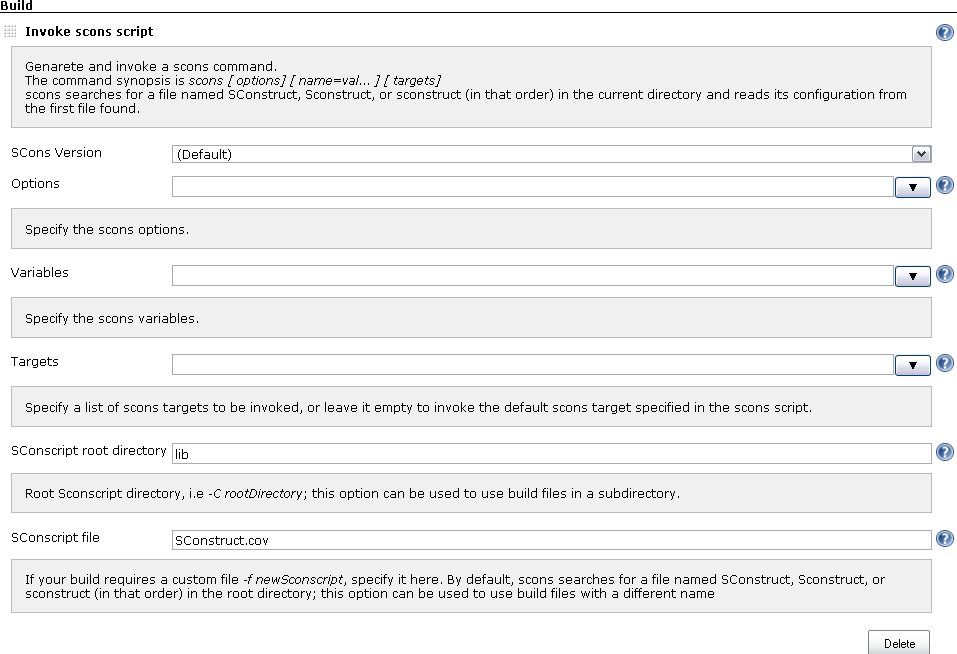

| Plugin Information                                                                      |
|-----------------------------------------------------------------------------------------|
| View SCons [on the plugin site](https://plugins.jenkins.io/scons) for more information. |

**This plugin is up for adoption.** Want to help improve this plugin?
[Click here to learn
more](http://localhost:8085/display/JENKINS/Adopt+a+Plugin "Adopt a Plugin")!

  
This plugin allows Hudson to invoke [SCons](http://www.scons.org/) build
script as the main build step.  
  
  

# Configurations

## Project Configuration

The plugin works much like Ant builder, and using it is very easy. You
basically just need to specify the SCons options, variables and targets
build script that you want to run:  
  
  
  
  
  
  
  

## Global Configuration

If 'scons' is not in PATH, or if you have multiple SCons installations
and need to be able to configure which project uses which SCons, then
you can go to the system configuration and tell Hudson where your Gradle
are:  
  
  
  

# Changelog

## Release 0.4 (May 24, 2011)

\* Fixed
[JENKINS-9755](https://issues.jenkins-ci.org/browse/JENKINS-9755) -
SCons-Plugin does not work with current Jenkins release (1.413)

## Release 0.3 (March 06, 2011)

\* Upgraded to Jenkins 1.399 metadata

## Release 0.2.1 (July 07, 2010)

\* Fixed
[JENKINS-5791](https://issues.jenkins-ci.org/browse/JENKINS-5791)

## Release 0.2 (January 28, 2010)

\* Added the ability to provide a SCons script content without a SCons
file.

NOTE: the config.xml section name changed in this release. 
SConsBuilderScriptFile replaced SConsBuilder, and you will have to
manually change the section name in your existing configuration files.

## Release 0.1 (April 08, 2009)

\* Initial
