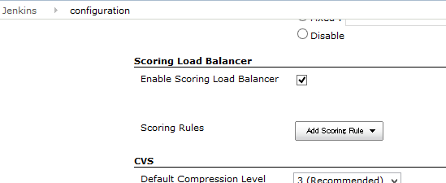
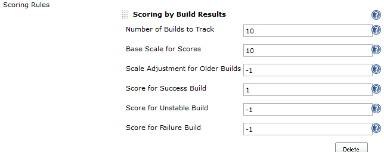
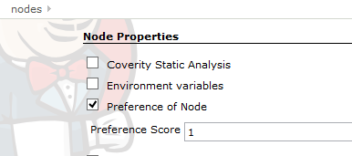
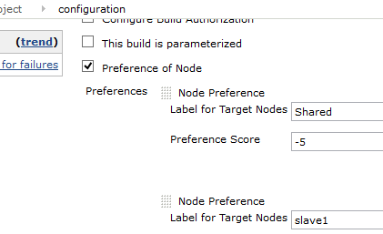

Decides a build run on which node by scoring nodes.

## What's this?

This plugin provides following features:

-   Decides a node where a build run depending on scores of nodes.
-   Provides following scoring rules. New ones can be added using
    \`ExtensionPoint\`.
    -   Scoring by Build Results
        -   Prefers nodes where the last builds of the project
            succeeded.
        -   Avoids nodes where the last builds of the project failed.
    -   Scoring by Node Loads
        -   Prefers nodes where more executers remain.
        -   Avoids nodes where more builds run.
    -   Scoring by Node Preferences
        -   Prefers nodes marked "Preferred" in configuration of the
            building project.
        -   Prefers nodes with labels marked "Preferred" in
            configuration of the building project.
        -   Prefers nodes marked "Preferred" in configuration of nodes.
-   Scoring rules are configured in "Manage Jenkins" \> "Configure
    System"
    -   Pick up available scoring rules and put them in preferred order.
        -   Each scoring rules provides its configuration.
        -   You can put scoring rules twice or more, but it might be
            useless for current providing methods.

## Screenshots

-   Scoring Load Balancer plugin adds a new configuration section to
    "Manage Jenkins" \> "Configure System" page. You can add rules to
    decide which nodes is preferred to use for building.  
    
-   "Scoring by Build Results" scores a node by past results of builds
    on that node. You can configure weights of successes and failures.  
    
-   "Scoring by Node Loads" scores a node by the number of builds are
    running on that node now.  
    
-   "Scoring by Node Preference" scores a node by preference
    configuration in nodes or projects.  
    
    -   In node configuration pages, "Preference of Node" can be
        specified.  
        
    -   In project configuration pages, "Preference of Node" appears.
        You can specify scores for nodes or node labels. Multiple
        preferences can be specified.  
        

## How does this work?

You may read later "WorkChunks and ExecutorChunks" first for
understanding how Jenkins works for build assignment.

This plugin works as following:

1.  When the plugin loaded, replaces the default `LoadBalancer` to
    `ScoringLoadBalancer`.
2.  Jenkins requests to map builds to nodes ( `LoadBalancer#map`)
3.  Pick the first WorkChunk (that is, subtask).
4.  Score all nodes by calling all configured `ScoringRule`
    -   You can define a new scoring rule by creating a subclass of
        `ScoringRule`.
5.  Pick the ExecutorChunk with the highest score node. Assign that
    ExecutorChunk to the current WorkChunk.
6.  Pick the next WorkChunk, and back to 4. Scoring is performed for
    each WorkChunk, for the case scores differ for each subtask.
7.  If assignment is failed (e.g. some constrains is broken), pick the
    next ExecutorChunk, and back to 6.
8.  If assignment is succeeded, it is used.

## WorkChunks and ExecutorChunks

In simple cases, Jenkins launches only one build at the same time.  
Though multi-configuration project results in multiple builds even
triggered once,  
these builds are launched just one by one sequentially.

But there are cases Jenkins launches two or more builds at the same
time.  
SEE `JobProperty#getSubTasks` or `SubTaskContributor` for details.

Before builds start on node, Jenkins requests to map tasks to
executors.  
Here are definitions of words:

| Word     | Explanation                                                                                                                                                                                                                                                                             |
|----------|-----------------------------------------------------------------------------------------------------------------------------------------------------------------------------------------------------------------------------------------------------------------------------------------|
| Task     | A root source of builds. Includes `FreeStyleProject`, `MatrixConfiguration`. `MatrixProject` is also a task, but not processed with LoadBalancer (for it is a `FlyWeightTask` ).                                                                                                        |
| SubTask  | A task may contain multiple subtasks. One subtask creates one build. Generally, a task contains itself as a subtask. For example, task `FreeStyleProject` contains a subtask `FreeStyleProject` itself and other subtasks created by `JobProperty#getSubTasks` or `SubTaskContributor`. |
| Build    | A process runs on a computer. A build is created by a subtask.                                                                                                                                                                                                                          |
| Node     | One can be registered in "Manage Nodes".                                                                                                                                                                                                                                                |
| Computer | A node which is connected and builds can run on now.                                                                                                                                                                                                                                    |
| Executor | Build slots a computer provides. The number of executer of a node can be configured with "\# of executors" in "Manage Nodes" page.                                                                                                                                                      |

When Jenkins requests to map tasks to executors,  
it passes `WorkChunk` s and `ExecutorChunk` s.

`WorkChunk` groups subtasks that must run on a same node. Subtasks can
be grouped by `SubTask#getSameNodeConstraint` returning the same
`Object`.

`ExecutorChunk` groups executors by their computers (that is by nodes).

## Extension point

New scoring rule can be added with extending `ScoringRule`, overriding
the following method:

``` syntaxhighlighter-pre
public abstract boolean updateScores(Task task, WorkChunk wc, Mapping m, NodesScore nodesScore);
```

You can score nodes by updating `nodesScore`.

## Limitations

-   A performance problem may occurs for a large number of nodes.
    -   I've tested the behavior with only 10 nodes.

## Issues

To report a bug or request an enhancement to this plugin please create a
ticket in JIRA (you need to login or to sign up for an account). Also
have a look on [How to report an
issue](http://localhost:8085/display/JENKINS/How+to+report+an+issue)

-   [Bug
    report](https://issues.jenkins-ci.org/secure/CreateIssueDetails!init.jspa?pid=10172&issuetype=1&components=18051&priority=4&assignee=ikedam)
-   [Request or propose an improvement of existing
    feature](https://issues.jenkins-ci.org/secure/CreateIssueDetails!init.jspa?pid=10172&issuetype=4&components=18051&priority=4)
-   [Request or propose a new
    feature](https://issues.jenkins-ci.org/secure/CreateIssueDetails!init.jspa?pid=10172&issuetype=2&components=18051&priority=4)

Key

T

P

Summary

Loading...

Refresh

## Change Log

### Version 1.0.1 (Nov 07, 2013)

-   Fixed NPE happining when BuildPreferenceJobProperty is enabled but
    not configured.

### Version 1.0.0 (Sep 07, 2013)

-   Initial release.
